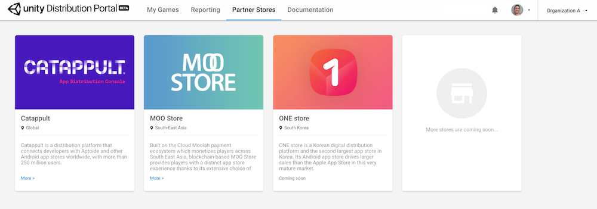
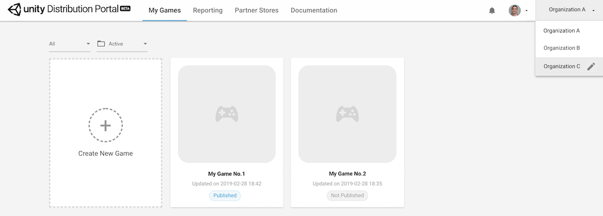
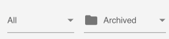
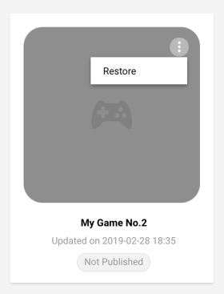

### Archive and restore your game

When you no longer need a game, the UDP console allows you to archive it. Note that you cannot delete the game on the UDP console.

To archive your game:

1. Go to the **My Games** panel.
2. Select your filters for the game. By default, you can see all active games.

1. When you hover over the game, you can see the **More** affordance. Archive your game by choosing **More > Archive**. 

To restore your game:

1. Go to the **My Games** panel.
2. Select the **Archived** filter.

1. When you hover over the game, you can see the **More** affordance. Restore your game by choosing **More > Restore**.

