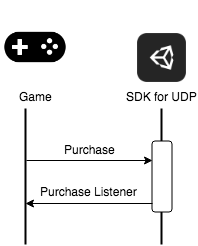
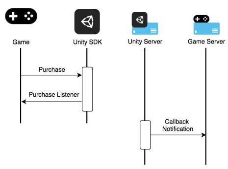

# Building your game and deploying it to the UDP console

There are three ways to build your game and deploy it to the UDP console:

* you create a local build, and upload it directly to the UDP console

* you create a local build, and upload it to CloudBuild to deploy it to UDP

* you build your game via CloudBuild, and deploy it to UDP via CloudBuild

### Building your game locally

Create a local Android APK build in the Editor (**File** > **Build Settings** > **Android** > **Build**). For more information, refer to [Getting started with Android development](https://docs.unity3d.com/Manual/android-GettingStarted.html).
 
### Uploading your game file to the UDP console directly

You can create a local build in the Unity Editor and upload it to the UDP console directly.

1. On the UDP console, navigate to your Project via **My Games**.

2. Select **GAME INFO** > **Basic**.

3. Click **APK Files** to upload the APK file of your game.

### Pushing the build to the UDP console via Cloud Build

In the Editor, enable Cloud Build through the Unity Services window (see documentation on [Cloud Build implementation](https://docs.unity3d.com/Manual/UnityCloudBuild.html)).

You can upload your game build to the build history of your Project, and push it to UDP either via the Editor, or via the Unity Cloud Build Developer Dashboard.

#### **Upload and push via the Unity Editor**

##### Step 1 - Upload your UDP build:

In the **Cloud Build Services** window, if you haven't uploaded any build before, select **Upload Build**. 

Upload the apk **FILE** of your UDP build, set the **PLATFORM** field to Android and enter a useful **LABEL**. 

Select **UPLOAD** and let it complete the upload process.

##### Step 2 - Push your build to UDP

In the Cloud Build Services window, locate the desired build from the build **History** timeline and select **Push to Unity Distribution Portal**. Verify that you want to push, and that the action completes.

#### Upload and push via the [Unity Cloud Build Developer Dashboard](https://developer.cloud.unity3d.com/build)

##### Step 1 - Upload your UDP build

Navigate to your Project’s **Cloud Build > History**.

Select **Upload**, then select the APK file you built from the Editor.

 

##### Step 2 - Push the build to UDP

Navigate to your Project’s **Cloud Build History**.

Click **Download .APK** file, then select **Push to Unity Distribution Portal** from the drop-down menu.

 
### Building and Deploying via Cloud Build

If you use Unity Teams Advanced, you can generate builds automatically (see documentation on [Automated Build Generation](https://docs.unity3d.com/Manual/UnityCloudBuildContinuousIntegration.html)). 

In the Cloud Build Services window:

* Select **Manage Build Targets** > **Add new build target**

* In the **TARGET SETUP** window, set the **PLATFORM** field to Android and enter a useful **TARGET LABEL**. 

* Select **Next****: Save**.

* Select **Start Cloud Build**, then select the target build you just created.

Push your build to UDP directly via the Unity Cloud Build Developer Dashboard (as shown in above section) 