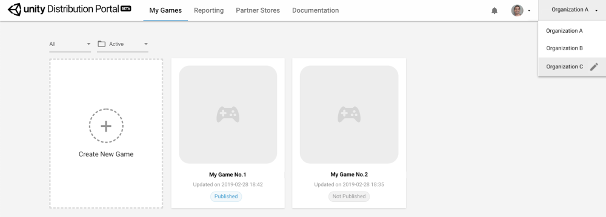

## Company Information

Before publishing your game to the UDP console, you need to create a company information profile. UDP sends this company information to the partner stores, who use it to populate the “About the developer” section of your game’s listing on their app store.  

1. On the [UDP console](https://distribute.dashboard.unity.com), choose your organization and click on the pencil icon to edit the profile.

 Choosing your organization 

2.Enter your company information.

| Property              | Description                                                  |
| --------------------- | ------------------------------------------------------------ |
| Company Name          | The name of your company.                                    |
| Location              | The place where your company is located in.                  |
| Company Size          | Use the drop-down to specify the number of people in your company. |
| Official Website      | The official website of your company.                        |
| Support Email Address | The support email that you provide to users of your game or app. |
| About                 | Any additional information about your company.               |

