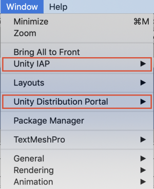
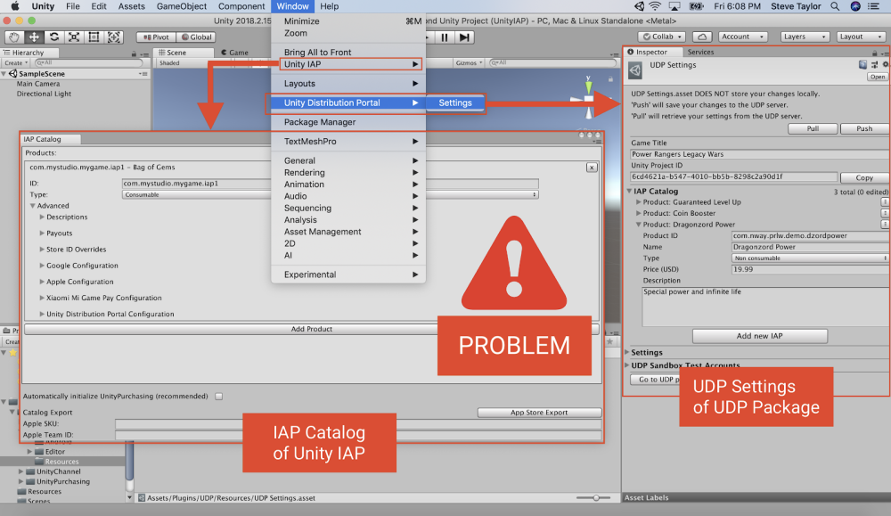

## Don’t mix the implementations

There are [Two different ways to implement UDP](Before_you_begin_know_this.md) in your game:

- [Using Unity IAP](UDP_via_Unity_IAP.md)
- [Using the UDP Package](UDP_Package.md)

**CHOOSE ONE AND ONE ONLY.**

**DO NOT install the UDP Package in your project, if it is already using Unity IAP.**

**DO NOT enable Unity IAP, if you decided to implement using the UDP Package.**

While this would not necessarily break your implementation, you expose yourself to edge cases where your game client would ultimately fail to sync its IAP Products with the stores’ servers.

Keep it simple: choose ONE implementation and stick to it.

**Important note**: if you’re **implementing UDP via Unity IAP**, it is NORMAL to have both “Unity IAP” and “Unity Distribution Portal” in the **Window** menu:

 

It is normal to have both when implementing via Unity IAP

This is because Unity IAP includes a UDP implementation (from version 1.22 and above); we therefore surface a UDP item in the Window menu once Unity IAP is installed.

You still need to make sure (especially if you had mixed the implementations) that these menu items give you access to the correct [UI elements of the UDP implementation via Unity IAP](UDP_via_Unity_IAP.md).

 Specifically, if you have both:

- in **Window > Unity Distribution Portal > Settings** = the UDP Settings window of the UDP Package (the one that already features an IAP Catalog) 

- the IAP Catalog of Unity IAP (**Window > Unity IAP > IAP Catalog**)

Then you likely have a problem (your game is juggling two IAP Catalogs!)

If you find out you mixed the two UDP implementations:

- Decide which one you want to keep,
- Remove the other.

**If you choose to implement with the UDP Package, disable Unity IAP.**

**If you choose to implement via Unity IAP, you must:** 

1. **Uninstall the UDP Package (first)**
2. **Install Unity IAP (re-import if needed)**

See in Annex the **Editor UI elements of a UDP implementation** [via Unity IAP](UDP_via_Unity_IAP.md) and [via the UDP Package](UDP_Package.md); double-check that you’re getting the correct UI elements for the implementation of your choice.

