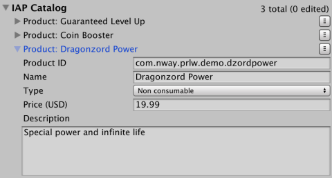
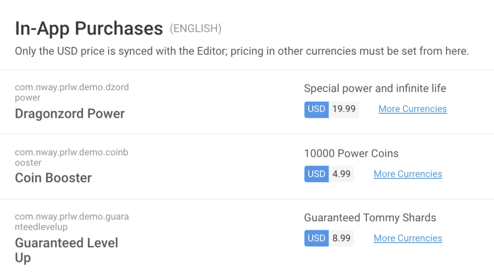

### Double-check your IAP Catalog on the UDP Console

So you’ve synced / pushed all your IAP Products from the Editor side.

It’s always best to make sure the UDP Console has received them well.

On the [UDP Console](https://distribute.dashboard.unity.com/udp), find the **In-App Purchases** section under your project’s **Game Info** tab:

If IAP Products are missing, or are different across IAP Catalogs, you have a problem to look into, due either to [point 1/](Do not mix the implementations.md) or to [point 2/](Save Sync Push your IAP Catalog.md)

**Reminder**: if you [implemented your IAPs directly in code](https://docs.unity3d.com/Manual/UnityIAPDefiningProducts.html), you have to enter your IAP products manually on the UDP console, and be vigilant that the Product IDs match the ones implemented in your code. More info [here](Editing in-app purchases.md).

