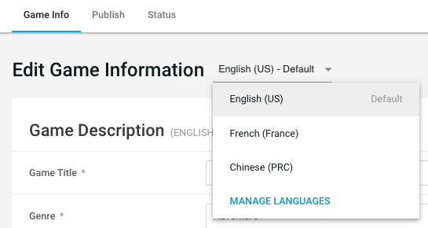
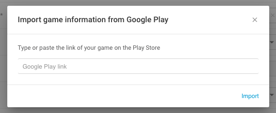

# Editing your game information on the UDP console

The UDP console creates a game when you [generate a UDP client in the Unity Editor](Generating a UDP client.md). To edit the game information, go to the [UDP console](https://distribute.dashboard.unity.com) and [navigate](Navigating_the_UDP_console.md) to the game that you created in the Editor.

Click **EDIT INFO** to edit your game information. You can then access the following sections:

- Basic Information
- Binary
- Premium Price
- In-App Purchases
- Integration Information
- Sandbox Test Accounts
- Beta Users

### Basic Information

Populate the following fields:

| Property             | Description                                                  |
| -------------------- | ------------------------------------------------------------ |
| Game Title           | The title of your game (this field is synced with the Editor) |
| Genre                | Indicates the category that your game belongs to. You can choose among **Action, Adventure, Arcade, Board, Card, Casino, Casual, Educational, Music, Puzzle, Racing, Role Playing, Simulation, Sports, Strategy, Trivia**, and **Word**. |
| Platform             | The platform that your game is published to. Currently the platform can only be Android. |
| Game ID              | The unique identifier of your game (this field is not editable). |
| Game Icon            | The game icon that will be shown on the app stores.          |
| Description          | The full-length description of your game to players, which will be shown on the app stores. |
| Game Banner          | An image used by stores to feature your game. For example, it can be a placement in a carousel. |
| Screenshots & Videos | The screenshots and video trailers of your game. **Note for videos:** certain stores only accept mp4 files while others only accept a Youtube link. We recommend you upload both. |

Input metadata for each of your supported languages. To add new languages, go to the editing mode by choosing **EDIT INFO** and go to **MANAGE LANGUAGE**. 

English is the default language. You can switch the default language to any of your supported languages.

**Hint**: If you have already published the game on Google Play, you can import the basic information via the URL of your game on Google Play.

- Click **IMPORT FROM GOOGLE PLAY**.
- Copy the link of your game on Google Play to the following input box and choose **Import**.
  

### Binary

If necessary upload your APK file and OBB files: 

- **APK File**, which is the file of your game or app. If you have pushed your UDP build via Cloud Build, you don’t need to upload it again.
- **OBB File(Main)**, which is the main extension file for additional resources that your game or app might need.
- **OBB File(Patch)**, which is optional and lets you make small updates to the main expansion file.

OBB files do not get pushed during a Cloud Build deployment, so if your game uses them you must upload them manually from the UDP console.

Note that you can change the APK files and OBB files only in the default language view. 

Describe what’s new for the files in the **What’s New** box. UDP publishes this description in the stores together with your game.

### Premium Price

This functionality is disabled for now as no connected store supports pay-to-download yet. If your game monetizes primarily via pay-to-download, do not submit it as you will not be able to generate revenue. We will inform the developer community once premium / pay-to-download is supported.

### Editing in-app purchases 

You can create and edit In-App Purchase (IAP) products both in the Unity Editor and on the UDP console. To create IAP products in the Unity Editor, refer to [Implementing UDP IAP on the client side](Using_the_UDP_package_detail.md). Unity synchronizes your IAP settings in the Editor with the IAP settings on the UDP console automatically. 

To create or edit IAP products on the UDP console:

- Be sure you are in editing mode (via the top **EDIT INFO** button).
- Click **ADD ITEM** to create a new item
- Click the **pencil icon** to edit an existing item 
- Specify your product information:
- - **Product ID,** the unique identifier for the IAP product. Please take note of the required syntax for Product IDs
  - **Product Name**, the name of the IAP product
  - **Consumable**, to indicate whether the IAP product is consumable or not
  - **Description**, to succinctly describe the IAP product
    

**Product Name** and **Description** can also be entered in the different languages of your game listing. Select the desired language at the top on the Game Information page and input your IAP copy in that language.

Set the price of the IAP product by clicking **Manage amounts and currencies.**

**Note**: if you used the IAP Catalog during your game implementation, you shouldn’t have to create IAP products from the UDP console again - the IAP Catalog syncs between the Unity Editor and the UDP console. However, if you [implemented your IAPs directly in code](https://docs.unity3d.com/Manual/UnityIAPDefiningProducts.html), you have to enter your IAP products manually on the UDP console, and be vigilant that the Product IDs match the ones implemented in your code. 

### Integration Information

This information is synced with the Unity Editor. Only the **IAP Callback URL** field can be edited.

### Sandbox Test Accounts

Your generic UDP game build, when it launches in the UDP Sandbox environment, will ask the user for access credentials. You define and manage these credentials in that section. 

Sandbox Test Accounts are also covered under [this section](Configuring_Unity_Distribution_Portal.md)

The information you edit on the UDP console will be synced with the Unity Editor once you save your Revision draft.

**Note**: the test accounts are only for the UDP Sandbox environment, and will only apply to the generic UDP build. Once a game is repacked for a specific store, it no longer points to the sandbox environment where the test accounts belong.

### Beta Users

Stores which have a Beta test environment allow you to push your game to it, and let you give restricted access to the Beta users of your game. 

The Beta users you set from the general **Game Info** page will be automatically set for all the stores you will submit your game to. You can set store-specific beta user lists from the [Advanced](Publishing_your_game_to_stores.md) section in the next Publish step.

### Save your Revision

Once you entered all the game information for this revision, including in all the languages, save your changes using the **SAVE** button. 

Saving your changes will only save your Revision Draft. Release your Revision Draft to create a new Revision which can be submitted to stores.

**Note**: you can overwrite an existing Revision Draft by editing a previously-released Revision and saving the ensuing draft. The latter will become the latest Revision Draft.

Refer to the FAQ section for more information about the concept of [Revisions and Releases](FAQs.md)

### Release your revision

Only RELEASED revisions can be published to stores. 

You need to have at least one IAP product defined in order to release a revision. 

Once you have saved your Revision Draft and are ready to publish it, click the **RELEASE** button. Enter release notes to keep track of your revision.

**Note**: only the last revision will be published to the stores. If you need to submit an older revision, edit it and re-release it so it becomes the latest one.

