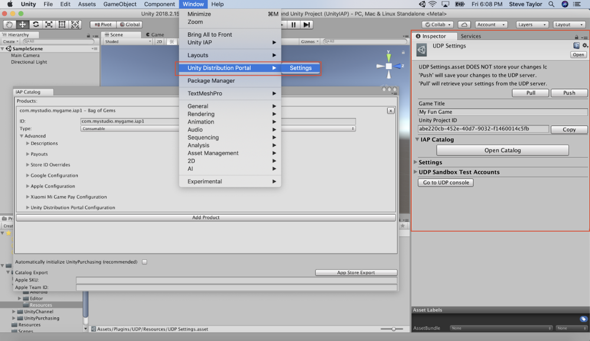
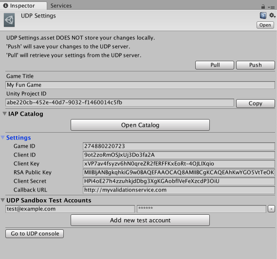
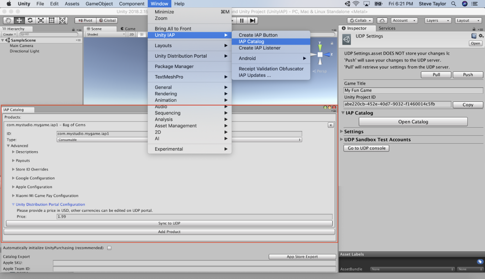

### Editor UI elements for UDP implementation via Unity IAP

So you have [Unity IAP 1.22 installed](How do I get Unity IAP set up with UDP.md).

It is NORMAL you have both “Unity IAP” and “Unity Distribution Portal” in the **Window** menu, as Unity IAP 1.22 includes a UDP implementation. 

- **Unity Distribution Portal** > gives you access to the UDP Settings window specific to the Unity IAP implementation. 
- **Unity IAP** > gives you access to the regular Unity IAP features, including the IAP Catalog.

However make sure you are getting the following.

**Window > Unity Distribution Portal > Settings** opens the UDP Settings inspector window:

The **UDP Settings** window, for Unity IAP, looks like this:

In that window, you can only set Game Title, Test Account Settings, and view/copy some the UDP client settings (yes there’s some clutter, and we are working on it).

The IAP Catalog is in a separate window, accessed via  **Window > Unity IAP > IAP Catalog**:
 

In the Unity IAP Catalog, there is a dedicated UDP section. **You must enter your IAP Products in this section for them to become part of the UDP Catalog:**

Remember to **Sync to UDP** every IAP Product that you add to the catalog under the **UDP Configuration** section, using the button immediately below the price field:

Otherwise your IAP Product will NOT be synced with the IAP Catalog on the UDP Console.

Which will ultimately result in this IAP Product not being synced with the store.

Before you build, make sure you set **UDP as Build Target:**

Finally, remember that UDP is only compatible with **Unity 5.6.1** and above.

If you are using Unity IAP with a lower version of Unity, you will encounter problems.