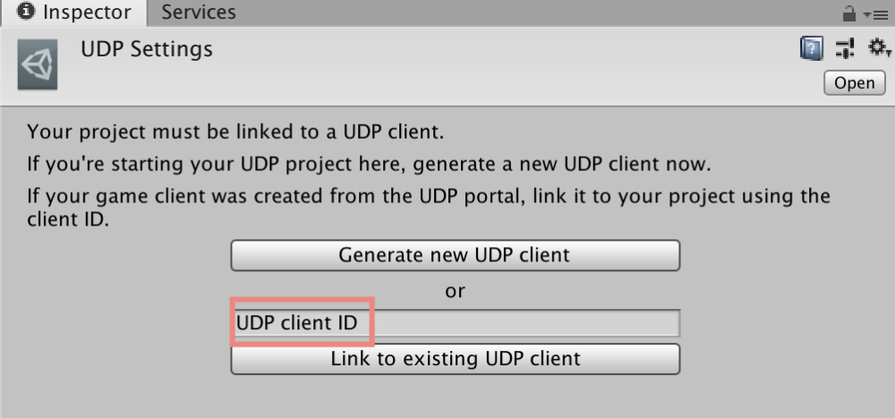

### Generating a UDP client

Your Unity project needs to be linked to a UDP client. You can create a new UDP client from the Unity Editor, or link your project to an existing UDP client. Note that a Unity project can only be linked to a single UDP client.

1. Create a **UDP Settings** file by selecting **Window > Unity Distribution Portal > Settings**. 

2. In the **UDP Settings** inspector window, link your project with an existing UDP client or generate a new UDP client:

**If your game was first created from the UDP console, link it this way:**

1. On the UDP console, go the **Game Info** section of your game
2. Copy the value in **Client ID** from the **Integration Information** section
3. Paste it into the UDP Client ID field of the **UDP Settings** window (cf. above)
4. Press the button “**Link to existing UDP client**”

The user interface of the **UDP Settings** inspector window is different depending on which implementation you choose (via Unity IAP, or with the UDP Package). 

In both cases you will find in the **UDP Settings** window a section for general **UDP settings** and a section for UDP Sandbox Test Accounts.

