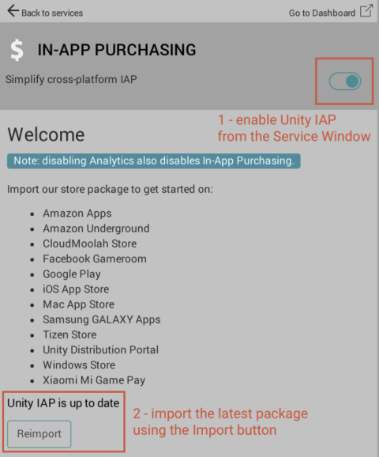
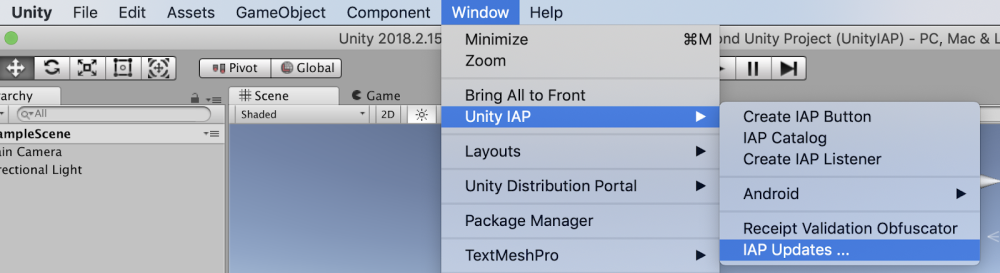
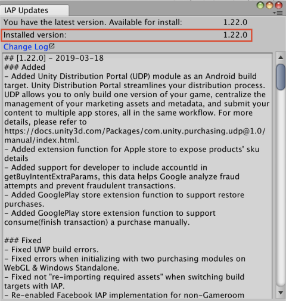

### How do I get Unity IAP set up with UDP?

Follow these steps to install the latest **Unity IAP** version and check you have 1.22 or above installed (which has UDP)

From the Unity Services Window:

1 - [enable Unity IAP from the Service Window](https://docs.unity3d.com/Manual/UnityIAPSettingUp.html);

2 - import the latest package using the **Import** button;

3 - from the Unity Editor top menu, go to IAP Updates:

UDP is included in version 1.22 and above