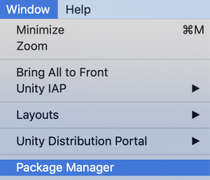
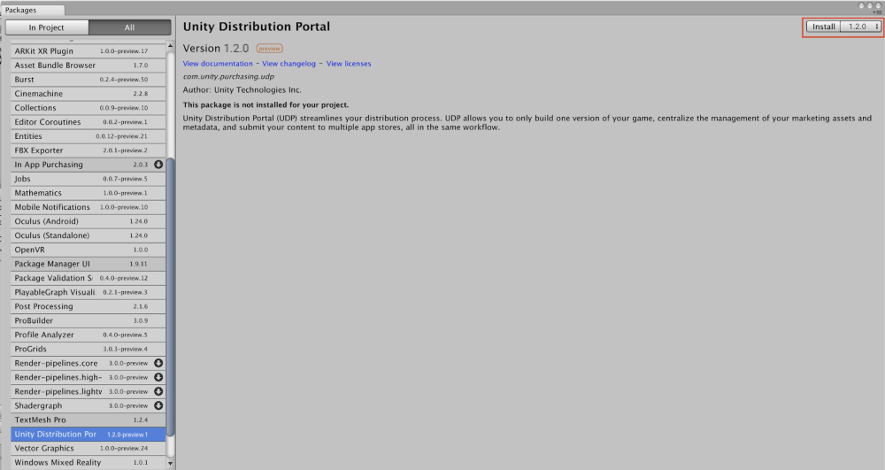

### How do I get the UDP Package?

#### From the Package Manager

From the Unity Editor’s top menu: **Window > Package Manager:**

Select the tab **All** and look for Unity Distribution Portal:

General info on the Package Manager can be found [here](https://docs.unity3d.com/Packages/com.unity.package-manager-ui@2.1/manual/index.html).

#### From the Asset Store

No access to Unity Package Manager? No problem. 

Download the **UDP Package** from the [Unity Asset Store](https://assetstore.unity.com/packages/add-ons/services/billing/unity-distribution-portal-138507) and install it in your project.