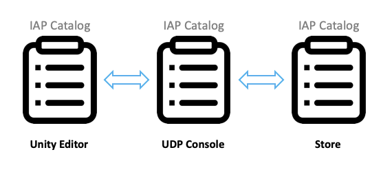
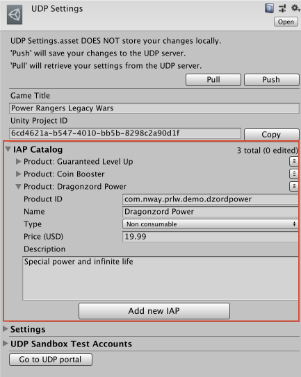
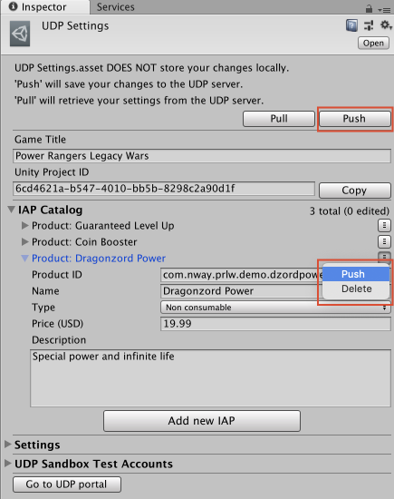

### Implementing UDP IAP on the client side 

To implement UDP IAP, follow these steps:

1. Configure UDP IAP

2. Initialize UDP SDK

3. Query the partner stores’ inventory

4. Purchase a product

5. Consume a purchase

6. Validate the client-side integration

#### Configuring UDP IAP

To configure UDP IAP:

1. Open the **IAP Catalog** (**Window** > **Unity Distribution Portal** > **Settings** > **IAP Catalog**).

2. Enter your product information.

    * **Name**, the name of the IAP product
    * **Product ID**, the unique ID that is used to identify the IAP product
    * **Type**, which indicates whether the IAP product is consumable
    * **Price**, the price of the IAP product. You must specify the product price, otherwise players can’t purchase products in game stores.
    * **Description**, which provides you with a reference

3. Click **Push** to create the product and sync with the UDP server. 

4. To add more products, click **Add new IAP**.

#### Initializating the UDP SDK

To initialize the UDP SDK, your game needs to have GameSettings.asset file which has generated/got/linked with a client. The initialization listener then lets you know whether the initialization succeeds by returning a success or failure message. 




Call the **Initialize** method with **IInitListener** in your game code.

```
StoreService.Initialize(IInitListener listener)
```


The InitListener then tells your game whether the initialization has succeeded or failed. 

```

    public class InitListener : IInitListener
{
    public void OnInitialized(UserInfo userInfo)
    {
        Debug.Log("Initialization succeeded");
        // You can call the QueryInventory method here
        // to check whether there are purchases that haven’t be consumed.       
    }

    public void OnInitializeFailed(string message)
    {
        Debug.Log("Initialization failed: " + message);
    }
}
```

#### Querying the partner store’s inventory

To prevent a product from being bought but not delivered, your game needs to query the partner stores’ inventory after the initialization is completed. This allows you to, for example, restore non-consumable products when users reinstall your game. 

<table>
  <tr>
    <td>Consumable products
Consumable products provide temporary effects, such as game currency and extra experience points. You can make them available to your players multiple times.

Non-consumable products
Non-consumable products provide permanent effects. Players can only purchase them once. </td>
  </tr>
</table>


Your game determines whether there is an unconsumed product by calling the QueryInventory method immediately after the initialization succeeds. 


Sending a query from your game to the UDP inventory

You can query for the product details by calling the QueryInventory method. If you don’t specify product IDs, you get the information of all products that are purchased but not consumed. If you specify product IDs, you get the product information for your specified products along with the not-consumed purchases. 

```
StoreService.QueryInventory(List<string> productIds, IPurchaseListener listener);
StoreService.QueryInventory(IPurchaseListener listener);
```


**Hint**: Call this method after a successful initialization. This step is used to recover  a product being paid for but not delivered for some reason, such as an application crash.

##### Implementing listeners for events that are related to the purchase service

IPurchaseListener provides the following listeners that tell you the result of all purchase-related events:

* OnPurchase - The purchase succeeded.
* OnPurchaseFailed - The purchase failed.
* OnPurchaseRepeated - Used when a player buys a non-consumable product several times. You can implement this listener when the partner store doesn’t support QueryInventory.
* OnPurchaseConsume - The consumption succeeded.
* OnPurchaseConsumeFailed - The consumption failed.
* OnQueryInventory - The query succeeded.
* OnQueryInventoryFailed - The query failed.

Here is an example:

```

    public class PurchaseListener : IPurchaseListener
{
    public void OnPurchase(PurchaseInfo purchaseInfo)
    {
        // The purchase has succeeded.
        // If the purchased product is consumable, you should consume it here.
        // Otherwise, deliver the product.
    }

    public void OnPurchaseFailed(string message, PurchaseInfo purchaseInfo)
    {
        Debug.Log("Purchase Failed: " + message);
    }

    public void OnPurchaseRepeated(string productCode)
    {
        // Some stores don't support queryInventory.
        
    }

    public void OnPurchaseConsume(PurchaseInfo purchaseInfo)
    {
        // The consumption succeeded.
        // You should deliver the product here.        
    }

    public void OnPurchaseConsumeFailed(string message, PurchaseInfo purchaseInfo)
    {
        // The consumption failed.
    }

    public void OnQueryInventory(Inventory inventory)
    {
        // Querying inventory succeeded.
    }

    public void OnQueryInventoryFailed(string message)
    {
        // Querying inventory failed.
    }
}

```


#### Purchasing a product

To start a purchase request from your game, call the **Purchase** method. The UDP automatically checks the purchase receipt to see whether the purchase is valid.




When you call the **Purchase** method, provide the:

* **productId** - The unique identifier of the product that the player wants to buy. 
* **developerPayload** - The information you want to send to the UDP SDK.
* **IPurchaseListener** - the listener that tells you the results of all purchase-related events.

For example

```
StoreService.Purchase(string productId, string developerPayload, IPurchaseListener listener);
```


The UDP returns information to your game after the purchase is complete. 

If your game is an online game, you can verify the purchase on your game server by receiving a callback notification. UDP sends the callback notification to the callback URL that you have specified either in the Unity Editor or on the UDP console.

 

#### Consuming a purchase

When a user has purchased a consumable product, they cannot repurchase that product until it has been consumed for some stores. So you can use the consumption to make sure the purchased product is successfully delivered. 

Note: This step is only necessary when the product is consumable.

To consume a product, your game needs to send a Consume request to the UDP SDK. We recommend that your game delivers a product after it has been initially consumed, or the product may be delivered repeatedly.


                                      

```
StoreService.ConsumePurchase(PurchaseInfo, IPurchaseListener);
```


PurchaseInfo is returned by OnPurchase. 

#### Validating the client-side integration

UDP performs client-side validations automatically. When partner stores return the payload and signature after a successful purchase, the UDP SDK validates the signature. If the validation fails, the purchase fails accordingly.
