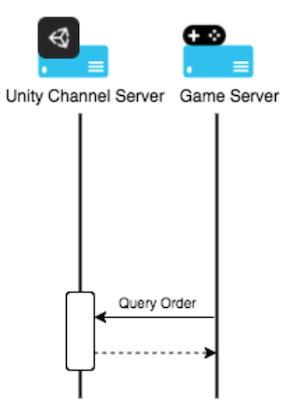

### Implementing UDP IAP on the server side

The server-side integration consists of the following steps:

* Query orders

* Receive callback notifications

<br/>
##### **Querying Orders**

Your game can query UDP about orders by calling an HTTP GET request.



```
GET /udp/developer/api/order?orderQueryToken=<orderQueryToken>&sign=<sign>

```
Parameters in the request:

<table>
  <tr>
    <td>Attribute name</td>
    <td>Format</td>
    <td>Required/Optional</td>
    <td>Description</td>
    <td>Example</td>
  </tr>
  <tr>
    <td>orderQueryToken</td>
    <td>String</td>
    <td>Required</td>
    <td>The order query token returned by the client SDK when finishing a purchase.The toke needs to be encoded Base64 before being used in the query.</td>
    <td>eyJjcE9yZGVySWQiOiJyZWZl
        cmVuY2V0OCIsImNsaWVudElkI
        joiSnY5UHhVemVWMmJ6TnJrdV
        lVRjlOUSIsImNoYW5uZWxUeXBl
        IjoiQVBUT0lERSIsImNoYW5uZWx
        Vc2VySWQiOiIiLCJjaGFubmVsUH
        JvZHVjdElkIjoiIiwiY2hhbm5lbE
        FwcElkIjoiIiwiY2hhbm5lbFBhY
        2thZ2VOYW1lIjoiY29tLnVuaXR5
        LmFwdG9pZGUudGVzdG9uaW50In0=
</td>
  </tr>
  <tr>
    <td>sign</td>
    <td>String</td>
    <td>Required</td>
    <td>An MD5 hash value containing the orderQueryToken and Unity Client Secret. </td>
    <td>Jd9CeyOUwK0fAUJtnEU+YQ==
</td>
  </tr>
</table>
     

Parameters in the response:

<table>
  <tr>
    <td>Attribute name</td>
    <td>Format</td>
    <td>Required /optional</td>
    <td>Description</td>
    <td>Example</td>
  </tr>
  <tr>
    <td>clientId</td>
    <td>String </td>
    <td>Required</td>
    <td>The clientId that is returned by Unity after the game has created a client in the Unity IAP. </td>
    <td>Q4AnJDW2-rxLAPujqrk1zQ</td>
  </tr>
  <tr>
    <td>cpOrderId</td>
    <td>String </td>
    <td>Required</td>
    <td>The order ID assigned by your game, or Unity if the game does not generate it.</td>
    <td>66mea52wne</td>
  </tr>
  <tr>
    <td>channelType</td>
    <td>string</td>
    <td>Required</td>
    <td>Channel type</td>
    <td>APTOIDE,
CLOUDMOOLAH</td>
  </tr>
  <tr>
    <td>status </td>
    <td>String</td>
    <td>Required</td>
    <td>Indicates the status of the order.  </td>
    <td>SUCCESS, FAILED, UNCONFIRMED</td>
  </tr>
  <tr>
    <td>productId</td>
    <td>String</td>
    <td>Required</td>
    <td>The product ID associated with the order</td>
    <td>Product_1</td>
  </tr>
  <tr>
    <td>amount  

</td>
    <td>String</td>
    <td>Required</td>
    <td>The payment amount of the order </td>
    <td>1</td>
  </tr>
  <tr>
    <td>quantity
</td>
    <td>Integer</td>
    <td>Required</td>
    <td>Indicates the quantity of the product.</td>
    <td>1</td>
  </tr>
  <tr>
    <td>currency</td>
    <td>ISO 4217</td>
    <td>Required</td>
    <td>The currency used to purchase the product</td>
    <td>CNY</td>
  </tr>
  <tr>
    <td>country</td>
    <td>ISO 3166-2</td>
    <td>Required</td>
    <td>The country or geographic region in which the user is located</td>
    <td>CN</td>
  </tr>
  <tr>
    <td>paidTime</td>
    <td>ISO8601 yyyy-MM-ddThh:mm:ssXXX， UTC timezone</td>
    <td>Required</td>
    <td>Specifies the time when the order is paid.</td>
    <td>2017-03-08T06:43:20Z
</td>
  </tr>
  <tr>
    <td>rev</td>
    <td>String</td>
    <td>Required</td>
    <td>The revision of the order (only for update)</td>
    <td>0</td>
  </tr>
  <tr>
    <td>extension</td>
    <td>Json String</td>
    <td>Optional</td>
    <td>the developer payload which is used to contain reference information for developers</td>
    <td>{"abc" : "123"}</td>
  </tr>
</table>


Here is an example request from your game server to the UDP server and response from the UDP server back to your game server.

The content of the **orderQueryToken**:
```
{

   "cpOrderId": "referencet8",

   "clientId": "Jv9PxUzeV2bzNrkuYUF9NQ",

   "channelType": "APTOIDE",

   "channelUserId": "",

   "channelProductId": "",

   "channelAppId": "",

   "channelPackageName": "com.unity.aptoide.testonint"
}
```
Being encoded using Base64, **the orderQueryToken**:
```
eyJjcE9yZGVySWQiOiJyZWZlcmVuY2V0OCIsImNsaWVudElkIjoiSnY5UHhVemVWMmJ6TnJrdVlVRjlOUSIsImNoYW5uZWxUeXBlIjoiQVBUT0lERSIsImNoYW5uZWxVc2VySWQiOiIiLCJjaGFubmVsUHJvZHVjdElkIjoiIiwiY2hhbm5lbEFwcElkIjoiIiwiY2hhbm5lbFBhY2thZ2VOYW1lIjoiY29tLnVuaXR5LmFwdG9pZGUudGVzdG9uaW50In0=
```

Secret:
```
_V5HwIqTTEge7m9vq1sasZE0_H9Xaj5dc3LydEJCn2Q
```
Sign:
```
Jd9CeyOUwK0fAUJtnEU+YQ==
```
Request:
```
Get /udp/developer/api/order?orderQueryToken=eyJjcE9yZGVySWQiOiJyZWZlcmVuY2V0OCIsImNsaWVudElkIjoiSnY5UHhVemVWMmJ6TnJrdVlVRjlOUSIsImNoYW5uZWxUeXBlIjoiQVBUT0lERSIsImNoYW5uZWxVc2VySWQiOiIiLCJjaGFubmVsUHJvZHVjdElkIjoiIiwiY2hhbm5lbEFwcElkIjoiIiwiY2hhbm5lbFBhY2thZ2VOYW1lIjoiY29tLnVuaXR5LmFwdG9pZGUudGVzdG9uaW50In0%3D&sign=Jd9CeyOUwK0fAUJtnEU%2BYQ%3D%3D
```
Response:
```
{

    "ClientId": "Jv9PxUzeV2bzNrkuYUF9NQ",

    "CpOrderId": "referencet8",

    "ProductId": "com.unity.aptoide.testonint.product1",

    "ChannelType": "APTOIDE",

    "Currency": "APPC",

    "Amount": "0.1",

    "Country": "PT",

    "Quantity": 1,

    "Rev": "0",

    "Status": "SUCCESS",

    "PaidTime": "2019-01-17T17:07:22Z",

    "Extension": "\"metadatat8\""

}
```
<br/>
##### **Receiving callback notifications**

After a purchase succeeds, if you have specified a callback URL, the UDP server notifies the game server with the payment result. Implement an HTTP GET request and accept the following query parameters:

<table>
  <tr>
    <td>Attribute Name</td>
    <td>Format</td>
    <td>Required/Optional</td>
    <td>Description</td>
  </tr>
  <tr>
    <td>payload</td>
    <td>Json String</td>
    <td>Required</td>
    <td>The contents of the purchase order. See more in Json payload.</td>
  </tr>
  <tr>
    <td>signature</td>
    <td>String</td>
    <td>Required</td>
    <td>The PKCS1 v1.5
 signature of the payload</td>
  </tr>
</table>


**Using the certificate**

You can verify the certificate using the Unity Client RSA Public Key. If the certificate passes verification, extract the RSA public key from the certificate and use this key to verify the signature. The signature is generated by encrypting the payload with the by RSA-SHA1 algorithm. 

Here is an example.

Public key:
```
MIIBIjANBgkqhkiG9w0BAQEFAAOCAQ8AMIIBCgKCAQEA4qxbtUqsrvwk2FZ+F2J0EkUDKLdZSVE3qPgxzKxOrgScGrCZULLav9CPzRP91HN9GccvmShH2bsegP3RVtMdwU1eV7C2JdOW1sylCyKIgylCT8tLdQeUMRaIlt7fOfl+k3bkUouWJx8WnrQYM6a7oDeCGklIlekvpQ2NcS1eg7Jp646vBzyu8FMBiuj5LZOhCJg/XXs0kRpvSOBAPndUu/HgqD9aFaXNZBxMN++efxq6PnAVRzRdTtRur+OZSBGjXxgaBKrdbXCkEM3fkMgXP9egq6vnzCiQhZ7UDFXtXQ3DPqviqrTY5WsR9t4X6JxCXo6yGlQAEK/ft9MWN13nrQIDAQAB
```
Request body:
```
{

    "signature": "swWWZpg0/Y26XBohvqqC/for4nyhS5zwzru5s8AJI7YYC+ECHOk7KQjOyFw7cWxM3QNpd7N7E7Umy3vYwDXjV2Y4BLnuJy5gGIpO5jKU4xBNQf793FmI0Fk93YrU31QyiIjXymg1O/H1nKSJXqMz6bycBugiStqsuGp1/CctTHE0Dpv4hC6fZoNWIHYpPJQuKh4DyP1lgE32omcuKUh7IAQduRPDa+qiYJRCA8bV17xK6T8ajS3RlhKue9hjE2a21t8p017ViaOS5OWdzptUwgnWaFi6gs1k0cjdn7o/0QJEgk5j6a8WYE/S8F7YfsYcAwUQV4KY3ex0ULsH3GQEGA==",

    "payload": "{\"ClientId\":\"Q_sX9CXfn-rTcWmpP9VEfw\",\"CpOrderId\":\"0bckmoqhel5yd13f\",\"ProductId\":\"com.mystudio.mygame.productid1\",\"ChannelType\":\"APTOIDE\",\"Currency\":\"APPC\",\"Amount\":\"1.01\",\"Country\":\"CHINA\",\"Quantity\":1,\"Rev\":\"0\",\"Status\":\"SUCCESS\",\"PaidTime\":\"2018-09-28T06:43:20Z\",\"Extension\":\"{\\\"key\\\":\\\"value\\\"}\"}"

}
```
A code sample showing how to verify the certificate in Go:

```
func verify(data []byte, publicKey string, sign string) bool {

    decodePublic, err := base64.StdEncoding.DecodeString(publicKey)

    if err != nil {

        panic(err)

    }

    pubInterface, err := x509.ParsePKIXPublicKey(decodePublic)

    if err != nil {

        panic(err)

    }

    pub := pubInterface.(*rsa.PublicKey)

    decodeSign, err := base64.StdEncoding.DecodeString(sign)

    if err != nil {

        return false

    }

    sh1 := sha1.New()

    sh1.Write(data)

    hashData := sh1.Sum(nil)

    err = rsa.VerifyPKCS1v15(pub, crypto.SHA1, hashData, decodeSign)

    if err != nil {

        return false

    }

    return true

}

```


Here is the content of a JSON payload:

<table>
  <tr>
    <td>Attribute Name</td>
    <td>Format</td>
    <td>Required/Optional</td>
    <td>Description</td>
    <td>Example</td>
  </tr>
  <tr>
    <td>cpOrderId</td>
    <td>String</td>
    <td>Required</td>
    <td>The unique order identifier assigned by your game.</td>
    <td>0bckmoqhel5yd13f</td>
  </tr>
  <tr>
    <td>status</td>
    <td>String</td>
    <td>Required</td>
    <td>Indicates the status of the order.</td>
    <td>SUCCESS</td>
  </tr>
  <tr>
    <td>amount</td>
    <td>String</td>
    <td>Required</td>
    <td>Specifies the amount of money that the order cost.</td>
    <td>1.01</td>
  </tr>
  <tr>
    <td>productId</td>
    <td>String</td>
    <td>Required</td>
    <td>Specifies the unique identifiers of the products that belong to the order.</td>
    <td>com.mystudio.mygame.productid1</td>
  </tr>
  <tr>
    <td>payTime</td>
    <td>ISO8601 yyyy-MM-ddThh:mm:ssZ, UTC timezone</td>
    <td>Required</td>
    <td>The time when the order was paid. </td>
    <td>2018-09-28T06:43:20Z</td>
  </tr>
  <tr>
    <td>country</td>
    <td>ISO 3166-2</td>
    <td>Required</td>
    <td>The country where the order was paid.</td>
    <td>CHINA</td>
  </tr>
  <tr>
    <td>currency</td>
    <td>ISO 4217 or cryptocurrency type</td>
    <td>Required</td>
    <td>The currency of the country where the order was placed.</td>
    <td>APPC</td>
  </tr>
  <tr>
    <td>quantity</td>
    <td>Integer</td>
    <td>Required</td>
    <td>The number of products in the order.</td>
    <td>1</td>
  </tr>
  <tr>
    <td>clientId</td>
    <td>String</td>
    <td>Required</td>
    <td>The unique client identifier that is returned after your game generates a client in Unity IAP.</td>
    <td>Q_sX9CXfn-rTcWmpP9VEfw</td>
  </tr>
  <tr>
    <td>extension</td>
    <td>String</td>
    <td>Optional</td>
    <td>The developer payload which is used to contain reference information for developers.</td>
    <td>"{\"key\":\"value\"}"</td>
  </tr>
</table>

