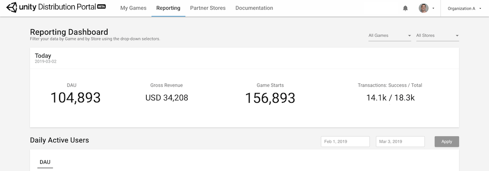

# Monitoring submission statuses and downloading builds

### Monitoring submission statuses

Once UDP starts processing your game, visit the **Status** panel to monitor progress and check the submission history of your game. Your game can have the following statuses :

- **Packing**: your game is being repacked with the SDK of the selected store.
- **Packed**: your game was successfully repacked with the SDK of the selected store.
- **Packing failed**: your game could not be repacked with the SDK of the selected store.
- **Submitted**: your game was successfully repacked with the SDK of the selected store and submitted to its Production environment.
- **Submission failed**: your game was successfully repacked with the SDK of the selected store but encountered a problem during the submission process.
- **Canceled**: your game submission was cancelled by you or someone from your Organization.
- **Vetting**: your game is being reviewed by the store’s content management team.
- **Accepted**: your game was accepted by the store’s content management team.
- **Rejected**: your game was rejected by the store’s content management team.
- **Going Live**: your game is being promoted to the storefront.
- **Live**: your game is now live on the storefront *(congratulations!)*.

For stores with a Beta environment (such as MOO Store) the following statuses may also occur:

- **Pushing to Beta**: your game was successfully repacked with the SDK of the selected store and is being synced to its Beta environment.
- **Ready for Beta**: your game was successfully repacked with the SDK of the selected store and synced to its Beta environment.
- **Beta push failed**: your game was successfully repacked with the SDK of the selected store, but could not be synced to its Beta environment.

Once your game is published to the store(s) you can monitor its performance from the [Reporting dashboard](Reporting.md).

### Downloading repacked builds

When you have repacked your build, pushed it to the test environment of the store, or submitted it to the production environment of the store, you can download your repacked build by clicking on **Download APK file** on the **Status** panel.

