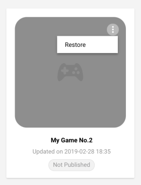

# My Games 

Access your UDP projects from the **My Games** section of the top navigation bar. This is where you can:

- switch between UDP projects
- create a new game
- archive and restore games

 

### Switch between UDP projects

Select the card of the game you want to work on. This sends you to the game’s corresponding **Game Info** page where you can [edit your game information](Editing_your_game_information_on_the_UDP_console.md), and from there [publish your game and view its status](Publishing_your_game_to_stores.md).

A game card has a status “Published” if it has been submitted to and accepted by at least one partner store.

### Create a new game

You can create a game placeholder on the UDP console, and later link it to an actual UDP project. 

Click on the blank card to create a new game. 

This sends you to your new game’s **Game Info** page where you can [edit your game information](Editing_your_game_information_on_the_UDP_console.md).

> **Note**: You need to link your Unity project with your **UDP client** in the Unity Editor (refer to [Generating a UDP client](Configuring_Unity_Distribution_Portal.md)).

**Why would I create my game from the UDP console**? Using the [Unity Organization](https://docs.unity3d.com/Manual/OrgsManagingyourOrganization.html) system, users can:

-  Create a game instance on the UDP console and prepare it for distribution (typically the Owner).

-  Give developers within the same Organization the UDP client ID so they can:
  - Integrate UDP
  - Build the game
  - Deploy it to the console. 

### Archive and restore your game

When you no longer need a game, the UDP console allows you to archive it. Note that you cannot delete the game on the UDP console.

To archive your game:

1. Go to the **My Games** panel.
2. Select your filters for the game. By default, you can see all active games.
   
3. When you hover over the game, you can see the **More** affordance. Archive your game by choosing **More > Archive**.  
   

To restore your game:

1. Go to the **My Games** panel.

2. Select the **Archived** filter. 
  
   
   
3. When you hover over the game, you can see the **More** affordance. Restore your game by choosing **More > Restore**. 

   

