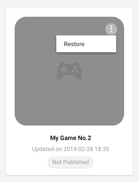

# Navigating the UDP console

## My Games 

Access your UDP projects from the **My Games** section of the top navigation bar. This is where you can:

* switch between UDP projects

* create a new game

* archive and restore games

### 

### Switch between UDP projects

Select the card of the game you want to work on. This will send you to the game’s corresponding **Game Info** page where you can [edit your game information](Editing-game-info.md), and from there [publish your game and view its status](Publishing-to-stores.md).

A game card has a status "Published" if it has been submitted to and accepted by at least one partner store.

### Create a new game

Click on the blank card to create a new game. 

This will send you to your new game’s **Game Info** page where you can [edit your game information](Editing-game-info.md).

<table>
  <tr>
    <td>**Important note**: you will need to link your Unity Project with your UDP Client in the Unity Editor (refer to Generating a Unity client).</td>
  </tr>
</table>

### Archive and restore your game

When you no longer need a game, the UDP console allows you to archive it. Note that you cannot delete the game on the UDP console.

To archive your game:

1. Go to the **My Games** panel.

2. Select your filters for the game. By default, you can see all active games.

3.  When you hover over the game, you can see the **More** affordance. Archive your game by choosing **More** > **Archive**. 

To restore your game:

1. Go to the **My Games** panel.

2. Select the **Archived** filter.

3. When you hover over the game, you can see the **More** affordance. Restore your game by choosing **More** > **Restore**.

## Reporting 

Monitor the performance of your published games from the **Reporting** section in the top navigation bar:

### 

The **Reporting** dashboard tracks the following data from the UDP stores your games were published to:

<table>
  <tr>
    <td>Metric</td>
    <td>Description</td>
  </tr>
  <tr>
    <td>Today</td>
    <td>Metrics for the present day: daily active users (DAU), Gross Revenue, Game Starts, and Transaction Success / Total</td>
  </tr>
  <tr>
    <td>DAU</td>
    <td>Daily active users</td>
  </tr>
  <tr>
    <td>Unique Devices</td>
    <td>The number of unique devices launching the game</td>
  </tr>
  <tr>
    <td>Revenue</td>
    <td>The gross revenue you receive from players</td>
  </tr>
  <tr>
    <td>Game Starts</td>
    <td>The percentage of new players for each day</td>
  </tr>
  <tr>
    <td>In-app Purchase: Total</td>
    <td>The total volume of IAP transactions</td>
  </tr>
  <tr>
    <td>In-app Purchase: Success</td>
    <td>The volume of successful IAP transactions</td>
  </tr>
</table>

You can filter the information presented on the Reporting dashboard by game and by store.

## Partner Stores

You can view the partner stores’ information from the **Partner Stores** section of the top navigation bar:

Click on the **More** link to access more information on a store: overview, FAQs, and other useful links specific to each store.

## Company Information

Before publishing your game to the UDP console, you need to create a company information profile. UDP sends this company information to the partner stores, who use it to populate the "About the developer" section of your game’s listing on their app store.  

1. On the [UDP console](https://distribute.dashboard.unity.com), choose your organization and click on the pencil icon to edit the profile.

2. Enter your company information.

<table>
  <tr>
    <td>Property</td>
    <td>Description</td>
  </tr>
  <tr>
    <td>Company Name</td>
    <td>The name of your company.</td>
  </tr>
  <tr>
    <td>Location</td>
    <td>The place where your company is located in.</td>
  </tr>
  <tr>
    <td>Company Size</td>
    <td>Use the drop-down to specify the number of people in your company.</td>
  </tr>
  <tr>
    <td>Official Website</td>
    <td>The official website of your company.</td>
  </tr>
  <tr>
    <td>Support Email Address</td>
    <td>The support email that you provide to users of your game or app.</td>
  </tr>
  <tr>
    <td>About</td>
    <td>Any additional information about your company.</td>
  </tr>
</table>
