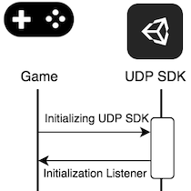

## Notion of IAP Catalog

Very important that you understand how the **IAP Catalog** works on UDP.

The IAP Catalog is an inventory of the IAP Products implemented in your game. For each IAP Product, you define a description, a price, a consumable type, and a Product ID.

Your game, once repacked and published on a store, will query its IAP inventory from the store’s back-end. The store is given your game’s IAP Catalog via UDP. When players make in-game purchases, your game asks the store to confirm the IAP Catalog. UDP must be properly implemented in your game for this step to work smoothly.

With UDP, the IAP Catalog you define in the Unity Editor is synced with the UDP Console (web portal). And when your game is repacked and submitted to a store, the IAP Catalog is synced with the store’s back-end:

The **IAP Catalog on UDP Console** is the keystone.

Unity takes care of the sync between the UDP Console and the store’s back-end.

This part is Unity’s responsibility and has been extensively tested before public preview release.

**It is crucial that the IAP Catalog implemented in the Editor syncs properly with the UDP Console**. That part relies on your implementation and requires that you closely follow the UDP implementation guidance.

A misguided implementation could break the IAP Catalog sync between the game client and the server, and typically result in symptoms in the final game such as:

- The wallet doesn’t appear when invoked
- IAPs are unresponsive

Which means your game is not able to monetize. 