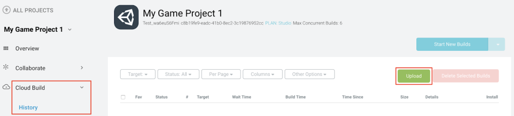
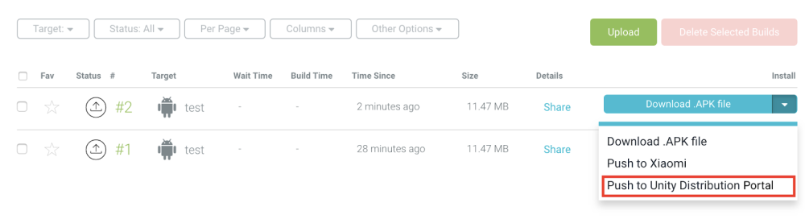

## Publishing your game to stores

The **Publish** panel is where you set the distribution of your game in motion. Remember that only RELEASED revisions can be published to stores. 

Select the stores you want to publish to, and follow these 4 steps for each store: 

* Sign up to the store

* Register your game with the store

* Select the Target Step

* Set Advanced settings

Click on the **PUBLISH** button once your set-up is complete for all stores.

### Sign up to the store

If this is the first time you work with this store, sign up for a store account. The sign-up redirects you outside the UDP console to complete your signup process with the store. 

<table>
  <tr>
    <td>**Note**: Only the Organization Owner and Manager can sign up with a store.</td>
  </tr>
</table>

Once you signed up to the store, this step will no longer be required.

**Note**: signing up to a store is based on your Unity Organization. If you return to the UDP console under a different Organization, you will be asked to sign up again and this will create a different account.

### Register your game with the store

Once you signed up, you can register your game with the store.

Confirm the package name you want to register with the store and click **REGISTER**.

**Note**: once your game is registered with the store, you can no longer change the package name for that store. 

### Select the Target Step

Select the target step that you want to take with the given store:

* **Repack Game**, which indicates the step where UDP packs your game with the SDK from the selected store.

* **Push to Test**, which indicates that the step where UDP packs and submits your game to the test environment of the selected stores. Note that not all stores have this target step.

* **Submit to Store**, which indicates the step where UDP packs and submits your game to the production environment of the selected stores.

### Countries and Advanced settings

Click **Countries** and select the countries that you want to distribute your game to. 

Click **Advanced** to configure more store-specific settings. 

The following properties can be configured specifically for a store:

<table>
  <tr>
    <td>Property</td>
    <td>Function</td>
  </tr>
  <tr>
    <td>Target SDK</td>
    <td>The version of the store SDK that you publish your game to. By default, UDP repacks for the latest version of the store SDK.</td>
  </tr>
  <tr>
    <td>IAP</td>
    <td>The name, price and currency for your IAP products</td>
  </tr>
  <tr>
    <td>Beta Users</td>
    <td>Specifies the users who can receive a link to the game. This list is inherited from the Beta Users list in the Game Info section, and can be further edited. 
Note that only stores with the Test target step have this property. </td>
  </tr>
</table>

### Publish

Once you completed all the above steps, select each store you want to submit this game revision to, and click on the **PUBLISH** button. 

Remember that only the latest released revision of your game will be taken through the target steps selected for each store.

## Monitoring submission status 

Once UDP starts processing your game, visit the **Status** panel to monitor progress and check the submission history of your game.

 You can filter the dashboard by store, target step, and status.

The Status states are the following:

* **Packed**, which indicates that your game has been packed with the SDK from the selected store.

* **Pushed to Test**, which indicates that your game has been packed and synced to the test environment of the selected store.

* **Published**, which indicates that your game has been packed and synced to the productive environment of the selected store.

* **Pending**, which indicates the process, such as packing and vetting, is ongoing.

* **Failed**, which indicates the process, such as packing and vetting, has failed.

Once your game is published to the store(s) you can monitor its performance from the [Reporting dashboard](Navigating-UDP-console.md).