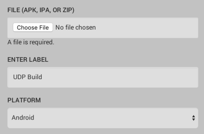
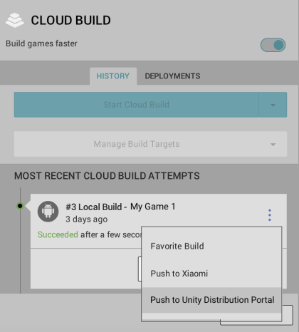

# Pushing the build to the UDP console via Cloud Build

In the Editor, enable Cloud Build through the Unity Services window (see documentation on [Cloud Build implementation](https://docs.unity3d.com/Manual/UnityCloudBuild.html)).

You can upload your game build to the build history of your Project, and push it to UDP either <u>via the Editor</u>, or <u>via the Unity Cloud Build Developer Dashboard</u>.

### Upload and Deploy via the Unity Editor

**Step 1 - Upload your UDP build:**

In the **Cloud Build Services window**, if you haven't uploaded any build before, select **Upload Build**. 

In **FILE**, choose the APK of your UDP build, enter a useful **LABEL**, and set the **PLATFORM** field to Android.

Select **UPLOAD** , and let it complete the upload process.

**Step 2 - Push your build to UDP**

In the **Cloud Build Services** window, locate the desired build from the build **History** timeline and select **Push to Unity Distribution Portal**. Verify that you want to push, and that the action completes.

### Upload and Deploy via the Unity Cloud Build Developer Dashboard

**Step 1 - Upload your UDP build**

In the [Unity Developer Dashboard](https://developer.cloud.unity3d.com/build), navigate to your Project’s **Cloud Build > History.**

Select **Upload**, then select your APK file.

Uploading a build via the Cloud Build Developer Dashboard.

**Step 2 - Push the build to UDP**

From your Project’s **Cloud Build History,**

Click the arrow next to **Download .APK file** to expand the drop-down menu, then select **Push to Unity Distribution Portal.**

​           Pushing a hosted build to UDP via the Unity Cloud Build Developer Dashboard.