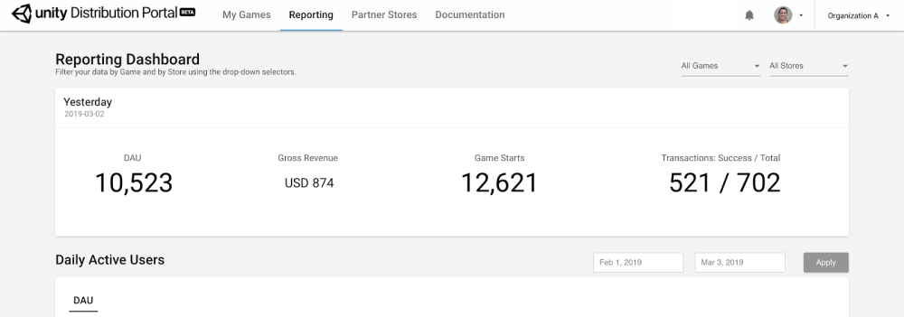
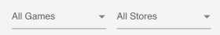

## Reporting 

Monitor the performance of your published games from the **Reporting** section in the top navigation bar:

The **Reporting** dashboard tracks the following data from the UDP stores your games were published to:

| Metric                   | Description                                                  |
| ------------------------ | ------------------------------------------------------------ |
| Today                    | Metrics for the present day: **daily active users (DAU), Gross Revenue, Game Starts, and Transaction Success / Total** |
| DAU                      | Daily active users                                           |
| Unique Devices           | The number of unique devices launching the game              |
| Revenue                  | The gross revenue you receive from players                   |
| Game Starts              | The percentage of new players for each day                   |
| In-app Purchase: Total   | The total volume of IAP transactions                         |
| In-app Purchase: Success | The volume of successful IAP transactions                    |

You can filter the information presented on the Reporting dashboard by game and by store.

**Important note**: revenue data on the Reporting dashboard is estimated; definite numbers must be sought directly from the stores.

