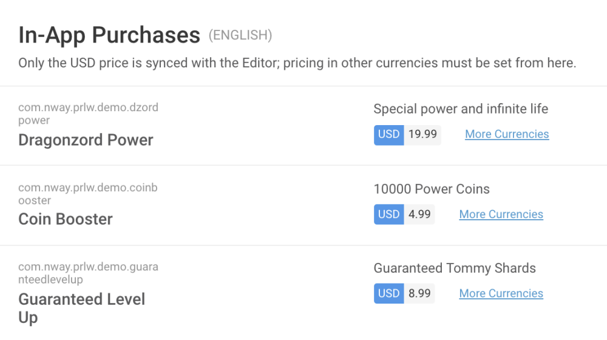

# Save / Sync / Push your IAP Catalog

You wouldn’t close a JSON file you spent an hour writing without saving it first, right?

Think of your IAP Catalog in the same way. 

**Save it before you close it, and before building your game.** 

**Double-check it has synced properly with the UDP console.**

Here, “saving” is called 

- **Sync** (in the Unity IAP implementation) 
- **Push** (in the UDP Package implementation)

Other than naming, the two implementations have a slightly different process.

### Case of UDP implementation via Unity IAP

In the **IAP Catalog** of Unity IAP:

You have to **Sync to UDP** every IAP Product that you add to the catalog under the **UDP Configuration** section, using the button immediately below the price field:

Otherwise your IAP Product is not synced with the IAP Catalog on the UDP Console.

This results in this IAP Product not being synced with the store.

**Warning**: closing the IAP Catalog without syncing the changes **doesn’t** pop any warning message, so until we add that in, make sure sync your IAP Products diligently.

The best way to be sure all your IAP Products are synced is to **check the UDP Console**.

### Case of UDP implementation via the UDP Package

In the **IAP Catalog** in the UDP Settings window, when you add / change IAP Products, make sure you save them to the UDP Console by using the PUSH functions:

The top **Push** button syncs everything with the UDP console (all IAP Products, Game Title, Settings, Test Accounts)

The Product-specific **Push** only syncs the information about that IAP Product.

The top **Pull** button retrieves the latest UDP Settings that were saved on the UDP Console (all IAP Products, Game Title, Settings, Test Accounts). It also overrides any unsaved inputs in your Editor window.

Keep an eye out for any unsaved changes:

The “edited” label disappears once your IAP Product is synced.

**Warning**: closing the UDP Settings inspector window without pushing the changes **doesn’t** pop any warning message, so until we add that in, make sure push your IAP Products diligently.

### Double-check your IAP Catalog on the UDP Console

So you’ve synced / pushed all your IAP Products from the Editor side.

It’s always best to make sure the UDP Console has received them well.

On the [UDP Console](https://distribute.dashboard.unity.com/udp), find the **In-App Purchases** section under your project’s **Game Info** tab:

If IAP Products are missing, or are different across IAP Catalogs, you have a problem to look into, due either to [point 1/](Do not mix the implementations.md) or to [point 2/](Save Sync Push your IAP Catalog.md)

**Reminder**: if you [implemented your IAPs directly in code](https://docs.unity3d.com/Manual/UnityIAPDefiningProducts.html), you have to enter your IAP products manually on the UDP console, and be vigilant that the Product IDs match the ones implemented in your code. For more information, see [Editing in-app purchases](Editing_your_game_information_on_the_UDP_console.md).

