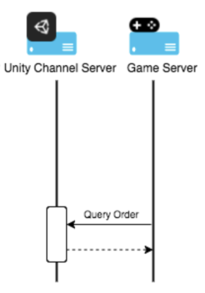

# Server-side implementation of UDP

The server-side integration consists of the following steps:

- Query orders
- Receive callback notifications

### Querying Orders

Your game can query UDP about orders by calling an HTTP GET request.



Querying UDP about orders：

```
/udp/developer/api/order?orderQueryToken=<orderQueryToken>&orderId=<orderId>&clientId=<clientId>&sign=<sign>
```


Parameters in the request:

<table>
    <tr>
        <td>Attribute name</td>
        <td>Format</td>
        <td>Required/Optional</td>
        <td>Description</td>
        <td>Example</td>
    </tr>
    <tr>
        <td>orderQueryToken</td>
        <td>String</td>
        <td>Required</td>
        <td>The order query token returned by the client SDK when finishing a purchase. The token needs to be encoded Base64 before being used in the query.(UDP SDK will return PurchaseInfo.OrderQueryToken)</td>
<td style="word-break:break-all;">eyJjaGFubmVsUHJvZHVjdElkIjoiaWFwLl9mM2YzZiIsImNoYW5uZWxUeXBlIjoiQVBUT0lERSIsImNsaWVudElkIjoiQUFJZ3g5VmNGaDJZQ1ZxbUs2VWNDUSIsImNwT3JkZXJJZCI6IjJhNGQ5MWY4NDgzZjQ3YjlhYzFhNGY5MDAwZDVhNTRhIiwicGFja2FnZU5hbWUiOiJjb20udW5pdHkudW5pdHl0ZXN0Z2FtZV9mZWZ3In0=
        </td>
    </tr>
  <tr>
        <td>orderId</td>
        <td>String</td>
        <td>Required</td>
        <td>The orderId returned by the client SDK when finishing a purchase.(UDP SDK will return PurchaseInfo.GameOrderId)</td>
        <td >2a4d91f8483f47b9ac1a4f9000d5a54a
        </td>
    </tr>
   <tr>
        <td>clientId</td>
        <td>String</td>
        <td>Required</td>
        <td>The clientId can be found in the Game info - integration information of UDP console</td>
        <td >AAIgx9VcFh2YCVqmK6UcCQ
        </td>
    </tr>
    <tr>
        <td>sign</td>
        <td>String</td>
        <td>Required</td>
      <td>Generate signature with orderQueryToken and client secret, MD5.hash(orderQueryToken + clientSecret).</br>
Client Secret can also been found in the Game info - integration information of UDP console.
 </td>
      <td style="word-break:break-all;">Client Secret:  KKcCyAgej06MxjKX31WuFNeHSaTJAjLDlgoDWsPJDAM </br></br>
Sign:
90a4e440897623c7cd0b2b80a97c267e</td>
</tr>
</table>

  

Parameters in the response：

| Attribute name | Format                                        | Required /optional | Description                                                  | Example                      |
| -------------- | --------------------------------------------- | ------------------ | ------------------------------------------------------------ | ---------------------------- |
| clientId       | String                                        | Required           | The clientId that is returned by Unity after the game has created a client in the Unity IAP. | Q4AnJDW2-rxLAPujqrk1zQ       |
| cpOrderId      | String                                        | Required           | The order ID assigned by your game, or Unity if the game does not generate it. | 66mea52wne                   |
| channelType    | String                                        | Required           | Channel type                                                 | APTOIDE,CLOUDMOOLAH          |
| status         | String                                        | Required           | Indicates the status of the order.                           | SUCCESS, FAILED, UNCONFIRMED |
| productId      | String                                        | Required           | The product ID associated with the order                     | product_1                    |
| amount         | String                                        | Required           | The payment amount of the order                              | 1                            |
| quantity       | Integer                                       | Required           | Indicates the quantity of the product.                       | 1                            |
| currency       | ISO 4217                                      | Required           | The currency used to purchase the product                    | CNY                          |
| country        | ISO 3166-2                                    | Required           | The country or geographic region in which the user is located | CN                           |
| paidTime       | ISO8601 yyyy-MM-ddThh:mm:ssXXX， UTC timezone | Required           | Specifies the time when the order is paid.                   | 2017-03-08T06:43:20Z         |
| rev            | String                                        | Required           | The revision of the order (only for update)                  | 0                            |
| extension      | Json String                                   | Optional           | The developer payload used to add reference information      | {"abc" : "123"}              |


Here is an example request from your game server to the UDP server and response from the UDP server back to your game server：

**The content of the orderQueryToken:**

```
{“channelProductId”:“iap._f3f3f”,“channelType”:“APTOIDE”,“clientId”:“AAIgx9VcFh2YCVqmK6UcCQ”,“cpOrderId”:“2a4d91f8483f47b9ac1a4f9000d5a54a”,“packageName”:“com.unity.unitytestgame_fefw”}
```

**Being encoded using Base64, the orderQueryToken:**

```
eyJjaGFubmVsUHJvZHVjdElkIjoiaWFwLl9mM2YzZiIsImNoYW5uZWxUeXBlIjoiQVBUT0lERSIsImNsaWVudElkIjoiQUFJZ3g5VmNGaDJZQ1ZxbUs2VWNDUSIsImNwT3JkZXJJZCI6IjJhNGQ5MWY4NDgzZjQ3YjlhYzFhNGY5MDAwZDVhNTRhIiwicGFja2FnZU5hbWUiOiJjb20udW5pdHkudW5pdHl0ZXN0Z2FtZV9mZWZ3In0=
```

**orderId**:

```
2a4d91f8483f47b9ac1a4f9000d5a54a
```

**clientId**:

```
AAIgx9VcFh2YCVqmK6UcCQ
```

**clientSecret**:

```
KKcCyAgej06MxjKX31WuFNeHSaTJAjLDlgoDWsPJDAM
```

**Sign**:

```
90a4e440897623c7cd0b2b80a97c267e
```

**Request**:

```
Get 
https://distribute.dashboard.unity.com/udp/developer/api/order?orderQueryToken=eyJjaGFubmVsUHJvZHVjdElkIjoiaWFwLl9mM2YzZiIsImNoYW5uZWxUeXBlIjoiQVBUT0lERSIsImNsaWVudElkIjoiQUFJZ3g5VmNGaDJZQ1ZxbUs2VWNDUSIsImNwT3JkZXJJZCI6IjJhNGQ5MWY4NDgzZjQ3YjlhYzFhNGY5MDAwZDVhNTRhIiwicGFja2FnZU5hbWUiOiJjb20udW5pdHkudW5pdHl0ZXN0Z2FtZV9mZWZ3In0%3D&orderId=2a4d91f8483f47b9ac1a4f9000d5a54a&clientId=AAIgx9VcFh2YCVqmK6UcCQ&sign=90a4e440897623c7cd0b2b80a97c267e
```

**Response**:

```
{
"ClientId":"AAIgx9VcFh2YCVqmK6UcCQ",
"CpOrderId":"2a4d91f8483f47b9ac1a4f9000d5a54a",
"ProductId":"iap._f3f3f",
"ChannelType":"APTOIDE",
"Currency":"APPC",
"Amount":"0.1",
"Country":"HK",
"Quantity":1,
"Rev":"0",
"Status":"SUCCESS",
"PaidTime":"2019-06-12T03:59:42Z",
"Extension":"unity://unity3d.com?cpOrderId=2a4d91f8483f47b9ac1a4f9000d5a54a\u0026payload=payload2"
}
```

### Receiving callback notifications

After a purchase succeeds, if you have specified a callback URL, the UDP server notifies the game server with the payment result. Implement an HTTP GET request and accept the following query parameters:

| Attribute Name | Format      | Required/Optional | Description                                                  |
| -------------- | ----------- | ----------------- | ------------------------------------------------------------ |
| payload        | Json String | Required          | The contents of the purchase order. See more in [Json payload](#json_payload). |
| signature      | String      | Required          | The PKCS1 v1.5 signature of the payload                      |

**Using the certificate**

You can verify the certificate using the Unity Client RSA Public Key. If the certificate passes verification, extract the RSA public key from the certificate and use this key to verify the signature. The signature is generated by encrypting the payload with the by RSA-SHA1 algorithm. 

Here is an example：

**Public key:**

```
MIIBIjANBgkqhkiG9w0BAQEFAAOCAQ8AMIIBCgKCAQEA4qxbtUqsrvwk2FZ+F2J0EkUDKLdZSVE3qPgxzKxOrgScGrCZULLav9CPzRP91HN9GccvmShH2bsegP3RVtMdwU1eV7C2JdOW1sylCyKIgylCT8tLdQeUMRaIlt7fOfl+k3bkUouWJx8WnrQYM6a7oDeCGklIlekvpQ2NcS1eg7Jp646vBzyu8FMBiuj5LZOhCJg/XXs0kRpvSOBAPndUu/HgqD9aFaXNZBxMN++efxq6PnAVRzRdTtRur+OZSBGjXxgaBKrdbXCkEM3fkMgXP9egq6vnzCiQhZ7UDFXtXQ3DPqviqrTY5WsR9t4X6JxCXo6yGlQAEK/ft9MWN13nrQIDAQAB
```

**Request body:**

```
{
    "signature": "swWWZpg0/Y26XBohvqqC/for4nyhS5zwzru5s8AJI7YYC+ECHOk7KQjOyFw7cWxM3QNpd7N7E7Umy3vYwDXjV2Y4BLnuJy5gGIpO5jKU4xBNQf793FmI0Fk93YrU31QyiIjXymg1O/H1nKSJXqMz6bycBugiStqsuGp1/CctTHE0Dpv4hC6fZoNWIHYpPJQuKh4DyP1lgE32omcuKUh7IAQduRPDa+qiYJRCA8bV17xK6T8ajS3RlhKue9hjE2a21t8p017ViaOS5OWdzptUwgnWaFi6gs1k0cjdn7o/0QJEgk5j6a8WYE/S8F7YfsYcAwUQV4KY3ex0ULsH3GQEGA==",

    "payload": "{\"ClientId\":\"Q_sX9CXfn-rTcWmpP9VEfw\",\"CpOrderId\":\"0bckmoqhel5yd13f\",\"ProductId\":\"com.mystudio.mygame.productid1\",\"ChannelType\":\"APTOIDE\",\"Currency\":\"APPC\",\"Amount\":\"1.01\",\"Country\":\"CHINA\",\"Quantity\":1,\"Rev\":\"0\",\"Status\":\"SUCCESS\",\"PaidTime\":\"2018-09-28T06:43:20Z\",\"Extension\":\"{\\\"key\\\":\\\"value\\\"}\"}"

}
```

**A code sample showing how to verify the certificate in Go:**

```
func verify(data []byte, publicKey string, sign string) bool {

   decodePublic, err := base64.StdEncoding.DecodeString(publicKey)

   if err != nil {

       panic(err)

   }

   pubInterface, err := x509.ParsePKIXPublicKey(decodePublic)

   if err != nil {

       panic(err)

   }

   pub := pubInterface.(*rsa.PublicKey)

   decodeSign, err := base64.StdEncoding.DecodeString(sign)

   if err != nil {

       return false

   }

   sh1 := sha1.New()

   sh1.Write(data)

   hashData := sh1.Sum(nil)

   err = rsa.VerifyPKCS1v15(pub, crypto.SHA1, hashData, decodeSign)

   if err != nil {

       return false

   }

   return true

}
```

Here is the content of a <a id="json_payload">JSON payload</a>:

| Attribute Name | Format                                     | Required/Optional | Description                                                  | Example                        |
| -------------- | ------------------------------------------ | ----------------- | ------------------------------------------------------------ | ------------------------------ |
| cpOrderId      | String                                     | Required          | The unique order identifier assigned by your game.           | 0bckmoqhel5yd13f               |
| status         | String                                     | Required          | Indicates the status of the order.                           | SUCCESS                        |
| amount         | String                                     | Required          | Specifies the amount of money that the order cost.           | 1.01                           |
| productId      | String                                     | Required          | Specifies the unique identifiers of the products that belong to the order. | com.mystudio.mygame.productid1 |
| payTime        | ISO8601 yyyy-MM-ddThh:mm:ssZ, UTC timezone | Required          | The time when the order was paid.                            | 2018-09-28T06:43:20Z           |
| country        | ISO 3166-2                                 | Required          | The country where the order was paid.                        | CHINA                          |
| currency       | ISO 4217 or cryptocurrency type            | Required          | The currency of the country where the order was placed.      | APPC                           |
| quantity       | Integer                                    | Required          | The number of products in the order.                         | 1                              |
| clientId       | String                                     | Required          | The unique client identifier that is returned after your game generates a client in Unity IAP. | Q_sX9CXfn-rTcWmpP9VEfw         |
| extension      | String                                     | Optional          | The developer payload which is used to contain reference information for developers. | "{\"key\":\"value\"}"          |