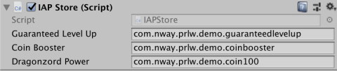

## Set your Product IDs correctly

Make sure that, after you implemented all your IAP Products in your game, you collect and double-check all the **Product IDs** you set in the IAP Catalog.

For instance: the event “purchase ItemNo1” (triggered when player confirms he/she wants to purchase “ItemNo1”) will reference its Product ID. Your IAP Catalog must use the exact same Product ID for the product “ItemNo1”.

In the below example, the IAP Store component is used to list the game’s IAP Product IDs:

The Product IDs must be copied into the IAP Catalog, and the Catalog must be synced with the UDP console, for the in-game purchases to properly go through the UDP system.

**IMPORTANT NOTE**: Product IDs must follow these requirements:

- Product IDs must start with a letter or a digit;
- Product IDs must be only composed of letters, digits, dots (.) and underscores (_)
- Product IDs must not use capitalized letters

UDP stores will reject your game if a Product ID is invalid; in such cases you will be notified of a rejection for the reason “Error: internal server error”.

