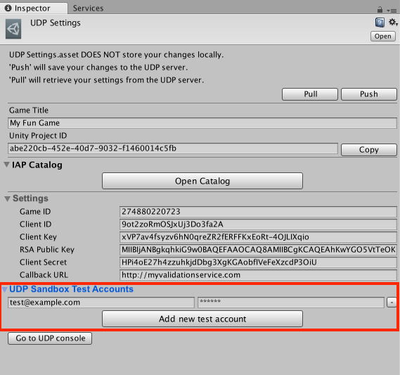

## Test your IAPs in the Sandbox environment 

If you have a problem upstream, it will not solve itself downstream. Test that your IAPs are working **<u>in your generic UDP build</u>**, before you push it to UDP and have it repacked and submitted to the stores.

Once you built your APK, run it in the emulator or on a real Android device, using the UDP Sandbox Test Environment. 

You can set Sandbox Test Accounts directly from inside the UDP Settings window:

*Sandbox Test Accounts in [UDP Settings] inspector, for UDP Package:*

Sandbox Test Accounts in [UDP Settings] inspector, for UDP IAP:

**Test your IAPs from the emulator or from a real device**. If your purchase buttons are unresponsive, or generally if you cannot make a purchase work in the Sandbox environment, something has been implemented incorrectly in your game. [Check your IAP implementation](Check_your_IAP_implementation.md) and fix it before pushing to the UDP console and then the stores.

