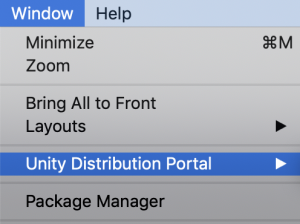
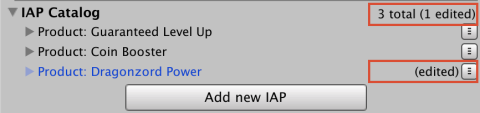

# UDP Package

### How do I get the UDP Package?

**From the Package Manager**

From the Unity Editor’s top menu: **Window > Package Manager:**

Select the tab **All** and look for Unity Distribution Portal:

General info on the Package Manager can be found [here](https://docs.unity3d.com/Packages/com.unity.package-manager-ui@2.1/manual/index.html).

**From the Asset Store**

No access to Unity Package Manager? No problem. 

Download the **UDP Package** from the [Unity Asset Store](https://assetstore.unity.com/packages/add-ons/services/billing/unity-distribution-portal-138507) and install it in your project.

### Editor UI elements for UDP implementation via UDP Package

So you [installed the UDP Package](UDP_Package.md).

You should ONLY have “Unity Distribution Portal” in the **Window** menu.

(as in, you should NOT have Window > Unity IAP)

Everything you need is in the UDP Settings inspector window:

**Window > Unity Distribution Portal > Settings**

The IAP Catalog for UDP is directly included in the UDP Settings window:

Make sure that when you add / change IAP Products, you save them to the UDP Console by using the PUSH functions:

The top **Push** button will sync everything with the UDP console (all IAP Products, Game Title, Settings, Test Accounts)

The Product-specific **Push** will only sync the information about that IAP Product.

The top **Pull** button will retrieve the latest UDP Settings that were saved on the UDP Console (all IAP Products, Game Title, Settings, Test Accounts). It will also override any unsaved inputs in your Editor window.

**Don’t forget to PUSH your IAP Product changes once you’re done, and BEFORE you go on to build your game client.**

Keep an eye out for any unsaved changes:

The “edited” label disappears once your IAP Product is synced.

Remember that in the case of an implementation via UDP Package, you need to explicitly implement in your game the IAP-related steps explained in [this section of the UDP Documentation](Client-side_implementation_of_UDP.md).

