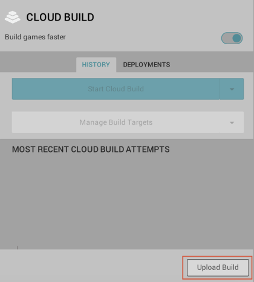

### Upload and Deploy via the Unity Editor

#### Step 1 - Upload your UDP build:

In the **Cloud Build Services window**, if you haven't uploaded any build before, select **Upload Build**. 

In **FILE**, choose the APK of your UDP build, enter a useful **LABEL**, and set the **PLATFORM** field to Android.

Select **UPLOAD** , and let it complete the upload process.

#### Step 2 - Push your build to UDP

In the **Cloud Build Services** window, locate the desired build from the build **History** timeline and select **Push to Unity Distribution Portal**. Verify that you want to push, and that the action completes.
