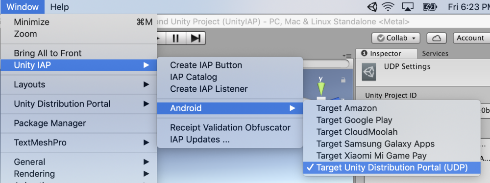
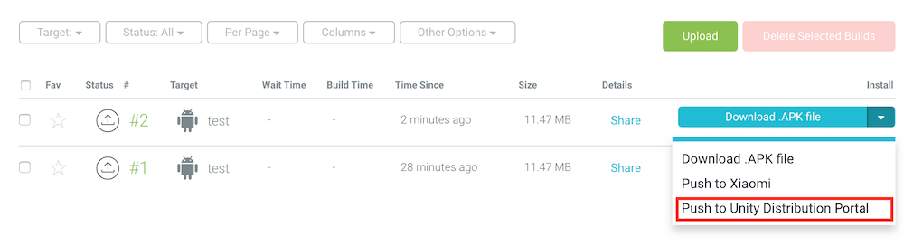
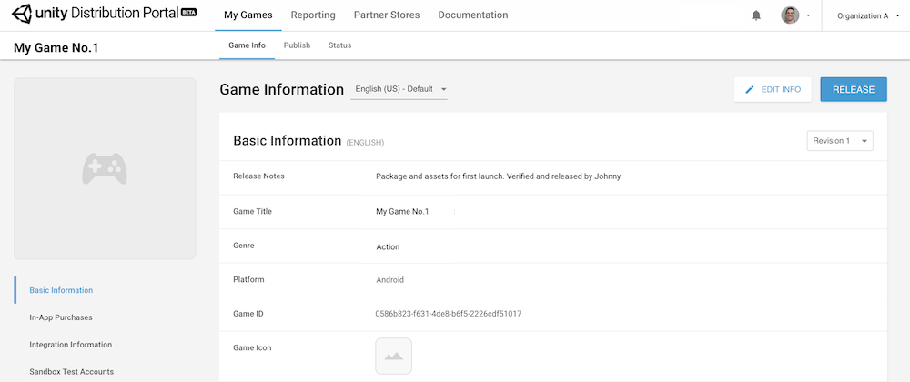

# Using Unity IAP

If you want to use UDP with Unity IAP instead of the UDP package, [set up Unity IAP](https://docs.unity3d.com/Manual/UnityIAPSettingUp.html). 

**Note**: If you choose to implement UDP with Unity IAP (instead of using the UDP package) then implement via Unity IAP only. More information on this [here](Do_not_mix_the_implementations.md).

Once you have implemented your game’s in-app purchases with Unity IAP, take the following steps to set up UDP with Unity IAP.

### Set UDP as build target

In the Unity Editor, to choose UDP as the target platform for the game to build, select Unity **IAP > Android > Target Unity Distribution Portal (UDP)**

### Fill in the IAP Catalog

Refer to [this section](Before_you_begin_know_this.md) to understand how the IAP Catalog works in the UDP context.

To configure the IAP catalog, select **Window > Unity IAP > IAP Catalog** and for each IAP product fill in the following fields:

- **ID**, the unique identifier of the IAP product
- **Type**, consumable or non-consumable
- **Title**, the name of the IAP product
- **Description**, a short description of the IAP product
- **Price**, the price of the IAP product (in USD). This field is found directly under the **Unity Distribution Portal Configuration** section

Save your IAP product by clicking on **Sync to UDP.**

> **Important note**: remember to **Sync to UDP** every individual IAP product that you add to the catalog under the **UDP Configuration** section, using the button immediately below the price field:

 

 

> Refer to [this section](Save_Sync_Push_your_IAP_Catalog.md) of the Troubleshooting Guide to ensure your IAP Catalog is properly saved.

**Note**: if you choose NOT to use the Codeless way of implementing Unity IAP, you will have to manually create and sync your IAP Catalog on the UDP Console. [More info here](Editing_your_game_information_on_the_UDP_console.md).

