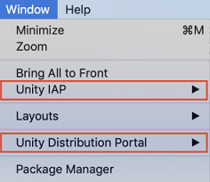
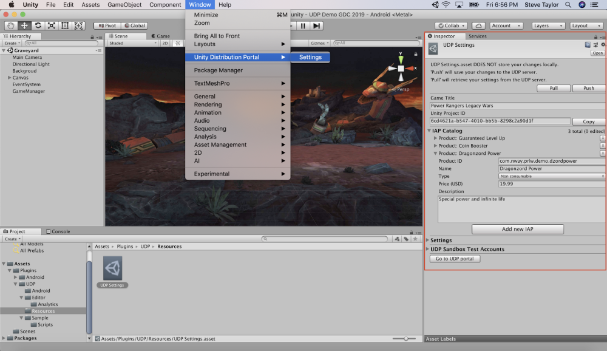
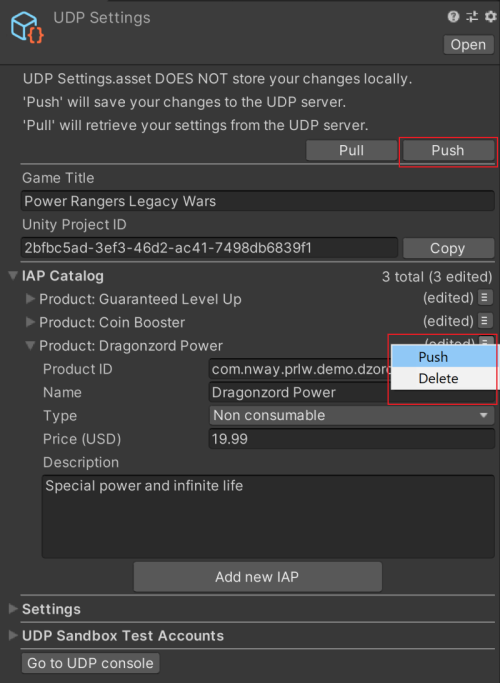

# Best practices

## Purpose

The purpose of this section is to help you verify your UDP implementation is correct, and identify, avoid, or extract yourself from implementation problems. This goes deeper than the [FAQs ](#faq.md)and you should read this before beginning your implementation.

## Notion of IAP Catalog

It is important to understand how the **IAP Catalog** works on UDP.

The IAP Catalog is an inventory of the IAP items implemented in your game. For each IAP item, you define a:

* description
* price
* consumable type
* Product ID

Your game, once repacked and published on a store, will query its IAP item inventory from the store’s back-end. The store is given your game’s IAP Catalog via UDP. When players make in-game purchases, your game asks the store to confirm the IAP Catalog. UDP must be properly implemented in your game for this step to work smoothly.

The IAP Catalog you define in the Unity Editor is synced with the UDP console. 

When your game is repacked and submitted to a store, the IAP Catalog is synced with the store’s back-end.

The **IAP Catalog on UDP Console** is the source of truth for what is submitted to the store’s back-end systems.

If you maintain an IAP Catalog in your game client, your IAP Catalog must be able to sync properly between the Unity Editor and the UDP Console. A misguided implementation of UDP in your game client could prevent the sync from working. Typical symptoms of such a problem in your game would be:

* The wallet doesn’t appear when invoked
* In-app purchases are unresponsive

If these symptoms occur in your generic UDP build, address them right away. They are not solved downstream when the game gets repacked. Failure to address such issues will mean that your game cannot monetize in players’ hands.

We recommend you closely follow the UDP implementation guidance to ensure this is the case. Make sure also that you [test your game in the UDP Sandbox environment](#test) to ensure that your IAPs behave properly.

If you do not maintain an IAP Catalog in your game client (for instance, your IAP items are maintained solely on your game server) you can still implement and use UDP. 

You will have to create an IAP Catalog on the UDP Console, as all stores maintain an IAP Catalog on their back-end and UDP must pass them the corresponding information. See [In-App Purchases](managing-and-publishing-your-game.html#iap) to understand how to create this setup.

## UDP implementation

From the following package versions and above, you can use the UDP and Unity IAP packages together:

* UDP - 2.0.0
* Unity IAP - 2.0.0 (Asset Store version)

If you are using older package versions, you cannot use both packages. In this case, implement UDP in one of the following ways:

* [Using Unity IAP](getting-started.html#using-iap)
* [Using the UDP Package](getting-started.html#using-udp)

**Note:** Choose one implementation method only. 
Do not install the UDP Package in your project if you are already using Unity IAP. 
Do not enable Unity IAP, if you decided to implement using the UDP Package.

You will receive errors (either in the Unity Editor console or as a popup) if:

* You have the UDP package installed and then try to install Unity IAP.
* You have the Unity IAP package installed and then try to install the UDP package from the Package Manager.
* You have the Unity IAP or UDP package installed from the Package Manager and then try to install the UDP package from the Asset Store.

This can cause your game client to fail to sync its IAP items with the stores' servers.

If you find out you have mixed the two UDP implementations, decide which one you want to keep and remove the other.

If you choose to implement with the UDP Package, disable Unity IAP.

If you choose to implement via Unity IAP, you must 

1. Uninstall the UDP Package.
2. Install Unity IAP (re-import if needed).

See [UDP in the Unity Editor](#udp-in-editor) to double-check you’re getting the correct UI elements for the implementation of your choice.

**Note:** The Unity IAP package (1.22.0-1.23.5) contains a UDP DLL. If you implement UDP in this way, the **Window** menu displays both **Unity IAP** and **Unity Distribution Portal**.

## UDP in the Unity Editor

You can implement UDP in your game:

* [Using Unity IAP](getting-started.html#using-iap)
* [Using the UDP Package](getting-started.html#using-udp)

This section shows how the Editor UI looks in each case.

### Editor UI for the UDP Package (up to 2019.4)

So you [installed the UDP Package](setting-up-udp.html#install).

You should only have **Unity Distribution Portal** in the **Window** menu (that is, you should not have Window > Unity IAP).

To open the **UDP Settings** window, select **Window > Unity Distribution Portal > Settings**

The **IAP Catalog** for UDP is directly included in the **UDP Settings** window:

When you add / change IAP Products, use the **Push** buttons to save them to the UDP Console.

The top **Push** button syncs everything with the UDP console (all IAP Products, Game Title, Settings, Test Accounts).

The Product-specific **Push** only syncs the information about that IAP Product.

The top **Pull** button retrieves the latest UDP Settings that were saved on the UDP Console (all IAP Products, Game Title, Settings, Test Accounts). It also overrides any unsaved inputs in your Editor window.

Make sure you [push your IAP Product](#save) changes when you’re done, and before you build your game client.

For implementations via the UDP Package, you need to explicitly implement in your game the methods explained in [Game client implementation with the UDP Package](setting-up-udp.html#packman-install).

### Editor UI for the UDP package (2020.1 and above)
In Unity Editor versions 2020.1 and above, the UDP package contains separate windows for:

* IAP Catalog
* Settings

#### UDP Settings
The UDP Settings are displayed in the **Project Settings** window, under **Services**.
To access the UDP settings, select **Window** > **Unity Distribution Portal** > **Settings**.
Use the **Settings** window to configure the UDP settings.

Use the **Push** and **Pull** buttons to push and pull changes to your settings to and from the UDP console. This does not push changes made in the IAP Catalog.

#### IAP Catalog

Use the **IAP Catalog** window to add and modify IAP items, and push them to the UDP console.
To push changes for individual items, select the **Push** button for the specific item.
To push all changes you make in the window, select the **Push** button at the top of the **IAP Catalog** window.

### Editor UI for UDP with Unity IAP

So you have [Unity IAP 1.22.0-1.23.5 installed](setting-up-udp.html#install-with-iap). These versions include a version of the UDP package.

The **Window** menu displays both **Unity IAP** and **Unity Distribution Portal**.

* **Unity Distribution Portal >** gives you access to the UDP Settings window specific to the Unity IAP implementation. 

* **Unity IAP >** gives you access to the regular Unity IAP features, including the IAP Catalog.

#### UDP Settings

To open the **UDP Settings** window, select **Window > Unity Distribution Portal > Settings**.

The **UDP Settings** window, for Unity IAP, looks like this:

In the **UDP Settings** window, you can only set Game Title, Test Account Settings, and view/copy some the UDP client settings. This also contains the **Open Catalog** button, to open the IAP Catalog window.

#### IAP Catalog

The IAP Catalog is in a separate window, accessed via the **Open Catalog** button, or via the menu  **Window > Unity IAP > IAP Catalog**:

The Unity IAP Catalog has a dedicated UDP section. You must enter your IAP Products here and click **Sync to UDP** for each product to add them to the UDP Catalog:

## Save / Sync / Push your IAP Catalog

Save your IAP Catalog before you close it, and before building your game. 

Double-check it has synced properly with the UDP console.

Here, "saving" is called 

* **Sync** (in the Unity IAP implementation) 
* **Push** (in the UDP Package implementation)

Other than naming, the two implementations have a slightly different process.

### Implementation via Unity IAP

In the **IAP Catalog** of Unity IAP:

You have to **Sync to UDP** every IAP Product that you add to the catalog under the **UDP Configuration** section, using the button immediately below the price field:

Otherwise your IAP Product is not synced with the IAP Catalog on the UDP Console.

This results in this IAP Product not being synced with the store.

**Warning:** closing the IAP Catalog without syncing the changes doesn’t pop any warning message, so make sure to sync your IAP Products diligently.

The best way to be sure all your IAP Products are synced is to [check the UDP Console](#check).

**Note:** With Unity IAP, the sync of the IAP Catalog is **unidirectional**: from the Editor to the UDP Console only.

You can (and must) **Push** your IAP Products from the Editor to the UDP Console, as explained above.

You cannot **Pull** your IAP Products from the UDP Console into the Editor. The Pull button found in the **UDP Settings** window only retrieves the Game Title, Settings, and UDP Sandbox Test Accounts last saved on the UDP Console. It does not retrieve the IAP Catalog set up on the UDP Console. If you intend to modify your IAP Products on the UDP Console after your game is built, make sure you implement the AddProduct method before querying your IAP inventory. See [Querying IAP inventory](games-with-iap.html#query-iap) for details.

### Implementation via the UDP Package

In the **IAP Catalog** in the **UDP Settings** window, when you add / change IAP Products, make sure you save them to the UDP Console by using the PUSH functions:

The top **Push** button syncs everything with the UDP console (all IAP Products, Game Title, Settings, Test Accounts).

**Note**: For Unity Editor version 2020.1 and above, the IAP Catalog is available in a separate window. In this case, the **Push** button in the UDP Settings window only pushes the UDP settings.

The Product-specific **Push** only syncs the information about that IAP Product.

The top **Pull** button retrieves the latest UDP Settings that were saved on the UDP Console (all IAP Products, Game Title, Settings, Test Accounts). It also overrides any unsaved inputs in your Editor window.

If you have any unsaved changes, an **edited** label is displayed.

The **edited** label disappears once your IAP Product is synced.

**Warning:** closing the UDP Settings inspector window without pushing the changes doesn’t pop any warning message, so make sure to push your IAP Products diligently.

**Note:** With the UDP Package, the sync of the IAP Catalog is **bidirectional**.

You can (and must) **Push** your IAP Products from the Editor to the UDP Console, as explained above.

You can also **Pull** your IAP Products from the UDP Console into the Editor. The Pull button retrieves the Game Title, Settings, and UDP Sandbox Test Accounts, and entire IAP Catalog that were last saved on the UDP console. Do remember that only English descriptions and USD prices are synced between the Editor and the UDP Console.

### Double-check your IAP Catalog on the UDP Console

When you’ve synced / pushed all your IAP Products from the Editor side, check the UDP Console has received them.

On the [UDP Console](https://distribute.dashboard.unity.com/udp), find the **In-App Purchases** section under your project’s **Game Info** tab:

If IAP Products are missing, or are different across IAP Catalogs, you have a problem to look into.

**Reminder:** if you [implemented your IAPs directly in code](https://docs.unity3d.com/Manual/UnityIAPDefiningProducts.html), you have to enter your IAP products manually on the UDP console, and be vigilant that the Product IDs match the ones implemented in your code. For more information, see [In-App Purchases](managing-and-publishing-your-game.html#iap).

## Set your Product IDs correctly

When all your IAP Products are created in your game, make sure that they each use the same **Product ID** as the one set in the IAP Catalog. 

**Note:** Product IDs must follow these requirements:

* Must start with a letter or a digit
* Must be only composed of letters, digits, dots (.) and underscores (_)
* Must only use lower-case letters

UDP stores will reject your game if a Product ID is invalid; in such cases you will be notified of a rejection for the reason *"Error: internal server error*".

## Test your IAPs in the Sandbox environment 

Test that your in-app purchases work in your generic UDP build before you repack and submit it to the stores.

To ensure the UDP SDK is implemented in games that are uploaded to UDP, [test in the Sandbox](managing-and-publishing-your-game.html#sandbox) to make sure:

* The `Initialize()` method is called (for all games)
* The `Purchase()` method is called (for IAP games only)

Games that don’t meet this criteria cannot be released. This applies to the first release of a game only.
If the tests are successful, you can release your revision and move to the submission stages.

Test your in-app purchases from the emulator or from a real device. If your purchase buttons are unresponsive, or generally if you cannot make a purchase work in the Sandbox environment, something has been implemented incorrectly in your game. Check your IAP / UDP implementation and fix it before pushing to the UDP console and then the stores.

## Archive games no longer needed

When you no longer need a game, the UDP console allows you to archive it. You cannot delete a game on the UDP console.

To archive your game:

1. Go to the **My Games** panel.
2. Select your filters for the game. By default, you can see all active games. 
    
3.  Hover over the game to display the **More** menu (&vellip;). Archive your game by choosing **More** > **Archive**.  
    

To restore your game:

1. Go to the **My Games** panel.
2. Select the **Archived** filter. 
    
3. Hover over the game to display the **More** menu (&vellip;). Restore your game by choosing **More** > **Restore**. 
    