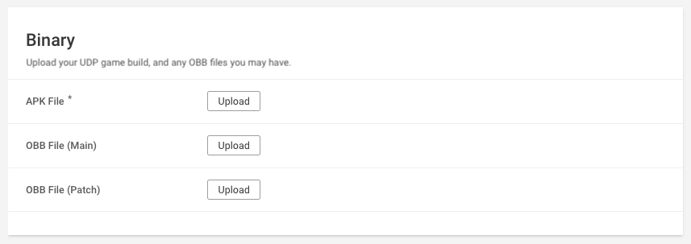

# Building your game and deploying it to the UDP console

## Building your game locally

Build an APK from the Editor (**File** > **Build Settings** > **Android** > **Build**). For more information, see [Getting started with Android development](https://docs.unity3d.com/Manual/android-GettingStarted.html).

**Note:** Make sure you [save your IAP Catalog](best-practices.html#save) before building your game. If you’re using UDP via Unity IAP, make sure that you’ve [set UDP as a build target](games-with-iap.html#set-build-target).

## Uploading your game APK to the UDP console

Follow these steps to directly upload your build to the UDP Console. Note that the UDP console only accepts APKs with a UDP implementation. 

1. On the UDP Console, select your Project in **My Games**.
2. In the **Game Info** tab, go to the **Binary** section to upload the APK file (and OBB files, if any) of your game.

You can also deploy your game to the UDP console in the following ways:

* Upload your APK to CloudBuild, and deploy it to UDP from there.
* Build your game with CloudBuild, and deploy it to UDP from there.

These ways are covered in [Using CloudBuild with UDP](using-cloud-build-with-udp.md).