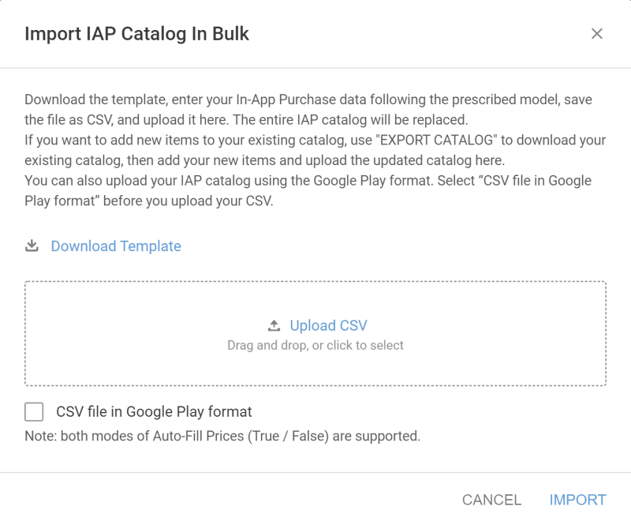
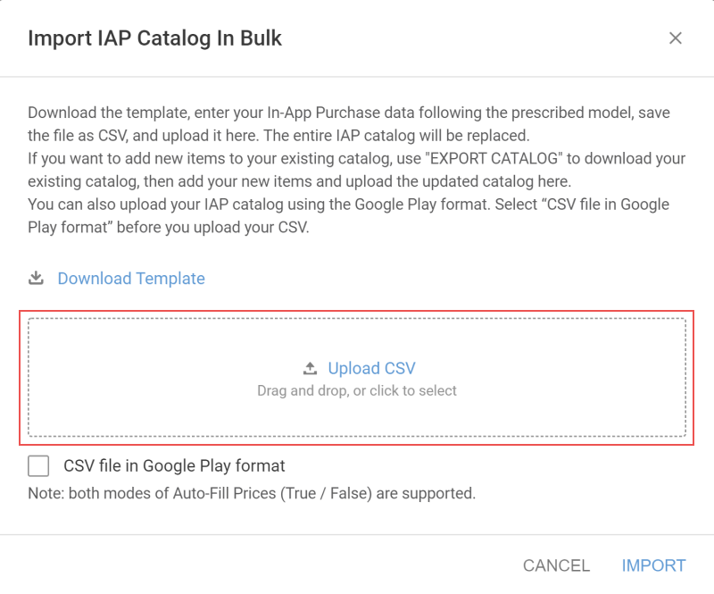

# Bulk IAP Import

A typical UDP implementation consists of:

* Preparing your IAP Catalog inside your Unity project
* Building and uploading your APK file to the UDP console

However, putting together an IAP Catalog of hundreds of products in the Editor can be tedious, and that’s when you may want to leverage the Bulk IAP Import feature. 

Bulk IAP Import lets you upload a CSV file to the UDP Console with all your IAP product details, including prices in multiple currencies and descriptions in multiple languages.

This section describes how to import your IAP items in bulk.

## Implementation requirements

### To add new IAP products

You should only use the Bulk IAP Import function to add new IAP products if you implemented UDP:

* With the UDP Package
* With Unity IAP, not using codeless

If your implementation is with Unity IAP codeless, don’t use the Bulk IAP Import function to add  new IAP products to your catalog. Your game’s IAP products must be defined in the Editor’ IAP Catalog by the time you build your game APK, so your bulk upload would be in vain.

### To add localized descriptions and prices

For all implementations, you can use Bulk IAP Import to assign descriptions in more languages and prices in more currencies to your existing IAP products.

### With the UDP Package

You can use Bulk IAP Import to entirely redefine your game’s IAP Catalog without having to rebuild your game.

You only need to have a UDP implementation in good working order. 

### With Unity IAP (non codeless)

With Unity IAP, the IAP Catalog sync is unidirectional: from the Editor to the UDP Console only. You therefore cannot Pull an IAP Catalog that was uploaded on the UDP Console.

If you will upload your game’s IAP Catalog to the UDP Console via Bulk IAP Upload, you should prepare your game to fetch IAP product information from the UDP Console, rather than from the game client’s default IAP Catalog.

Simply do not invoke any IAP product retrieval method in your code to allow your game to fetch its entire IAP Catalog from the UDP Console.

For more information, see [Querying IAP inventory](games-with-iap.html#query-iap).

### With Unity IAP (codeless)

Don’t use the Bulk IAP Import function to add new IAP products, your bulk upload would be in vain. You must define your game’s IAP products in the Editor’s IAP Catalog by the time you build your game APK. See [Filling in the IAP Catalog](games-with-iap.html#fill-iap).

You can still, however, use Bulk IAP Import to assign descriptions in more languages and prices in more currencies to your existing IAP products. To ensure a successful operation, make sure that for each IAP product the ProductID and Product Type you define in the CSV file match exactly the values defined in your Editor’s IAP Catalog.

## Download the CSV Template

1. Select **EDIT INFO** on the **Game Information** page.<br/>
  
2. Go to the **In-App Purchases** panel.
3. Click **IMPORT CATALOG**.<br/>
  
4. Click **Download Template**.


## Fill in the CSV file

CSV files use commas (,) and semicolons (;) to separate data values. Commas separate primary data values, and semicolons separate subvalues.

Each IAP item must appear entirely on a single line within the CSV file.

You must enter data in the exact format of the template provided.

### Data values for CSV files

See [Filling in the IAP Catalog](games-with-iap.html#iap-catalog) for general information on IAP item fields.

Each row in a CSV file of In-App Purchases can contain the following values. Do not pass empty values.

<table>
  <tr>
    <td>Field</td>
    <td>Description</td>
  </tr>
  <tr>
    <td>product_id</td>
    <td>Represents the ID of a unique IAP product
product_id needs to start with a lowercase letter or a digit and must be composed of only lowercase letters (a-z), digits (0-9), underscores (_), and periods (.)</td>
  </tr>
  <tr>
    <td>language; product_name; description</td>
    <td>When setting the language value, use the language code listed in TABLE A.<br/>
UDP uses en-US as the default language.<br/>
Use semicolon(;) to separate language, product_name and description.<br/>
To include localized versions of the item's product name and description, you must list the default language, product_name, and description, followed by the languages, product_names, and descriptions for each locale. In the following example, the product has en-US (ENGLISH) as the default language and zh-CN (CHINESE) as a localization:<br/>
en-US;Product 1;This is my first product; zh-CN; 产品1; 产品描述1.<br/>
Note: After uploading the file, only the fields corresponding to languages already defined in the Game Info section will be imported. If you intend to support multiple languages, define them on the UDP Console before importing your IAP catalog.<br/>
</img>
</td>
  </tr>
  <tr>
    <td>consumable</td>
    <td>This value must be set to TRUE or FALSE (case insensitive).</td>
  </tr>
  <tr>
    <td>currency; price</td>
    <td>When setting the currency value, use the currency code listed in TABLE B.
The price must be positive.The default currency is USD.
The price of each IAP product must immediately follow its corresponding currency. For example:
USD;0.99;CNY;6</td>
  </tr>
</table>

#### **TABLE A - Language codes**

<table>
  <tr>
    <td>Language</td>
    <td>Code</td>
  </tr>
  <tr>
    <td>AFRIKAANS</td>
    <td>af</td>
  </tr>
  <tr>
    <td>AMHARIC</td>
    <td>am</td>
  </tr>
  <tr>
    <td>BULGARIAN</td>
    <td>bg</td>
  </tr>
  <tr>
    <td>CATALAN</td>
    <td>ca</td>
  </tr>
  <tr>
    <td>CHINESE</td>
    <td>zh-CN</td>
  </tr>
  <tr>
    <td>CHINESE(HONG KONG)</td>
    <td>zh-HK</td>
  </tr>
  <tr>
    <td>CHINESE (TAIWAN)</td>
    <td>zh-TW</td>
  </tr>
  <tr>
    <td>CROATIAN</td>
    <td>hr</td>
  </tr>
  <tr>
    <td>CZECH</td>
    <td>cs</td>
  </tr>
  <tr>
    <td>DANISH</td>
    <td>da</td>
  </tr>
  <tr>
    <td>DUTCH</td>
    <td>nl</td>
  </tr>
  <tr>
    <td>ENGLISH (UK)</td>
    <td>en-GB</td>
  </tr>
  <tr>
    <td>ENGLISH</td>
    <td>en-US</td>
  </tr>
  <tr>
    <td>ESTONIAN</td>
    <td>et</td>
  </tr>
  <tr>
    <td>FILIPINO</td>
    <td>fil</td>
  </tr>
  <tr>
    <td>FINNISH</td>
    <td>fi</td>
  </tr>
  <tr>
    <td>FRENCH (CANADA)</td>
    <td>fr-CA</td>
  </tr>
  <tr>
    <td>FRENCH</td>
    <td>fr-FR</td>
  </tr>
  <tr>
    <td>GERMAN</td>
    <td>de</td>
  </tr>
  <tr>
    <td>GREEK</td>
    <td>el</td>
  </tr>
  <tr>
    <td>HINDI</td>
    <td>hi</td>
  </tr>
  <tr>
    <td>HUNGARIAN</td>
    <td>hu</td>
  </tr>
  <tr>
    <td>INDONESIAN</td>
    <td>id</td>
  </tr>
  <tr>
    <td>ITALIAN</td>
    <td>it</td>
  </tr>
  <tr>
    <td>JAPANESE</td>
    <td>ja</td>
  </tr>
  <tr>
    <td>KOREAN</td>
    <td>ko</td>
  </tr>
  <tr>
    <td>LATVIAN</td>
    <td>lv</td>
  </tr>
  <tr>
    <td>LITHUANIAN</td>
    <td>lt</td>
  </tr>
  <tr>
    <td>MALAY</td>
    <td>ms</td>
  </tr>
  <tr>
    <td>NORWEGIAN</td>
    <td>no</td>
  </tr>
  <tr>
    <td>POLISH</td>
    <td>pl</td>
  </tr>
  <tr>
    <td>PORTUGUESE (BRAZIL)</td>
    <td>pt-BR</td>
  </tr>
  <tr>
    <td>PORTUGUESE (PORTUGAL)</td>
    <td>pt-PT</td>
  </tr>
  <tr>
    <td>ROMANIAN</td>
    <td>ro</td>
  </tr>
  <tr>
    <td>RUSSIAN</td>
    <td>ru</td>
  </tr>
  <tr>
    <td>SERBIAN</td>
    <td>sr</td>
  </tr>
  <tr>
    <td>SLOVAK</td>
    <td>sk</td>
  </tr>
  <tr>
    <td>SLOVENIAN</td>
    <td>sl</td>
  </tr>
  <tr>
    <td>SPANISH (LATIN AMERICA)</td>
    <td>es</td>
  </tr>
  <tr>
    <td>SPANISH</td>
    <td>es-ES</td>
  </tr>
  <tr>
    <td>SWAHILI</td>
    <td>sw</td>
  </tr>
  <tr>
    <td>SWEDISH</td>
    <td>sv</td>
  </tr>
  <tr>
    <td>THAI</td>
    <td>th</td>
  </tr>
  <tr>
    <td>TURKISH</td>
    <td>tr</td>
  </tr>
  <tr>
    <td>UKRAINIAN</td>
    <td>uk</td>
  </tr>
  <tr>
    <td>VIETNAMESE</td>
    <td>vi</td>
  </tr>
  <tr>
    <td>ZULU</td>
    <td>zu</td>
  </tr>
</table>

#### **TABLE B - Currency codes**

<table>
  <tr>
    <td>Code</td>
    <td>Code</td>
    <td>Code</td>
  </tr>
  <tr>
    <td>AED</td>
    <td>IDR</td>
    <td>PEN</td>
  </tr>
  <tr>
    <td>ARS</td>
    <td>ILS</td>
    <td>PHP</td>
  </tr>
  <tr>
    <td>AUD</td>
    <td>INR</td>
    <td>PKR</td>
  </tr>
  <tr>
    <td>BGN</td>
    <td>IQD</td>
    <td>PLN</td>
  </tr>
  <tr>
    <td>BHD</td>
    <td>ISK</td>
    <td>QAR</td>
  </tr>
  <tr>
    <td>BND</td>
    <td>JOD</td>
    <td>RON</td>
  </tr>
  <tr>
    <td>BIF</td>
    <td>JPY</td>
    <td>RUB</td>
  </tr>
  <tr>
    <td>BRL</td>
    <td>KES</td>
    <td>SAR</td>
  </tr>
  <tr>
    <td>CAD</td>
    <td>KHR</td>
    <td>SDG</td>
  </tr>
  <tr>
    <td>CHF</td>
    <td>KRW</td>
    <td>SEK</td>
  </tr>
  <tr>
    <td>CNY</td>
    <td>KWD</td>
    <td>SGD</td>
  </tr>
  <tr>
    <td>CZK</td>
    <td>LAK</td>
    <td>THB</td>
  </tr>
  <tr>
    <td>DKK</td>
    <td>LKR</td>
    <td>TND</td>
  </tr>
  <tr>
    <td>DZD</td>
    <td>LYD</td>
    <td>TRY</td>
  </tr>
  <tr>
    <td>EGP</td>
    <td>MAD</td>
    <td>TWD</td>
  </tr>
  <tr>
    <td>EUR</td>
    <td>MMK</td>
    <td>TZS</td>
  </tr>
  <tr>
    <td>GBP</td>
    <td>MXN</td>
    <td>USD</td>
  </tr>
  <tr>
    <td>GHS</td>
    <td>MYR</td>
    <td>UYU</td>
  </tr>
  <tr>
    <td>HKD</td>
    <td>NOK</td>
    <td>VND</td>
  </tr>
  <tr>
    <td>HRK</td>
    <td>NZD</td>
    <td>ZAR</td>
  </tr>
  <tr>
    <td>HUF</td>
    <td>OMR</td>
    <td> </td>
  </tr>
</table>

### Example 1

```
product_id,language; product_name; description,consumable,currency; price com.mystudio.mygame.product1,en-US;Product 1;This is my first product; zh-CN; 产品1; 产品描述1,TRUE,USD;0.99;CNY;6;EUR;0.79 com.mystudio.mygame.product2,en-US;Product 2;This is my second product; zh-CN; 产品2; 产品描述2,FALSE,USD;1.99;CNY;12;EUR;1.59 com.mystudio.mygame.product3,en-US;Product 3;This is my third product; zh-CN; 产品3; 产品描述3,TRUE,USD;4.99;CNY;30;EUR;3.99
```

### Example 2

```
product_id,language; product_name; description,consumable,currency; price com.mystudio.mygame.product1,en-US;Product 1;This is my first product,TRUE,USD;0.99 com.mystudio.mygame.product2,en-US;Product 2;This is my second product,FALSE,USD;1.99 com.mystudio.mygame.product3,en-US;Product 3;This is my third product,TRUE,USD;4.99
```

## Upload your CSV file

1. Select **EDIT INFO** on the **Game Information** page.
2. Go to the **In-App Purchases** section.
3. Click **IMPORT CATALOG**.
4. Click **Upload document** or drag and drop your CSV file in the designated box.<br/>
  
5. Click **CREATE** to upload your IAP Catalog to the UDP console.

**Note:** Uploading a CSV file entirely overwrites this revision’s IAP catalog. The UDP console only uses the information contained in your CSV file; any other IAP information you previously entered via the UDP console is lost.

## Export a CSV file

If you want to re-use an existing IAP Catalog or add new products to it, click **EXPORT CATALOG** to download it, and use this file to make modifications on your IAP Catalog. Upload the final IAP Catalog back using **IMPORT CATALOG**. 


The **EXPORT CATALOG** button is only shown if you have IAP products in your IAP Catalog, and is only visible in editing mode.