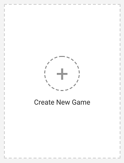
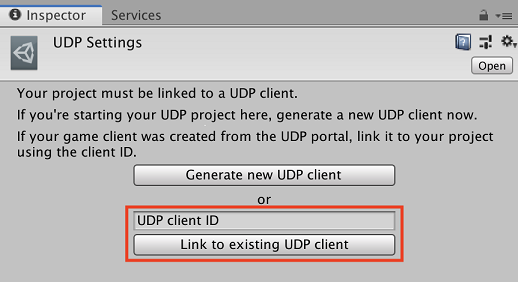

# Creating a game on UDP

## UDP client

You can create a game on UDP either from the Unity Editor or from the UDP console.

Creating a game on UDP means creating a new **UDP client**. The UDP client is what identifies your game on the UDP service; it has a **UDP client ID**.

You must link your UDP client to your Unity project.

If you begin your UDP journey inside the Unity Editor, you can **generate a new UDP client** from your Unity project and automatically link them. See [Starting from the Unity Editor](#starting-from-editor).

If you or someone else in your organization createscreate a new game on the UDP console, it only generates a new UDP client. You need to link this UDP client to your Unity project when you begin your UDP implementation in the Unity Editor. See [Creating a game in the UDP console](#udp-new-game).

### Existing UDP clients - user stories

Story 1 - you began exploring the UDP console before reaching this point in the documentation, and actually already created a game in the process - maybe even uploaded descriptions and screenshots of your game. You want to take it from here.

Story 2 - someone in your Organization generated the UDP client when getting started with the UDP implementation, and is now asking you to help implement UDP in the project.

Story 3 - someone in your Organization created the game on the UDP console, and is now asking you to implement UDP in the project.

Story 4 - you are tasked with distributing the game to UDP stores, but you don’t use the Unity Editor. You create the game from the UDP console and pass developers in your Organization the parameters needed to carry out the UDP implementation.

## Creating a game in the UDP console

You can create a game on the UDP console first, and later link it to an actual UDP project.

Click on the blank card to create a new game:

This sends you to your new game’s **Game Info** page where you can start [editing your game information](managing-and-publishing-your-game.html#edit-info).

**Note**: You must link your Unity project with your UDP client in the Unity Editor.

### Linking a project to an existing UDP client ID

When you create a game on the UDP console, it gets a UDP client ID. You need to use the UDP client ID to link your project to the UDP client. The client ID is displayed in the **Integration Information** panel of the **Game Info** section, in the UDP console.

1. To create a **UDP Settings** file, select **Window** > **Unity Distribution Portal** > **Settings**: 
   
2. In the **UDP Settings** inspector window, paste your UDP client ID into the input box,
   1. Select **Link to existing UDP client**:

**Note:** You can only link your Unity project to a single UDP client, and the link is irrevocable. If you need to link your project to a different UDP client, you’ll need a new project ID. See [Linking a project to another UDP client](#linking-project) for details on how to proceed.

## Starting from the Unity Editor

To link a project to a UDP client, there are two options:

* Your game has not yet been created on the UDP console; it has no UDP client ID
* Your game has been created on the UDP console; it has a UDP client ID

### Creating a UDP client ID from the Unity Editor

If you have not created your game on the UDP console; it has no UDP client ID. You need to generate one.

1. To create a **UDP Settings** file, select **Window** > **Unity Distribution Portal** > **Settings**: 
   
2. Select **Generate new UDP client**:

Your game is also created on the UDP console when you generate your UDP client.

## UDP Settings

Once your Unity project is linked to a UDP client, the **UDP Settings** inspector loads more settings.

|UDP Settings|Description|
|---|---|
|Pull|Retrieves (pulls) the information you last saved on the UDP server into the Editor. The following information is synced:  Game Title Settings UDP Sandbox Test Accounts IAP Catalog (if using the UDP package)|
|Push|Saves (pushes) your changes to the UDP server. The following information is synced: Game Title Settings UDP Sandbox Test Accounts IAP Catalog (if using the UDP package)|
|Game Title|Input the title of your game, and press Push to save. This field syncs with the UDP console.  By default and on first load, Game Title is populated with Game ID (see Settings).|
|Unity Project ID|Your Unity project ID, which is now linked to your UDP client ID. This field is not editable.|
|IAP Catalog|For UDP package implementations, the [IAP catalog](games-with-iap.html#iap-catalog) fields are displayed.  For Unity IAP implementations, the [Open Catalog](#iap-catalog) button is displayed.|
|Settings|Contains additional game [settings](#settings).|
|UDP Sandbox Test Accounts|Contains settings for [UDP Sandbox Test Accounts](#udp-sandbox).|

### IAP Catalog

For implementations via the UDP package, you can add and define IAP products in the **IAP Catalog** section of the UDP Settings.
The **Pull** and **Push** buttons in the top section of the **UDP Settings** window sync your IAP Catalog with the UDP server.

**Note**: With the UDP Package, you can **Push** your IAP Products from the Editor to the UDP Console, and can **Pull** your IAP Catalog from the UDP Console into the Editor.

For implementations via Unity IAP, the **Open Catalog** button opens your IAP Catalog in the **IAP Catalog** window. You can also access this window at **Window** > **Unity IAP** > **IAP Catalog**. You need to push each IAP product directly from the IAP Catalog; see [Filling in the IAP Catalog with Unity IAP](games-with-iap.html#iap-catalog). 

**Note**: With Unity IAP, you can only **Push** your IAP products from the Editor to the UDP console. You cannot **Pull** your IAP Catalog from the UDP console into the Editor.

See [UDP in the Unity Editor](best-practices.html#udp-in-editor) for a more extensive walkthrough of the IAP Catalog user interface in both implementations, and [Save / Sync / Push your IAP Catalog](best-practices.html#save) for details on syncing IAP products.

### Settings

**Callback URL** is the only setting you can edit. Press **Push** to save any changes.

|Field|Function|Editable|
|---|---|---|   
|Game ID|The identifier for the game|No|
|Client ID|The UDP client identifier|No|
|Client Key|Used when initializing the UDP SDK|No|
|Client RSA Public Key|Used to verify the callback notification|No|
|Client Secret|A Unity key to sign your request that your game sends to the UDP server|No|
|Callback URL|Specifies the URL for the server that receives the callback notification|Yes|

### UDP Sandbox Test Accounts

You can create test accounts for designated users to test your game in the UDP Sandbox environment. Sandbox test accounts only work with the generic UDP build - the one you create from your Unity project after you’ve implemented UDP.

The UDP Sandbox acts as a virtual "Store" where you can verify that your IAP implementation is correct before preparing your game for submission to the real stores. 

Sandbox mode also supports server-side validation.

You should only generate repacked builds when your IAP implementation has cleared Sandbox testing. For more information, see [Test your IAPs in the Sandbox environment](best-practices.html#test). 

**Note:** Sandbox test accounts do not work with repacked builds.

Your testers run the generic UDP build on an emulator or a real Android device. This requires the access credentials that you define in the UDP Sandbox Test Accounts.

|Field|Function|Editable|
|---|---|---|
|Email|The email address for the sandbox test account. It is used as the login name.|Yes|
|Password|The password for the test account.|Yes|

Press **Push** to save any changes.

You can also add/edit UDP [Sandbox test accounts](managing-and-publishing-your-game.html#sandbox) from the UDP console.