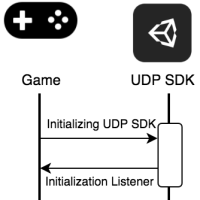

# Games with In-App Purchases

In-app purchases (IAP) let you sell content to players from inside your game. You only need to implement your in-app purchases via UDP. UDP then automatically repacks your game into store-specific builds. You don’t need to worry about store-specific SDKs. 

You can implement UDP on both the game client and server sides. If your game is offline, you only need to implement UDP in the game client. If your game is online, you can opt to also implement UDP on the server side.

* Implementing UDP in-app purchases in the game client<br/>
The implementation in the game client includes initializing the UDP SDK and integrating with the in-app purchase flow of UDP.
* Implementing UDP in-app purchases on the server side<br/>
The implementation on the server side lets you query the UDP server about orders, receive callback notifications, and return the acknowledgements.

This section shows you how to:

* [Implement in-app purchases on the Editor side](#implement-game-client)
    * with the UDP package
    * with Unity IAP
* [Implement in-app purchases on the server side](#server-side)
* [Manage in-app purchases on the UDP console](#managing-iap)

<a name="implement-game-client"></a>
## Game client implementation

In the game client, you can implement your in-app purchases either with the UDP Package or with Unity IAP.

To understand the difference between the implementations, and which one suits you best, see [How to implement UDP](getting-started.html#how-to-implement).

If you suspect your project is using both Unity IAP and the UDP Package at the same time, see [UDP implementations](best-practices.html#udp-implementation) to resolve this situation.

<a name="with-udp"></a>
### With the UDP package

To implement UDP in-app purchases, follow these steps:

1. [Initialize UDP SDK](#init)
2. [Query the partner store's inventory](#query)
3. [Purchase an IAP product](#purchase)
4. [Consume a purchase](#consume)
5. [Validate the client-side integration](#validate)
6. [Fill in the IAP Catalog](#iap-catalog)

Once you have implemented IAP items using UDP, [test your IAP](best-practices.html#test) in your generic UDP build before uploading it to the UDP console.

<a name="init"></a>
#### Initializing the UDP SDK

To initialize the UDP SDK, your game needs to have a `UDPSettings.asset` file [linked to a UDP client](creating-a-game-on-udp.html#linking-project). The initialization listener then returns a success or failure message to let you know if the initialization is successful.

<br/>
Initializing game integration with UDP

Call the `Initialize` method in your game code.

```
StoreService.Initialize(IInitListener listener)
```

**Note**: You must implement the `Initialize()` method in your game to be able to publish your game to app stores via UDP.

The InitListener then tells your game whether the initialization has succeeded or failed. 

```
using UnityEngine
using UnityEngine.UDP
  
public class InitListener : IInitListener
    {
    public void OnInitialized(UserInfo userInfo)
    {
        Debug.Log("Initialization succeeded");
        // You can call the QueryInventory method here
        // to check whether there are purchases that haven’t been consumed.       
    }

    public void OnInitializeFailed(string message)
    {
        Debug.Log("Initialization failed: " + message);
    }
}
```
<a name="query"></a>
#### Querying the partner store’s inventory

To prevent an IAP product from being bought but not delivered, your game needs to query the partner stores’ inventory after the initialization is completed. This allows you to, for example, restore non-consumable products when users reinstall your game. 

* Consumable IAP products provide temporary effects, such as game currency and extra experience points. You can make them available to your players multiple times.
* Non-consumable IAP products provide permanent effects. Players can only purchase them once.

To check for unconsumed IAP products, your game should call the `QueryInventory` method immediately after the initialization succeeds. 

<br/>
Sending a query from your game to the UDP inventory

To query for the product details, call the **QueryInventory** method. This returns the product information (product name, ID, price, description) for non-consumable purchases and consumable purchases which have not yet been consumed. 

If you specify product IDs, you get the product information for your specified IAP products. 

```
StoreService.QueryInventory(List<string> productIds, IPurchaseListener listener);
```

If you don’t specify product IDs, you get the information of all IAP products.

```
StoreService.QueryInventory(IPurchaseListener listener);
```

**Hint**: Call this method after a successful initialization. This step is used to recover a product being paid for but not delivered for some reason, such as an application crash.

Implement listeners for events that are related to the purchase service. `IPurchaseListener` provides the following listeners that tell you the result of all purchase-related events:


|Event|Description|
|---|---|
|OnPurchase|The purchase succeeded.|
|OnPurchaseFailed|The purchase failed.|
|OnPurchaseRepeated|Used when a player buys a non-consumable product several times. You can implement this listener when the partner store doesn’t support QueryInventory.|
|OnPurchaseConsume|The consumption succeeded.|
|OnPurchaseConsumeFailed|The consumption failed.|
|OnQueryInventory|The query succeeded.|
|OnQueryInventoryFailed|The query failed.|

Here is an example:

```
public class PurchaseListener : IPurchaseListener
{
    public void OnPurchase(PurchaseInfo purchaseInfo)
    {
        // The purchase has succeeded.
        // If the purchased product is consumable, you should consume it here.
        // Otherwise, deliver the product.
    }

    public void OnPurchaseFailed(string message, PurchaseInfo purchaseInfo)
    {
        Debug.Log("Purchase Failed: " + message);
    }

    public void OnPurchaseRepeated(string productCode)
    {
        // Some stores don't support queryInventory.
        
    }

    public void OnPurchaseConsume(PurchaseInfo purchaseInfo)
    {
        // The consumption succeeded.
        // You should deliver the product here.        
    }

    public void OnPurchaseConsumeFailed(string message, PurchaseInfo purchaseInfo)
    {
        // The consumption failed.
    }

    public void OnQueryInventory(Inventory inventory)
    {
        // Querying inventory succeeded.
    }

    public void OnQueryInventoryFailed(string message)
    {
        // Querying inventory failed.
    }
}
```

<a name="purchase"></a>
#### Purchasing an IAP product

To start a purchase request from your game, call the **Purchase** method. The UDP automatically checks the purchase receipt to check the purchase is valid.

<br/>
Sending a purchase request from your game to UDP

When you call the **Purchase** method, provide the:

* `productId` - The unique identifier of the IAP product that the player wants to buy. 
* `developerPayload` - The information you want to send to the UDP SDK.
* `IPurchaseListener` - The listener that tells you the results of all purchase-related events.

For example:

```
StoreService.Purchase(string productId, string developerPayload, IPurchaseListener listener);
```

**Note**: Games with IAP must contain a `Purchase` method.

The UDP returns information to your game when the purchase is complete. 

Some partner stores' payment gateways can't get payment callbacks in real-time. This can prevent UDP quickly receiving payment SUCCESS or FAILED callbacks. In this case, UDP regards the callback as FAILED. In case this situation occurs, add logic to your game to get the latest order status via server-side validation. This can be using the [SDK callback](#callback-notif) or [order queries](#query-order).

If your game is an online game, you can verify the purchase on your game server via a callback notification. UDP sends the callback notification to the callback URL that you have specified either in the Unity Editor or on the UDP console (see [UDP Settings](creating-a-game-on-udp.html#udp-settings)).

 

<a name="consume"></a>
#### Consuming a purchase

When a user has purchased a consumable product, they cannot repurchase that product until it has been consumed. So you can use the consumption to make sure the purchased product is successfully delivered. 

**Note**: This step is only necessary for consumable products.

To consume a product, your game needs to send a Consume request to the UDP SDK. Your game should deliver a product when it is initially consumed. This prevents the product being delivered repeatedly. Note that **PurchaseInfo** is returned by **OnPurchase**. 

For example:  

```
StoreService.ConsumePurchase(PurchaseInfo, IPurchaseListener);
```

<br/>
Sending a consume request from your game to UDP

#### UDP SDK data structure

This section describes the classes of the UDP SDK.

`UserInfo`

|field name|type|desc|
|---|---|---|
|Channel|string|PartnerStore name, generated by UDP|
|UserId|string|optional, user ID returned from PartnerStore|
|UserLoginToken|string|optional, user login token returned from PartnerStore|

`Inventory`


|public function|returns|desc|
|---|---|---|
|GetPurchaseInfo(string productId)|PurchaseInfo|get PurchaseInfo of given productId|
|GetProductInfo(string productId)|ProductInfo|get ProductInfo of given productId|
|HasPurchase(string productId)|bool|check if any unconsumed purchase exists for given productId|
|HasProduct(string productId)|bool|check if product exists for given productId|
|GetPurchaseDictionary()|Dictionary\<string, PurchaseInfo>|get purchases as productId - PurchaseInfo dictionary|
|GetPurchaseList()|List\<PurchaseInfo>|get purchases as list|
|GetProductDictionary()|Dictionary\<string, ProductInfo>|get products as productId - ProductInfo dictionary|
|GetProductList()|List\<ProductInfo>|get products as list|

`PurchaseInfo`

|field name|type|desc|
|---|---|---|
|ItemType|string|fixed value “inapp”|
|ProductId|string|product ID of IAP item|
|GameOrderId|string|cpOrderId provided by UDP|
|OrderQueryToken|string|token to query UDP server, generated by UDP|
|DeveloperPayload|string|any string provided by the developer. UDP will pass this to PartnerStore in ‘Purchase’ method|
|StorePurchaseJsonString|string|any other additional info provided by PartnerStore|

`ProductInfo`

|field name|type|desc|
|---|---|---|
|ItemType|string|fixed value “inapp”|
|ProductId|string|product ID of IAP item|
|Consumable|bool|can be consumed or not|
|Price|string|formatted price of the IAP item, including its currency sign|
|PriceAmountMicros|long|price of IAP item in micros|
|Currency|string|currency of IAP item|
|Title|string|IAP item name|
|Description|string|IAP item description|

<a name="validate"></a>
#### Validating the client-side integration

UDP performs client-side validations automatically. When partner stores return the payload and signature after a successful purchase, the UDP SDK validates the signature. If the validation fails, the purchase fails accordingly.

<a name="iap-catalog"></a>
#### Filling in the IAP Catalog

Filling in the IAP Catalog requires you to list and configure all your UDP in-app purchases.

**Note:** If you don’t use an IAP Catalog in your game client (for instance, your IAP items are maintained solely on your game server) you still have to create your IAP Catalog on the UDP console. For more information, see [In-App Purchases](managing-and-publishing-your-game.html#iap).

1. For Unity Editor versions 2019.4 and below, open the **UDP Settings** inspector window.<br/>For Unity Editor versions 2020.1 and above, open the **IAP Catalog** window.<br/>
2. In the **IAP Catalog** section, enter your product information for each IAP product:<br/>
  * **Name**, the name of the IAP product.
  * **Product ID**, the unique ID used to identify the IAP product. See below the requirements that Product IDs must follow.
  * **Type**, which indicates whether the IAP product is consumable or not.
  * **Price**, the price of the IAP product. You must specify the product price, otherwise players can’t purchase products in your game.
  * **Description**, a short description of the IAP product.
3. Click **Push** to create the IAP product and sync with the UDP server.<br/>
  
4. To add more products, click **Add new IAP**.<br/>
  **Product ID**s must follow these requirements:
  * Start with a letter or a digit;
  * Be only composed of letters, digits, dots (.) and underscores (_)
  * Must not use capitalized letters

When you’ve defined all your IAP products in your game, make sure they each use the same **Product ID** that is set in the IAP Catalog.

**Note:** Make sure you **Push** new IAP products (or changes to existing IAP products) so they are  saved on the UDP console. You can push individual IAP products using the drop-down menu opposite its name. To save the entire IAP Catalog, use the top-most **Push** button; this also saves/syncs other settings such as Sandbox Test Accounts, Game Title, and Settings. For more information, see [Save / Sync / Push your IAP Catalog](best-practices.html#save).

To understand how the IAP Catalog works in the UDP context, see [Notion of IAP Catalog](best-practices.html#notion).

For more information on the UDP Package user interface, see [Editor UI for the UDP Package](best-practices.html#editor-ui).

When you’ve completed the UDP implementation and configuration on the game client side, [implement UDP on the server side](#server-side) if needed, and [build your game](building-your-game.md).

<a name="with-unity-iap"></a>
### With Unity IAP

If you want to implement UDP using Unity IAP, first [set up Unity IAP](https://docs.unity3d.com/Manual/UnityIAPSettingUp.html). 

**Note**: If you choose to implement UDP with Unity IAP version 1.22.0-1.23.5 (instead of using the UDP package) then implement via Unity IAP only.

Unity IAP automatically handles the following:

* Initializing UDP
* Querying the store’s IAP product inventory
* Requesting to purchase a product
* Consuming the purchased item

However, your game must properly use Unity IAP’s similar functions (such as initialization and purchase) according to the [Unity IAP Documentation](https://docs.unity3d.com/Manual/UnityIAP.html).

**Note**: Unity IAP consumes the IAP item automatically, so Unity IAP doesn’t contain an API to consume the item.

Once you’ve implemented UDP using Unity IAP, [test your IAP](best-practices.md#test) in your generic UDP build, before uploading it to the UDP console.

When you’ve implemented your game’s in-app purchases with Unity IAP, take the following steps to set up UDP with Unity IAP.

<a name="query-iap"></a>
#### Querying IAP inventory

##### With Unity IAP codeless

Upon initialization, the codeless implementation fetches all the IAP product information from the Editor’s IAP Catalog with no additional instruction required from you. The **IAP Catalog** (**Window** > **Unity IAP** > **IAP Catalog**) should contain your final inventory of IAP products when you build your game APK. 

A codeless implementation cannot be made to fetch IAP product information elsewhere.

**Note**: With Unity IAP codeless you should not add IAP products from the UDP Console. If you do, your game will ignore these IAP products. You can still, however, modify the price and description of your original IAP products from the UDP Console when preparing your game for submissions.

##### With Unity IAP non-codeless

When fetching the IAP products to pass to the `queryInventory` method, invoke `ProductCatalog.LoadDefaultCatalog()` to return the IAP products originally defined in the Editor’s **IAP Catalog** (**Window** > **Unity IAP** > **IAP Catalog**).

For instance:

```
var catalog = ProductCatalog.LoadDefaultCatalog();

foreach (var product in catalog.allValidProducts)
{
   if (product.allStoreIDs.Count > 0)
   {
       var ids = new IDs();
       foreach (var storeID in product.allStoreIDs)
       {
           ids.Add(storeID.id, storeID.store);
       }
       builder.AddProduct(product.id, product.type, ids);
   }
   else
   {
       builder.AddProduct(product.id, product.type);
   }
}
```

`ProductCatalog.LoadDefaultCatalog()` does not fetch IAP products added with the [Bulk IAP Import](bulk-iap-import.md) feature or [directly from the UDP Console](managing-and-publishing-your-game.html#create-iap).

If you know that your game’s IAP Catalog will be modified on the UDP Console, prepare your game to fetch IAP product information from the UDP Console.

When fetching the IAP products to pass to the queryInventory method, invoke builder.AddProduct to retrieve specific IAP products defined from the UDP console:

```
builder.AddProduct(product.id, product.type, new IDs{}) 
```

To display the product price, formatted with currency, use `productInfo.Value.Price`.

If you want to retrieve all the IAP products defined on the UDP Console, you don’t need to invoke any IAP product retrieval method at all. Your game will then fetch the entire IAP Catalog from the UDP Console. 

In summary, you can choose to:

* Fetch your default IAP products with `ProductCatalog.LoadDefaultCatalog()` and any additional ones with `builder.AddProduct`
* Fetch only specific IAP products from the UDP Console by invoking them explicitly with `builder.AddProduct`
* Fetch your entire IAP Catalog from the UDP Console by not invoking any IAP product retrieval method at all

**Note:** Uploading a CSV file of IAP products on the UDP Console entirely overwrites your IAP Catalog. Therefore if you plan to use the [Bulk IAP Import](bulk-iap-import.md) feature, you should not invoke any IAP product retrieval method at all in your code to allow your game to fetch its entire IAP Catalog from the UDP Console.

<a name="set-build-target"></a>
#### Setting UDP as build target

In the Unity Editor, to choose UDP as the Android build target, select **Window** > **Unity IAP** > **Android** > **Target Unity Distribution Portal (UDP)**.


<a name="fill-iap"></a>
#### Filling in the IAP Catalog

Filling in the IAP Catalog requires you to list and configure all your in-app purchases. You should specifically configure your In-App Purchases for UDP. 

**Note:** If you don’t use an IAP Catalog in your game client (for instance, you maintain your IAP items solely on your game server) you still have to create your IAP Catalog on the UDP console. For more information, see [In-App Purchases](managing-and-publishing-your-game.html#iap).

1. Select **Window** > **Unity IAP** > **IAP Catalog** and for each IAP product fill in the following fields:<br/>
  * **ID**, the unique identifier of the IAP product
  * **Type**, consumable or non-consumable
  * **Title**, the name of the IAP product
  * **Description**, a short description of the IAP product
  * **Price**, the price of the IAP product (in USD). This field is found directly under the **Unity Distribution Portal Configuration** section<br/>
  
2. To save your IAP product, click **Sync to UDP**.

**Note**: Remember to **Sync to UDP** every individual IAP product that you add to the catalog under the **UDP Configuration** section.<br/>

<br/>
To ensure your IAP Catalog is properly saved, see [Save / Sync / Push your IAP Catalog](best-practices.html#save).

For more information on the UDP user interface when implementing via Unity IAP, see [Editor UI for UDP with Unity IAP](best-practices.html#editor-ui-iap).

To understand how the IAP Catalog works in the UDP context, see [Notion of IAP Catalog](best-practices.html#notion).

<a name="server-side"></a>
## Server-side implementation

You can validate purchases on the server side in one of the following ways:

* [Querying orders](#query-order)
* [Receiving callback notifications](#callback-notif)

**Note**: Callback notifications are not currently supported for the Huawei AppGallery store.

You can test your server-side implementation in the UDP Sandbox environment.

<a name="query-order"></a>
### Querying orders

Your game can query UDP about orders by calling an HTTP GET request.

<br/>
Querying UDP about orders 

GET https://distribute.dashboard.unity.com

/udp/developer/api/order?orderQueryToken=\<orderQueryToken>&orderId=\<orderId>&clientId=\<clientId>&sign=\<sign>

The API can return an "unconfirmed" status for the following reasons:

* The store can’t get the order status at this time
* The store doesn't support real-time order status query

In this case, retry the QueryOrder API with an interval. The store will send a callback (in near real-time) to UDP and UDP can return the status to the game.

Parameters in the request:

<table>
  <tr>
    <td>Attribute name</td>
    <td>Format</td>
    <td>Required/Optional</td>
    <td>Description</td>
    <td>Example</td>
  </tr>
  <tr>
    <td>orderQueryToken</td>
    <td>String</td>
    <td>Required</td>
    <td>The order query token returned by the client SDK when finishing a purchase. The token needs to be encoded Base64 before being used in the query. (UDP SDK will return PurchaseInfo.OrderQueryToken)</td>
    <td style="word-break:break-all;">eyJjaGFubmVsUHJvZHVjdElkIjoiaWFwLl9mM2YzZiIsImNoYW5uZWxUeXBlIjoiQVBUT0lERSIsImNsaWVudElkIjoiQUFJZ3g5VmNGaDJZQ1ZxbUs2VWNDUSIsImNwT3JkZXJJZCI6IjJhNGQ5MWY4NDgzZjQ3YjlhYzFhNGY5MDAwZDVhNTRhIiwicGFja2FnZU5hbWUiOiJjb20udW5pdHkudW5pdHl0ZXN0Z2FtZV9mZWZ3In0=
</td>
  </tr>
  <tr>
    <td>orderId</td>
    <td>String</td>
    <td>Required</td>
    <td>The orderId returned by the client SDK when finishing a purchase. (UDP SDK will return PurchaseInfo.GameOrderId)</td>
    <td>2a4d91f8483f47b9ac1a4f9000d5a54a</td>
  </tr>
  <tr>
    <td>clientId</td>
    <td>String</td>
    <td>Required</td>
    <td>The clientId can be found in the Game info - integration information of UDP console.</td>
    <td>AAIgx9VcFh2YCVqmK6UcCQ</td>
  </tr>
  <tr>
    <td>sign</td>
    <td>String</td>
    <td>Required</td>
    <td>Generate signature with orderQueryToken and client secret, MD5.hash(orderQueryToken + clientSecret).

Client Secret can also been found in the Game info - integration information of UDP console.</td>
    <td style="word-break:break-all;">Client Secret:  KKcCyAgej06MxjKX31WuFNeHSaTJAjLDlgoDWsPJDAM

Sign:
90a4e440897623c7cd0b2b80a97c267e


</td>
  </tr>
</table>


Parameters in the response：

<table>
  <tr>
    <td>Attribute name</td>
    <td>Format</td>
    <td>Required /optional</td>
    <td>Description</td>
    <td>Example</td>
  </tr>
  <tr>
    <td>clientId</td>
    <td>String </td>
    <td>Required</td>
    <td>The clientId that Unity returns after the game has created a client in the Unity IAP. </td>
    <td>Q4AnJDW2-rxLAPujqrk1zQ</td>
  </tr>
  <tr>
    <td>cpOrderId</td>
    <td>String </td>
    <td>Required</td>
    <td>The order ID assigned by your game, or Unity if the game does not generate it.</td>
    <td>66mea52wne</td>
  </tr>
  <tr>
    <td>channelType</td>
    <td>String</td>
    <td>Required</td>
    <td>Channel type.</td>
    <td>APTOIDE,
CLOUDMOOLAH</td>
  </tr>
  <tr>
    <td>status </td>
    <td>String</td>
    <td>Required</td>
    <td>Indicates the status of the order.  </td>
    <td>SUCCESS, FAILED, UNCONFIRMED, STORE_NOT_SUPPORT</td>
  </tr>
  <tr>
    <td>productId</td>
    <td>String</td>
    <td>Required</td>
    <td>The product ID associated with the order.</td>
    <td>product_1</td>
  </tr>
  <tr>
    <td>amount</td>
    <td>String</td>
    <td>Required</td>
    <td>The payment amount of the order.</td>
    <td>1</td>
  </tr>
  <tr>
    <td>quantity</td>
    <td>Integer</td>
    <td>Required</td>
    <td>Indicates the quantity of the product.</td>
    <td>1</td>
  </tr>
  <tr>
    <td>currency</td>
    <td>ISO 4217</td>
    <td>Required</td>
    <td>The currency used to purchase the product.</td>
    <td>CNY</td>
  </tr>
  <tr>
    <td>country</td>
    <td>ISO 3166-2</td>
    <td>Required</td>
    <td>The country or geographic region in which the user is located.</td>
    <td>CN</td>
  </tr>
  <tr>
    <td>paidTime</td>
    <td>ISO8601 yyyy-MM-ddThh:mm:ssXXX， UTC timezone</td>
    <td>Optional</td>
    <td>Specifies the time when the order is paid.</td>
    <td>2017-03-08T06:43:20Z
</td>
  </tr>
  <tr>
    <td>rev</td>
    <td>String</td>
    <td>Required</td>
    <td>The revision of the order (only for update).</td>
    <td>0</td>
  </tr>
  <tr>
    <td>extension</td>
    <td>Json String</td>
    <td>Optional</td>
    <td>The developer payload used to add reference information.</td>
    <td>{"abc" : "123"}</td>
  </tr>
</table>


Here is an example request from your game server to the UDP server and response from the UDP server back to your game server：

**The content of the orderQueryToken:**
```
{"channelProductId":“iap._f3f3f”,“channelType”:“APTOIDE”,“clientId”:“AAIgx9VcFh2YCVqmK6UcCQ”,“cpOrderId”:“2a4d91f8483f47b9ac1a4f9000d5a54a”,“packageName”:“com.unity.unitytestgame_fefw”}
```

**orderQueryToken (encoded as Base64):**
```
eyJjaGFubmVsUHJvZHVjdElkIjoiaWFwLl9mM2YzZiIsImNoYW5uZWxUeXBlIjoiQVBUT0lERSIsImNsaWVudElkIjoiQUFJZ3g5VmNGaDJZQ1ZxbUs2VWNDUSIsImNwT3JkZXJJZCI6IjJhNGQ5MWY4NDgzZjQ3YjlhYzFhNGY5MDAwZDVhNTRhIiwicGFja2FnZU5hbWUiOiJjb20udW5pdHkudW5pdHl0ZXN0Z2FtZV9mZWZ3In0=
```
**Order ID:**
```
2a4d91f8483f47b9ac1a4f9000d5a54a
```
**Client ID:**
```
AAIgx9VcFh2YCVqmK6UcCQ
```
**Client Secret:**
```
KKcCyAgej06MxjKX31WuFNeHSaTJAjLDlgoDWsPJDAM
```
**Sign:**
```
90a4e440897623c7cd0b2b80a97c267e
```
**Request**:
```
GET 

https://distribute.dashboard.unity.com/udp/developer/api/order?orderQueryToken=eyJjaGFubmVsUHJvZHVjdElkIjoiaWFwLl9mM2YzZiIsImNoYW5uZWxUeXBlIjoiQVBUT0lERSIsImNsaWVudElkIjoiQUFJZ3g5VmNGaDJZQ1ZxbUs2VWNDUSIsImNwT3JkZXJJZCI6IjJhNGQ5MWY4NDgzZjQ3YjlhYzFhNGY5MDAwZDVhNTRhIiwicGFja2FnZU5hbWUiOiJjb20udW5pdHkudW5pdHl0ZXN0Z2FtZV9mZWZ3In0%3D&orderId=2a4d91f8483f47b9ac1a4f9000d5a54a&clientId=AAIgx9VcFh2YCVqmK6UcCQ&sign=90a4e440897623c7cd0b2b80a97c267e
```
**Response:**
```
{"ClientId":"AAIgx9VcFh2YCVqmK6UcCQ","CpOrderId":"2a4d91f8483f47b9ac1a4f9000d5a54a","ProductId":"iap._f3f3f","ChannelType":"APTOIDE","Currency":"APPC","Amount":"0.1","Country":"HK","Quantity":1,"Rev":"0","Status":"SUCCESS","PaidTime":"2019-06-12T03:59:42Z","Extension":"unity://unity3d.com?cpOrderId=2a4d91f8483f47b9ac1a4f9000d5a54a\u0026payload=payload2"}
```

<a name="callback-notif"></a>
### Receiving callback notifications

After a purchase succeeds, if you have specified a Callback URL, the UDP server notifies the game server with the payment result. Implement an HTTP POST request and accept the following request body with JSON format:

<table>
  <tr>
    <td>Attribute Name</td>
    <td>Format</td>
    <td>Required/Optional</td>
    <td>Description</td>
  </tr>
  <tr>
    <td>payload</td>
    <td>JSON String</td>
    <td>Required</td>
    <td>The contents of the purchase order. See below for more information on the JSON payload.</td>
  </tr>
  <tr>
    <td>signature</td>
    <td>String</td>
    <td>Required</td>
    <td>The PKCS1 v1.5
 signature of the payload</td>
  </tr>
</table>

**Using the certificate**

To verify the certificate, use the Unity Client RSA Public Key. If the certificate passes verification, extract the RSA public key from the certificate and use this key to verify the signature. To generate the signature, encrypt the payload with the RSA-SHA1 algorithm. 

Here is an example：

**Public key:**
```
MIIBIjANBgkqhkiG9w0BAQEFAAOCAQ8AMIIBCgKCAQEA4qxbtUqsrvwk2FZ+F2J0EkUDKLdZSVE3qPgxzKxOrgScGrCZULLav9CPzRP91HN9GccvmShH2bsegP3RVtMdwU1eV7C2JdOW1sylCyKIgylCT8tLdQeUMRaIlt7fOfl+k3bkUouWJx8WnrQYM6a7oDeCGklIlekvpQ2NcS1eg7Jp646vBzyu8FMBiuj5LZOhCJg/XXs0kRpvSOBAPndUu/HgqD9aFaXNZBxMN++efxq6PnAVRzRdTtRur+OZSBGjXxgaBKrdbXCkEM3fkMgXP9egq6vnzCiQhZ7UDFXtXQ3DPqviqrTY5WsR9t4X6JxCXo6yGlQAEK/ft9MWN13nrQIDAQAB
```
**Request body:**
```
{
    "signature": "swWWZpg0/Y26XBohvqqC/for4nyhS5zwzru5s8AJI7YYC+ECHOk7KQjOyFw7cWxM3QNpd7N7E7Umy3vYwDXjV2Y4BLnuJy5gGIpO5jKU4xBNQf793FmI0Fk93YrU31QyiIjXymg1O/H1nKSJXqMz6bycBugiStqsuGp1/CctTHE0Dpv4hC6fZoNWIHYpPJQuKh4DyP1lgE32omcuKUh7IAQduRPDa+qiYJRCA8bV17xK6T8ajS3RlhKue9hjE2a21t8p017ViaOS5OWdzptUwgnWaFi6gs1k0cjdn7o/0QJEgk5j6a8WYE/S8F7YfsYcAwUQV4KY3ex0ULsH3GQEGA==",

    "payload": "{\"ClientId\":\"Q_sX9CXfn-rTcWmpP9VEfw\",\"CpOrderId\":\"0bckmoqhel5yd13f\",\"ProductId\":\"com.mystudio.mygame.productid1\",\"ChannelType\":\"APTOIDE\",\"Currency\":\"APPC\",\"Amount\":\"1.01\",\"Country\":\"CHINA\",\"Quantity\":1,\"Rev\":\"0\",\"Status\":\"SUCCESS\",\"PaidTime\":\"2018-09-28T06:43:20Z\",\"Extension\":\"{\\\"key\\\":\\\"value\\\"}\"}"
}
```
**A code sample showing how to verify the certificate in Go:**
```
func verify(data []byte, publicKey string, sign string) bool {
    decodePublic, err := base64.StdEncoding.DecodeString(publicKey)
    if err != nil {
        panic(err)
    }

    pubInterface, err := x509.ParsePKIXPublicKey(decodePublic)
    if err != nil {
        panic(err)
    }

    pub := pubInterface.(*rsa.PublicKey)
    decodeSign, err := base64.StdEncoding.DecodeString(sign)
    if err != nil {
        return false
    }

    sh1 := sha1.New()
    sh1.Write(data)
    hashData := sh1.Sum(nil)

    err = rsa.VerifyPKCS1v15(pub, crypto.SHA1, hashData, decodeSign)
    if err != nil {
        return false
    }
    return true
}
```

#### JSON payload

Here is the content of a JSON payload:

<table>
  <tr>
    <td>Attribute Name</td>
    <td>Format</td>
    <td>Required/Optional</td>
    <td>Description</td>
    <td>Example</td>
  </tr>
  <tr>
    <td>cpOrderId</td>
    <td>String</td>
    <td>Required</td>
    <td>The unique order identifier assigned by your game.</td>
    <td>0bckmoqhel5yd13f</td>
  </tr>
  <tr>
    <td>status</td>
    <td>String</td>
    <td>Required</td>
    <td>Indicates the status of the order.</td>
    <td>SUCCESS</td>
  </tr>
  <tr>
    <td>amount</td>
    <td>String</td>
    <td>Required</td>
    <td>Specifies the amount of money that the order cost.</td>
    <td>1.01</td>
  </tr>
  <tr>
    <td>productId</td>
    <td>String</td>
    <td>Required</td>
    <td>Specifies the unique identifiers of the products that belong to the order.</td>
    <td>com.mystudio.mygame.productid1</td>
  </tr>
  <tr>
    <td>paidTime</td>
    <td>ISO8601 yyyy-MM-ddThh:mm:ssZ, UTC timezone</td>
    <td>Optional</td>
    <td>The time when the order was paid. </td>
    <td>2018-09-28T06:43:20Z</td>
  </tr>
  <tr>
    <td>country</td>
    <td>ISO 3166-2</td>
    <td>Required</td>
    <td>The country where the order was paid.</td>
    <td>CHINA</td>
  </tr>
  <tr>
    <td>currency</td>
    <td>ISO 4217 or cryptocurrency type</td>
    <td>Required</td>
    <td>The currency of the country where the order was placed.</td>
    <td>CNY</td>
  </tr>
  <tr>
    <td>quantity</td>
    <td>Integer</td>
    <td>Required</td>
    <td>The number of products in the order.</td>
    <td>1</td>
  </tr>
  <tr>
    <td>clientId</td>
    <td>String</td>
    <td>Required</td>
    <td>The unique client identifier that is returned after your game generates a client in Unity IAP.</td>
    <td>Q_sX9CXfn-rTcWmpP9VEfw</td>
  </tr>
  <tr>
    <td>extension</td>
    <td>String</td>
    <td>Optional</td>
    <td>The developer payload which is used to contain reference information for developers.</td>
    <td>"{\"key\":\"value\"}"</td>
  </tr>
</table>  

<a name="managing-iap"></a>
## Managing in-app purchases on the UDP console

If you maintain an IAP Catalog in your game client, UDP keeps it synchronized between the Unity Editor and the UDP console. 

However, the IAP Catalog in the Unity Editor only shows IAP product descriptions in English and prices in USD.

[Managing In-App Purchases from the UDP console](managing-and-publishing-your-game.html#iap) lets you:

* manage other amounts and currencies than USD for the IAP price
* manage other languages than English for the IAP description
* [upload IAP items in bulk using a CSV file](bulk-iap-import.md) (multiple currencies and languages supported)

**Note:** With Unity IAP, you only can **Push** your IAP Products from the Editor to the UDP Console. You cannot **Pull** your IAP Catalog from the UDP Console into the Editor. <br/>
With the UDP Package, you can **Push** your IAP Products from the Editor to the UDP Console, and **Pull** your IAP Catalog from the UDP Console into the Editor.

If you do not maintain an IAP Catalog in your game client, you have to manually create your IAP Catalog on the UDP Console.

To understand how the IAP Catalog works in the UDP context, see [Notion of IAP Catalog](best-practices.html#notion).