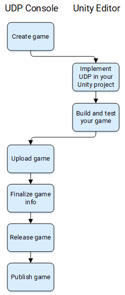

# Unity Distribution Portal

## Overview

Unity Distribution Portal (UDP) lets you distribute your Android games to multiple app stores through a single hub. UDP repacks your Android build with each store’s dedicated In-App Purchase SDK. You can manage all your store submissions from the [UDP console](https://docs.unity3d.com/Manual/udp.html).

## UDP package

The UDP package contains an SDK for working with UDP. It also enables the [Unity Distribution Portal](udp-package-reference.html#udp-settings) tab in the Project Settings window of the Unity Editor.

You can use the Unity Distribution Portal settings to:

* [Link your Unity project to the UDP client](getting-started.html#linking)
* [Create a catalog of IAP products](games-with-iap.html#iap-catalog) for your game
   For more flexibility, [create your IAP products in the UDP console](https://docs.unity3d.com/Manual/udp-distribution.html#create).

Additionally, the UDP package provides:

* A [sample scene](getting-started.html#sample) to help you get started with UDP
* A Sandbox environment where you can [test your game](building-your-game.html#testing) for UDP

## UDP journey

The overall steps required to [distribute a game with UDP]((https://docs.unity3d.com/Manual/udp-distribution.html)) are as follows:

1. Creating a game in the UDP console.
    1. Entering your game info on the UDP console.
    1. Defining supported languages.
1. Implement UDP in your Unity project.
    1. [Install the package](getting-started.html#install).
    1. [Link your project to the UDP client](getting-started.html#linking).
    1. [Initialize the UDP SDK](getting-started.html#init).
    1. [Implement IAP](games-with-iap.md) (if applicable).
    1. [Implement LicenceCheck for premium games](premium-games.md) (optional).
1. Build and test your game.
    1. Build your game as an APK or AAB file.
    1. Ensure all your IAP products are listed in the UDP console (if applicable).
    1. Test your game in the Sandbox.
1. Upload your game build to the UDP console.
1. Finalize the game information page in the UDP console.
    1. Verify testing was successful.
    1. Upload your app signing private key.
    1. Set a premium price (if applicable).
    1. Localize your game information for additional languages (if applicable).
1. Release your game on UDP.
1. Publish your game to stores.

The image below illustrates the overall workflow.

## System requirements

UDP is supported in Unity 5.6.1 or higher. Unity recommends to use 2018.4 or above.

You can implement UDP in your game in one of the following ways:

* Using the UDP package only (see [Installing the UDP package](getting-started.html#install))
* Using the UDP package and Unity IAP package

The implementation you choose does not affect the UDP console.

## Using the UDP package and the Unity IAP package

Unity recommends using the UDP package with Unity IAP package version 3.0.0 and above, accessible from the Package Manager.

If using Unity IAP package version &lt;3.0.0, you must also install the latest version of the Unity IAP plug-in from the Asset Store.

**Note**: The Unity IAP plug-in in the Asset Store is obsolete, and will be deprecated and no longer be supported after June 2021.