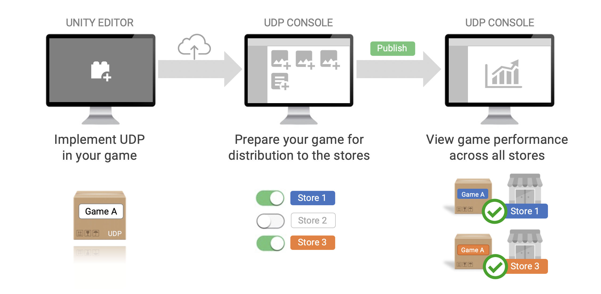

# Unity Distribution Portal

## Overview

Unity Distribution Portal (UDP) lets you distribute your games to multiple app stores through a single hub. UDP repacks your Android build with each store’s dedicated In-App Purchase SDK. You can manage all your store submissions from the UDP console.

  
UDP overview

## Support

* UDP is supported in Unity 5.6.1 or higher (2018.4 or higher is recommended) 
* UDP only supports Android
* UDP supports games with In-App Purchases and Premium games

## Documentation overview

Here is an overview of the UDP documentation.

### Getting Started

Understand the UDP journey and choose how you will implement UDP: using the UDP Package, or via Unity IAP.

### Setting up UDP

Get UDP set up in your Unity Editor.

### Creating a game on UDP

Begin the journey and start configuring UDP in your Unity project.

### Games with In-App Purchases

Understand how to implement your in-app purchases with UDP, and create an IAP catalog.

### Premium Games

If your game is a Premium game, all you need to implement in your game client is covered in this section.

### Building your game and deploying it to the UDP console

Build an APK for UDP, and upload it to the UDP console. This is when your journey switches from the Unity Editor to the UDP console.

### Managing and publishing your game on the UDP console

Enter and organize game information - descriptions in multiple languages, screenshots, trailers, prices in multiple currencies - and prepare your game for distribution. Sign up with stores and submit your game to them.

### Reporting Dashboard

Track the performance of your game on the stores you published it to.

### Bulk IAP Import, Service Interoperability, Using UDP with CloudBuild

These sections dive into more advanced topics.  

### FAQs and Best Practices

We’ve put together [FAQs](faq.md) and [Best Practices](best-practices.md) that we encourage you to go through early for a smooth UDP implementation.

## Questions and Feedback

If you have a question that isn’t answered in this documentation, contact the UDP Support team: [udpsupport@unity3d.com](mailto:udpsupport@unity3d.com)

Did anything go wrong? Which part of the documentation really helped you, or lost you? What do you think about UDP? What’s missing? We would really like to hear from you - just [head here](https://www.google.com/url?q=https://forms.gle/XHTNYZYZ1fFJSnwJ9&sa=D&ust=1586968763545000&usg=AFQjCNGcbuQOLuhNy0QvMLIDCpx31EOV0Q) and tell us.

