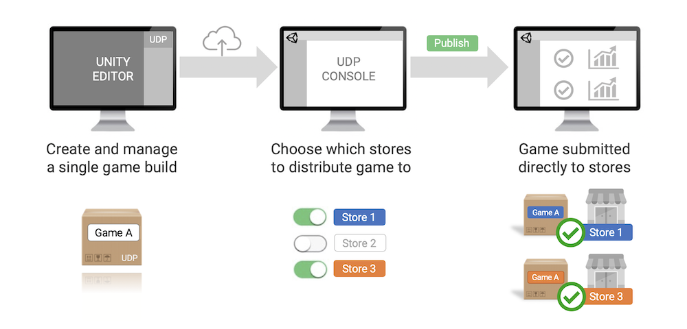

# Unity Distribution Portal

### Overview

Unity Distribution Portal (UDP) allows you to distribute your games to multiple app stores through a single hub. UDP repacks your Android build with each store’s dedicated IAP SDK and lets you manage all your store submissions from the UDP console.

### Prerequisites

- UDP is supported in Unity 5.6.1 or higher. 
- UDP currently only supports Android. 

### FAQs and Troubleshooting

Based on early usage observations and developer feedback, we’ve put together [FAQs](FAQs.md) and [Troubleshooting](Troubleshooting.md) sections to help you better understand how to use UDP. We encourage you to go through them to identify and avoid pitfalls ahead of implementation.

