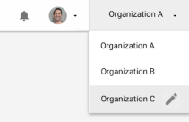

# Managing and publishing your game on the UDP console

The [UDP console](https://distribute.dashboard.unity.com) is a web-based portal where you can prepare your games for submission to multiple app stores. The UDP console lets you:

* [Consolidate and manage your game's information](#edit-info)
* [Edit your game's in-app purchases](#iap)
* [Publish your game to multiple app stores](#publish)
* [View your games’ performance across all UDP stores](reporting-dashboard.md)

**Note:** Make sure you successfully test your game’s IAPs in the Sandbox environment before continuing to this stage. If your IAPs don’t work in your generic UDP build, the versions that you’d submit to the stores would not work either. For more information, see [UDP Sandbox Test Accounts](creating-a-game-on-udp.html#udp-sandbox).

For a high-level overview of the UDP console’s information architecture, see [Navigating the UDP console](setting-up-udp.html#navigate).

## Editing your game information on the UDP console

In the [UDP console](https://distribute.dashboard.unity.com), navigate to your game via the **My Games** page. 

You can view and edit the following sections:

* [Game Description](#desc)
* [Binary](#binary)
* [Ads](#ads)
* [Premium Price](#premium)
* [In-App Purchases](#iap)
* [Integration Information](#integrate)
* [Sandbox Test Accounts](#sandbox)

Enter editing mode via the **EDIT INFO** button at the top on the Game Information page. To save changes select **SAVE**. To discard your changes, select **CANCEL**.

### Game description

Not every store necessarily takes all the assets listed below; however the list represents a superset of all the participating stores’ requirements. The UDP console flags which fields are mandatory and which are optional. Populate the following fields:

<table>
  <tr>
    <td>Property</td>
    <td>Description</td>
  </tr>
  <tr>
    <td>Game Title</td>
    <td>The title of your game (this field is synced with the Editor).</td>
  </tr>
  <tr>
    <td>Genre</td>
    <td>Indicates the category that your game belongs to. You can choose from Action, Adventure, Arcade, Board, Card, Casino, Casual, Educational, Music, Puzzle, Racing, Role Playing, Simulation, Sports, Strategy, Trivia, and Word.</td>
  </tr>
  <tr>
    <td>Device</td>
    <td>Choose between Smartphone, Tablet, or Universal.</td>
  </tr>
  <tr>
    <td>Game Icon</td>
    <td>The game icon that is shown on the app stores.</td>
  </tr>
  <tr>
    <td>Descriptions & Keywords</td>
    <td>The full-length description of your game to players, which is shown on the app stores. There is a short description (max 60 char) and a long description (4000 char); you can also define up to 4 keywords (30 char each).</td>
  </tr>
  <tr>
    <td>Game Banners</td>
    <td>An image used by stores to feature your game. For example, it can be a placement in a carousel. The landscape banner is mandatory, the portrait banner is optional.</td>
  </tr>
  <tr>
    <td>Screenshots & Videos</td>
    <td>The screenshots and video trailers of your game, including the cover image (thumbnail) to lay over the mp4 video when it is not playing.
Note: For videos, certain stores only accept mp4 files while others only accept a Youtube link. It’s recommended to upload both.</td>
  </tr>
</table>

Input metadata for each of your supported languages. To add new languages, choose **MANAGE LANGUAGES** while in editing mode.

**Hint**: If you have already published your game on Google Play, you can import the basic information using your game’s Google Play URL: 
1. Click IMPORT FROM GOOGLE PLAY.
2. Copy your game’s Google Play URL and paste it into the input box.
3. You can specify which language to specifically import by using a Google Play URL that contains the language suffix, for instance for Italian &hl=it.
4. If your Google Play URL doesn't contain the language suffix, UDP will fetch the information for the language that you’re currently editing the UDP console for (if it is set on Google Play).
5. Click Import.
6. Double-check the outcome as in some instances your computer’s IP address may ultimately determine which language you get served.

### Binary

Upload your APK file and OBB files: 

* **APK File**, which is your UDP game build. If you pushed your UDP build via Cloud Build, you don’t need to upload it again.
* **OBB File(Main)**, which is the main extension file for additional resources that your game or app might need.
* **OBB File(Patch)**, which is optional and lets you make small updates to the main expansion file.

OBB files are not pushed during a CloudBuild deployment, so if your game uses them you must upload them manually from the UDP console.

**Note**: You can only change the APK files and OBB files in the default language view (English).

Describe what’s new for the files in the **What’s New** box. UDP publishes this description in the stores together with your game.

### Ads

Certain stores expect you to implement their proprietary ad network in games you submit to them.

UDP asks if your game contains ads to better inform your submissions to the stores, especially if UDP can ascertain that your submission will be rejected from a store because of this.

If this is the case, these stores display a "warning" icon in the Publish section, and the tooltip explains the cause for concern. It is then easier for you to plan your submission knowing what issues lie ahead.

UDP otherwise does not modify your game’s ad implementation in any way. 

Ongoing tests of the most common mediation layers + ad networks indicate that games repacked for the UDP stores generally have no problem receiving ad campaigns. We will post findings once definite results are available; in the meantime feel free to [ask UDP Support](mailto:udpsupport@unity3d.com) about your ad set-up and its suitability for distribution via UDP. Make sure you mention which mediation SDK and ad networks your game uses, to get a better-informed answer faster.

### Premium price

The Premium price is the price it costs players to download your game. Set a default price in USD, and adjust prices in other currencies using the **Manage amounts and currencies** link. 

You can only set the Premium price on the UDP console.

**Note**: Not all Stores support Pay-to-Download. If you intend to submit a Premium game through UDP, make sure that in the **Publish** tab you only select Stores that carry the Pay-to-Download label.

If you try to submit a Premium game to a store which doesn’t support them, you will be warned before the submission can go through.

### In-App Purchases

UDP keeps your game’s IAP Catalog synchronized between the Unity Editor and the UDP console. However, the Unity Editor only handles IAP prices in USD and IAP descriptions in English. It is only in the UDP console that you can set prices in other currencies than USD, descriptions in other languages than English, and [import your IAP products in bulk](bulk-iap-import.md).

This section covers how to edit, create and delete IAP products from the UDP console.

To create IAP products in the Unity Editor, see [Game client implementation](games-with-iap.html#implement-game-client).

To understand how the IAP Catalog works in the UDP context, see [Notion of IAP Catalog](best-practices.html#notion).

#### **Editing IAP descriptions**

To edit IAP descriptions, proceed as follows.

1. Select **EDIT INFO** on the **Game Information** page
2. Choose the language which you want to edit your descriptions for via the drop-down language selector
3. In the In-App Purchases section, click the **pencil icon** to edit an existing IAP item 
4. Edit your IAP item information:
    1. **Product Name**, the name of the IAP item
    2. **Description**, to succinctly describe the IAP item
5. Select **SAVE**  to save your changes.

**Note:** The above steps only edit your IAP item information for the language selected. If the combination of *Number of IAP items x Number of Languages* to cover makes this task look daunting, consider importing all this information in bulk using the [Bulk IAP Import](bulk-iap-import.md) feature.

#### Editing IAP prices and currencies

1. Select **EDIT INFO** on the **Game Information** page.
2. Click the link **Manage amounts and currencies** of an IAP item to:
    1. Change the IAP price.
    2. Convert it from USD to foreign currencies. 
    3. Adjust pricing in these currencies.
3. Select **SAVE** to save your changes.

**Hint:** To elect certain currencies as favourite currencies, click the Star next to their currency code. This pins the currency to the top of the list. Click on the star again to unpin.

**Note:** If the combination of *Number of IAP items x Number of Currencies* to cover makes this task look daunting, you can use the `Convert` function to automatically convert all your IAP prices into global currencies, based on the USD amount set for each IAP item. This overrides any local prices you may have previously set.

Alternately, import all this information in bulk using the [Bulk IAP Import](bulk-iap-import.md) feature.

#### Creating new IAP items

**Note:** if you used the IAP Catalog during your game implementation, you shouldn’t have to create IAP products from the UDP console again - the IAP Catalog syncs between the Unity Editor and the UDP console. However, if you have to enter your IAP items manually on the UDP console, be vigilant that the Product IDs match those implemented in your code. 

1. Select **EDIT INFO** on the **Game Information** page
2. Click **Add Item** to create a new item
3. Specify and save your product information:
    1. **Product ID**, the unique identifier of the IAP item. Please take note of the required syntax for Product IDs
    2. **Product Name**, the name of the IAP item
    3. **Price**, the price in USD of the IAP item
    4. **Consumable**, to indicate whether the IAP item is consumable or not
    5. **Description**, to succinctly describe the IAP item
4. Click the link **Manage amounts and currencies** to:
    1. convert the IAP price from USD to foreign currencies. 
    2. adjust pricing in these currencies.
5. Select **SAVE** to save your changes.

**Note:** If you have many IAP items to create, consider using the [Bulk IAP Import](bulk-iap-import.md) feature to create all your IAP items in one go - including localized description and pricing in multiple currencies.

#### **Deleting IAP items**

1. Select **EDIT INFO** on the **Game Information** page
2. Click the **trash can icon** to delete an IAP item
3. Select **SAVE** to save your changes.

#### **Importing IAP items in bulk**

1. Select **EDIT INFO** on the **Game Information** page.
2. Click **IMPORT CATALOG** in the top-right corner of the In-App Purchases panel.
3. See [Bulk IAP Import](#bulk-iap-import.md) for full coverage of this function.
4. Select **SAVE** to save your changes.

### Integration Information

This information is synced with the Unity Editor. You can only edit the **IAP Callback URL** field.

### Sandbox Test Accounts

Your generic UDP game build, when it launches in the UDP Sandbox environment, asks the user for access credentials. You define and manage these credentials in that section. 

Learn more about [UDP Sandbox Test Accounts.](creating-a-game-on-udp.html#udp-sandbox)

The information you edit on the UDP console is synced with the Unity Editor when you save your Revision draft.

**Note:** The test accounts are only for the UDP Sandbox environment, and only apply to the generic UDP build. When a game is repacked for a specific store, it no longer points to the sandbox environment where the test accounts belong.

### Save your Revision

When you have entered all the game information for this revision, including in all the languages, save your changes using the **SAVE** button.

Saving your changes only saves your Revision Draft. [Release your Revision Draft](#release) to create a new Revision which can be submitted to stores.

**Note**: To overwrite an existing Revision Draft, edit a previously-released Revision and save the ensuing draft. This becomes the latest Revision Draft.

Learn more about the concept of [Revisions and Releases](faq.html#revisions).

### Release your revision

Only RELEASED revisions can be published to stores. 

When you have saved your Revision Draft and are ready to publish it, click the **RELEASE** button.

Enter **Release notes** and a **Release label** to keep track of your revision.

**Note:** You can only publish the latest revision to the stores. If you need to submit an older revision, edit it and re-release it so it becomes the latest one. Check the FAQ section for more tips.

The Release labels and notes of all your revisions are visible in:

* The **Game Info** section, when expanding the Revision drop-down
* The **Status** section, which is organized by Release

If you intend to submit different Releases to different stores, you should label and document your releases diligently. See [Submitting different Revisions to different stores](faq.html#submit-revisions).

## Publishing your game to stores

The **Publish** panel is where you set the distribution of your game in motion. You can only publish RELEASED revisions to stores. 

Follow these steps for each of the stores you want to submit your game to: 

1. [Sign up with the store](#sign-up)
2. [Register your game with the store](#register)
3. [Select the Target Step](#select-target)
4. [Set Advanced settings](#advanced)

Click on the **PUBLISH** button once your set-up is complete for all stores.

**Note:** each store displays an "info" icon mentioning whether it is fully or partially integrated with UDP. A full integration means that you can register and submit your game to the store without having to leave the UDP console. A partial integration means that additional work is required on the store’s developer console at some point during the process. The filter “**Only view stores which are fully integrated with UDP**” hides partially-integrated stores from view.  

### Sign up with the store

If this is your first time working with this store, sign up for a store account. The sign-up redirects you outside the UDP console to complete your sign-up process with the store. Partner stores each have their own onboarding process.

**Note:** Only the Organization Owner and Manager can sign up with a store. See UDP role-based permissions for more details.

Once your Organization has signed up with the store, this step is no longer required. 

Store accounts are per Unity Organization. If you return to the UDP console under a different Organization, you need to sign up again and create a different account.

### Register your game with the store

When you have signed up, you can register your game with the store.

Confirm the package name you want to register with the store and click **REGISTER**.

When your game is registered with the store, you can no longer change the package name for that store.

Some stores ask for additional information when registering the game.

### Select the target step

Select the target step you want to take with the given store:

* **Repack Game**, UDP repacks your game with the SDK from the selected store.
* **Submit to Store**, UDP repacks and submits your game, its metadata and its IAP catalog to the production environment of the selected stores.

Test your repacked build before submitting it to the stores to ensure your in-app purchases work as expected in the store’s commercial environment. If you [tested your IAPs in the sandbox environment](best-practices.html#test) there should be no problem, but it’s always safer to double-check on the final build. Select **Repack Game** only, and click on the **PUBLISH** button. When repacking is complete, download the APK from the **Status** tab.

**Note:** An IAP catalog is only synced with the store’s servers when the game is submitted to the store. A game that is only repacked would fetch the last IAP catalog submitted to the store. For the first time, you need to submit your game to create an IAP catalog on the store’s servers.

### Countries and Advanced settings

Click **Countries** and select the countries that you want to distribute your game to.

Click **Advanced** to configure more store-specific settings. 

You can configure the following properties specifically for a store:

|Property|Function|
|---|---|
|Target SDK|The version of the store SDK that you publish your game to. By default, UDP repacks for the latest version of the store SDK.|
|Premium Price|The price players will pay to download your game.|
|In-App Purchases|The name, price and currency for your IAP items.|

### Company Information

Before publishing your game to the UDP stores, you need to create a company information profile. The stores use this information to populate the "About the developer" section of your game’s listing on their app store. You only need to do this once.

1. On the UDP console, choose your organization and click on the **pencil icon** to edit the profile. 
  
2. Enter and save your company information:

|Field|Description|
|---|---|
|Company Name|The name of your company as you want players to see it.|
|Location|The location you want to define as your studio’s headquarters.|
|Company Size|Use the drop-down to specify the number of people in your company.|
|Official Website|The official website of your company.|
|Support Email Address|The support email that players can use to contact your company.|
|About|Any additional information about your company / studio.|

### Publish

Once you have completed all the above steps, select each store you want to submit this game revision to, and click on the **PUBLISH** button. 

Only the latest released revision of your game is taken through the target steps selected for each store.

If your submission is missing anything, the UDP console flags the omissions via a pop-up. The pop-ups can be:

* Errors (in red): you must fix these before you can submit your game. Click on **Modify** to be sent to the area when you can fix the issue. You can also choose to only submit to stores where there are no errors.
* Warnings (in yellow): you can ignore these, though addressing them will improve the quality of your submission.

In either case, the stores impacted by an Error or Warning are highlighted in the Pre-submission screening pop-up.

## Submission follow-up

### Monitoring status

When UDP starts processing your game, visit the **Status** panel to monitor progress and check the submission history of your game. Your game can have the following statuses:

* **Packing**: your game is being repacked with the SDK of the selected store
* **Packed**: your game was successfully repacked with the SDK of the selected store
* **Packing failed**: your game could not be repacked with the SDK of the selected store
* **Submitted**: your game was successfully repacked with the SDK of the selected store and submitted to its Production environment 
* **Submission failed**: your game was successfully repacked with the SDK of the selected store but encountered a problem during the submission process
* **Canceled**: your game submission was cancelled by you or someone from your Organization
* **Vetting**: your game is being reviewed by the store’s content management team
* **Accepted**: your game was accepted by the store’s content management team
* **Rejected**: your game was rejected by the store’s content management team

When your game is published to the store(s) you can monitor its performance from the [Reporting Dashboard](reporting-dashboard.md).

### Downloading repacked builds

When your game build is repacked or submitted to the store, click **Download APK file** in the **Status** panel to download your repacked build.

### Completing store submissions

Stores which are only partially integrated with UDP require you to take directly on the store’s own developer console. The **Go to Store** button next to a submitted revision indicates this. A tooltip explains which steps are still required. Follow the links and complete your submission on the store’s console.