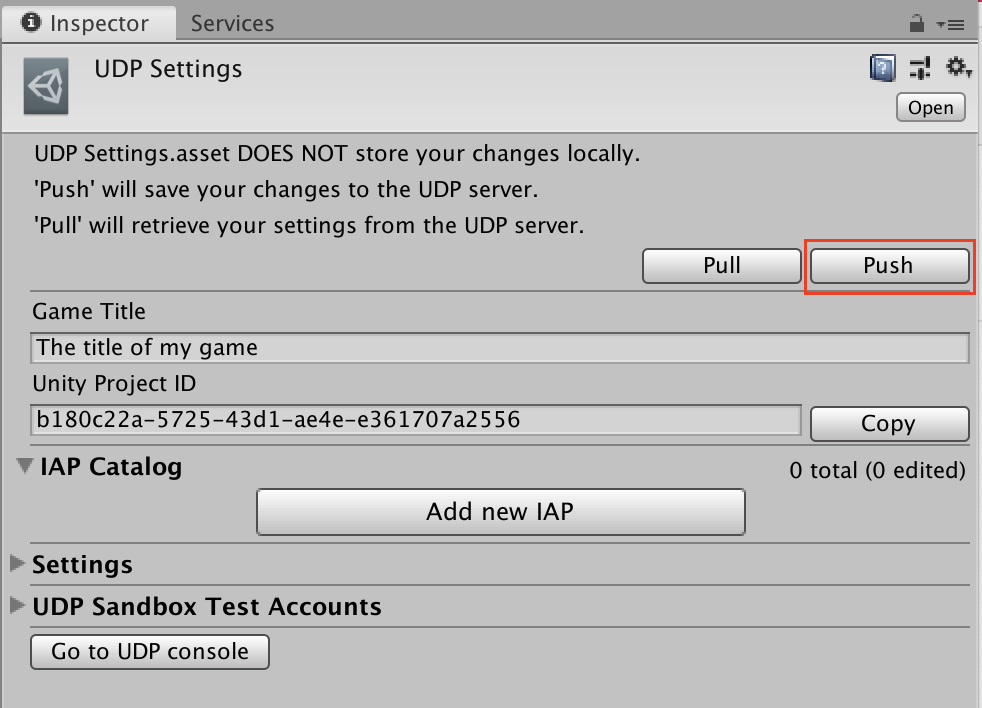
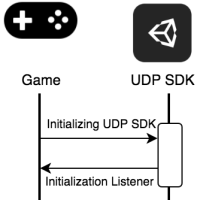

# Premium games

You can distribute Premium games (aka Pay-To-Download games) via UDP.

If your premium game does not offer any in-app purchases, your UDP implementation should be quite straightforward.

You still need to install the UDP Package in your project, for the following reasons:

* The UDP console checks whether your uploaded APK implements UDP and specifically verifies that your game build’s [UDP client](creating-a-game-on-udp.html#udp-client) matches the one registered on the UDP console - in other words, that you own and control the project that you intend to distribute.
* It enables the flow of your game’s data into the UDP console’s Reporting dashboard.

Follow this workflow to be able to distribute your Premium game via UDP.

## Install the UDP Package

Get the UDP Package from Unity’s Package Manager. See details in [Setting up UDP from the Package Manager](setting-up-udp.html#packman-install).

## Create a UDP client

1. Create a new UDP client or [link your project to an existing UDP Client](creating-a-game-on-udp.html#linking-project).
2. In the UDP Settings, you only need to enter the **Game Title**. <br/>You can ignore the IAP Catalog (unless your game also has IAPs). 
3. **Push** these changes to the server.



## Implement the Init method

To initialize the UDP SDK, your game needs to have a `UDPSettings.asset` file linked to a UDP client. The initialization listener then lets you know whether the initialization succeeds by returning a success or failure message. 

<br/>
Initializing game integration with UDP

Call the **Initialize** method in your game code.

`
StoreService.Initialize(IInitListener listener)
`

The InitListener then tells your game whether the initialization has succeeded or failed. 

```
using UnityEngine
using UnityEngine.UDP
  
public class InitListener : IInitListener
    {
    public void OnInitialized(UserInfo userInfo)
    {
        Debug.Log("Initialization succeeded");
        // You can call the QueryInventory method here
        // to check whether there are purchases that haven’t be consumed.       
    }

    public void OnInitializeFailed(string message)
    {
        Debug.Log("Initialization failed: " + message);
    }
}
```

## (Optional) Implement the LicenceCheck method 

The LicenceCheck method is currently only used by a single store (Viveport) so if you don’t intend to distribute your game to this store you can skip this step. Implementing it does not impact the behaviour of your game in other stores.

The UDP LicenseCheck service determines, at each game start, if the game has been purchased by the current player.

**Note**: the LicenceCheck method is only supported from UDP Package 1.2.0 and above, and Unity IAP 1.23 and above.

Call the LicenseCheck method in your game code (typically, before calling the UDP Init method):

StoreService.LicenseCheck(ILicensingListener listener)

The InitListener then tells your game whether it is licensed or not:

```
public class LicenseCheckListener : ILicensingListener
  {
      public void allow(LicensingCode code, string message)
      {
          //LicensingCode enum:
          //RETRY, LICENSED, NOT_LICENSED, STORE_NOT_SUPPORT
          Show(message);   //some meaningful message
      }
      public void dontAllow(LicensingCode code, string message)
      {
          //LicensingCode enum:
          //RETRY, LICENSED, NOT_LICENSED, STORE_NOT_SUPPORT
          Show(message);   //some meaningful message
      }
      public void applicationError(LicensingErrorCode code, string message)
      {
          //LicensingErrorCode enum:
          //ERROR_INVALID_PACKAGE_NAME, ERROR_NON_MATCHING_UID, ERROR_NOT_MARKET_MANAGED, ERROR_CHECK_IN_PROGRESS, ERROR_INVALID_PUBLIC_KEY, ERROR_MISSING_PERMISSION
          Show(message);   //some meaningful message
      }
}
```

## Next steps

The above is the only work needed on the game client. Now you need to:

* [Build your game and upload it to the UDP console](building-your-game.md)
* [Prepare your game for submission to the stores](managing-and-publishing-your-game.md)
    * Make sure you [set a premium price](managing-and-publishing-your-game.html#premium) for your game
    * Make sure you only submit your game to the stores which support premium games

Your premium game revenue is reported in the UDP console’s [Reporting dashboard](reporting-dashboard.md). 