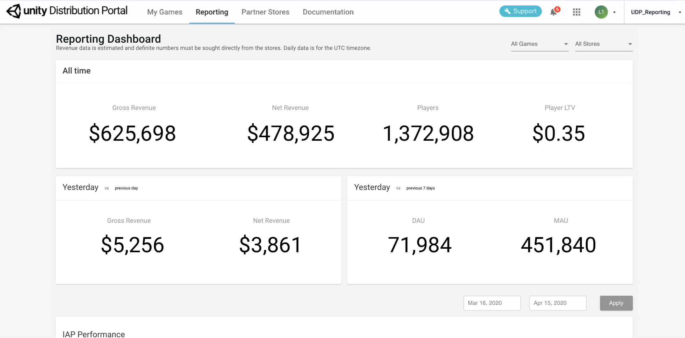

# Reporting dashboard

Monitor the performance of your published games from the **Reporting** dashboard, which is accessible from the top navigation bar:

## Metrics and definitions

The **Reporting** dashboard tracks the following data from the UDP stores where your games are published:

<table>
  <tr>
    <td>Metric</td>
    <td>Description</td>
  </tr>
  <tr>
    <td>Gross revenue (USD)</td>
    <td>Amount collected from players (eg. if IAP price= 0.99 then= $0.99)</td>
  </tr>
  <tr>
    <td>Net revenue (in USD)</td>
    <td>Share of developer’s revenue, based on each store’s revenue sharing terms. In cases where the revenue share depends on multiple factors, an average percentage is used to calculate this number.</td>
  </tr>
  <tr>
    <td>Players (or Unique Users)</td>
    <td>Based on UDP’s instrumentation, a unique user corresponds to a unique device where the game was downloaded and started on.</td>
  </tr>
  <tr>
    <td>Paying Player (or Spender)</td>
    <td>Unique user who made at least 1 successful payment.</td>
  </tr>
  <tr>
    <td>Player LTV (Lifetime Value, in USD)</td>
    <td>This is defined as Gross Revenue / Number of Players.</td>
  </tr>
  <tr>
    <td>DAU (Daily Active Users)</td>
    <td>Unique users who launched the game at least once on that day.</td>
  </tr>
  <tr>
    <td>MAU (Monthly Active Users)</td>
    <td>Unique users who launched the game at least once during the last 30 days.</td>
  </tr>
  <tr>
    <td>Unique Users (during a certain period)</td>
    <td>Unique users who launched the game at least once during the defined period.</td>
  </tr>
  <tr>
    <td>ARPPU (Average Revenue per Paying User, in USD)</td>
    <td>This is defined as Gross Revenue / Number of Paying Players.</td>
  </tr>
  <tr>
    <td>ARPU (Average Revenue per User, in USD)</td>
    <td>This is defined as Gross Revenue / Number of Players.</td>
  </tr>
  <tr>
    <td>Payer Conversion (%)</td>
    <td>This is defined as Number of Paying Players / Number of Players.</td>
  </tr>
  <tr>
    <td>Sessions</td>
    <td>Number of times the game was launched, on any device.</td>
  </tr>
  <tr>
    <td>New Players</td>
    <td>Number of Players who started the game for the first time during the selected time period.</td>
  </tr>
  <tr>
    <td>Day 1 Retention (%)</td>
    <td>This is defined as Percentage of Players that are still active 1 day after their first game launch.</td>
  </tr>
  <tr>
    <td>Day 7 Retention (%)</td>
    <td>This is defined as Percentage of Players that are still active 7 days after their first game launch.</td>
  </tr>
  <tr>
    <td>Day 30 Retention (%)</td>
    <td>This is defined as Percentage of Players that are still active 30 days after their first game launch.</td>
  </tr>
  <tr>
    <td>Transactions</td>
    <td>Number of successful transactions which resulted in a payment (OrderID was successful and verified by the UDP server).</td>
  </tr>
  <tr>
    <td>Average Revenue per Transaction (USD)</td>
    <td>This is defined as Revenue / Number of Transactions.</td>
  </tr>
</table>

**Note:** The Reporting dashboard contains estimated data; you can get exact numbers directly from the stores. The data shown is basis UTC time.

You can filter the information presented on the Reporting dashboard by game and by store.

The Reporting dashboard is divided into 5 panels, all subjected to the Games / Stores filter.

## All Time 

This panel displays the following lifetime metrics:

* Gross revenue (in USD)
* Net revenue (in USD) 
* Players (total number of unique players to date)
* Player LTV (in USD) 

## Yesterday 

This panel displays the following metrics from the last full 24h day (basis UTC):

* Gross revenue (in USD) *with % comparison on previous day*
* Net revenue (in USD) *with % comparison on previous day*
* DAU *with % comparison with average DAU value of last 7 days*
* MAU *with % comparison with average MAU value of last 7 days*

## IAP Performance 

This panel displays the following metrics for the selected date range:

* IAP Revenue
* Average Revenue per Transaction
* ARPPU
* ARPU
* Spender Conversion
* Transactions
* IAP Revenue Breakdown. You can view up to 5 IAPs in the chart, and select which ones to view via the drop-down selector.
* Transaction volume. You can view up to 5 IAPs in the chart, and select which ones to view via the drop-down selector.

## Premium Revenue 

This panel displays, for the selected date range:

* Pay-to-Download (Premium) Revenue

## Game Health 

This panel displays the following metrics for the selected date range:

* MAU
* DAU
* New Users
* Sessions
* Day 1 Retention
* Day 7 Retention
* Day 30 Retention