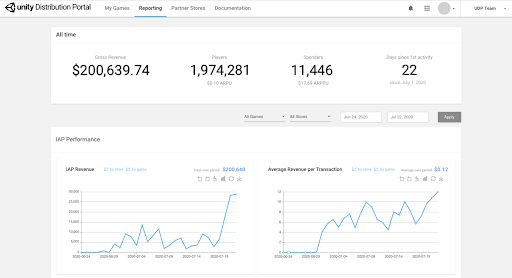

# Reporting dashboard

Monitor the performance of your published games from the **Reporting** dashboard, which is accessible from the top navigation bar:

You can filter the information presented on the Reporting dashboard by game and/or by store.

If you don’t select anything in the **All Games** and **All Stores** filters for the whole Reporting dashboard, you can view breakdowns on an individual chart level (where applicable). On supported charts, click the **by store** or **by game** filters to view performance on specific stores or for individual games.

The Reporting dashboard is divided into 5 panels, all subjected to the Games and Stores filters.

**Note**: The Huawei AppGallery only returns revenue information to UDP if you’ve set up server-side validation using QueryOrder. If you used callback notifications, no revenue-related charts or information is available for Huawei.

## Metrics and definitions

The **Reporting** dashboard tracks the following data from the UDP stores where your games are published:

<table>
  <tr>
    <td>Metric</td>
    <td>Description</td>
  </tr>
  <tr>
    <td>Gross revenue</td>
    <td>Amount collected from players in USD (e.g. if IAP price= 0.99 then= $0.99)</td>
  </tr>
  <tr>
    <td>Players</td>
    <td>The number of unique users who downloaded and started the game. This is calculated by unique devices.</td>
  </tr>
  <tr>
    <td>Spenders</td>
    <td>The number of paying players. That is, the number of unique users who have made at least one successful payment.</td>
  </tr>
  <tr>
    <td>Days since 1st activity</td>
    <td>The number of days since a game reached 10 players on an app store.</td>
  </tr>
    <tr>
    <td>New Players</td>
    <td>Number of players who started the game for the first time during the selected time period.</td>
  </tr>
  <tr>
    <td>DAU</td>
    <td>Daily active users. The number of unique users who launched the game at least once on that day.</td>
  </tr>
  <tr>
    <td>MAU</td>
    <td>Monthly Active Users. The number of unique users who launched the game at least once during the last 30 days.</td>
  </tr>
  <tr>
    <td>IAP Revenue</td>
    <td>Gross revenue from IAP, in USD.</td>
  </tr>
    <tr>
    <td>Average Revenue per Transaction</td>
    <td>This is defined as Revenue / Number of Transactions, in USD.</td>
  </tr>
  <tr>
    <td>ARPPU</td>
    <td>Average revenue per paying user, in USD. This is defined as Gross Revenue / Number of Paying Players.</td>
  </tr>
  <tr>
    <td>ARPU</td>
    <td>Average revenue per user, in USD. This is defined as Gross Revenue / Number of Players.</td>
  </tr>
  <tr>
    <td>Spender Conversion Rate</td>
    <td>This is defined as Number of Paying Players / Number of Players.</td>
  </tr>
  <tr>
    <td>Transactions</td>
    <td>Number of successful transactions which resulted in a payment (OrderID was successful and verified by the UDP server).</td>
  </tr>
  <tr>
    <td>Revenue by IAP</td>
    <td>Breakdown of gross revenue by IAP, in USD.</td>
  </tr>
  <tr>
    <td>Transaction Volume by IAP</td>
    <td>Breakdown of transactions by IAP.</td>
  </tr>
  <tr>
    <td>Premium Revenue</td>
    <td>Gross revenue generated by premium games, in USD.</td>
  </tr>
  <tr>
    <td>Sessions</td>
    <td>Number of times the game was launched, on any device.</td>
  </tr>
  <tr>
    <td>Day 1 Retention (%)</td>
    <td>This is defined as Percentage of Players that are still active 1 day after their first game launch.</td>
  </tr>
  <tr>
    <td>Day 7 Retention (%)</td>
    <td>This is defined as Percentage of Players that are still active 7 days after their first game launch.</td>
  </tr>
  <tr>
    <td>Day 30 Retention (%)</td>
    <td>This is defined as Percentage of Players that are still active 30 days after their first game launch.</td>
  </tr>
</table>

**Note:** The Reporting dashboard contains estimated data; you can get exact numbers directly from the stores. The data shown is in UTC time and is until the previous day to display the most accurate, complete data.

## All Time 

This panel displays the following lifetime metrics:

* Gross revenue (in USD)
* Players
* Spenders
* Days since 1st activity

## Yesterday 

This panel displays the following metrics from the last full 24h day (basis UTC):

* Gross revenue (in USD) *with $ or % comparison to the previous day*
* New players
* DAU *with % comparison with average DAU value of last 7 days*
* MAU *with % comparison with average MAU value of last 7 days*

## IAP Performance 

This panel displays the following metrics for the selected date range:

* IAP Revenue
* Average Revenue per Transaction
* ARPPU
* ARPU
* Spender Conversion Rate
* Transactions
* Revenue by IAP. You can view up to 5 IAPs in the chart, and select which ones to view via the drop-down selector.
* Transaction Volume by IAP. You can view up to 5 IAPs in the chart, and select which ones to view via the drop-down selector.

## Premium Revenue 

This panel displays, for the selected date range:

* Premium Revenue (revenue from paid downloads)

## Game Health 

This panel displays the following metrics for the selected date range:

* DAU - per day and average over the period
* MAU - per day and average over the period
* New Players - per day and total over the period
* Sessions - per day and total over the period
* Day 1 Retention Rate - per day and average over the period
* Day 7 Retention Rate  - per day and average over the period
* Day 30 Retention Rate  - per day and average over the period