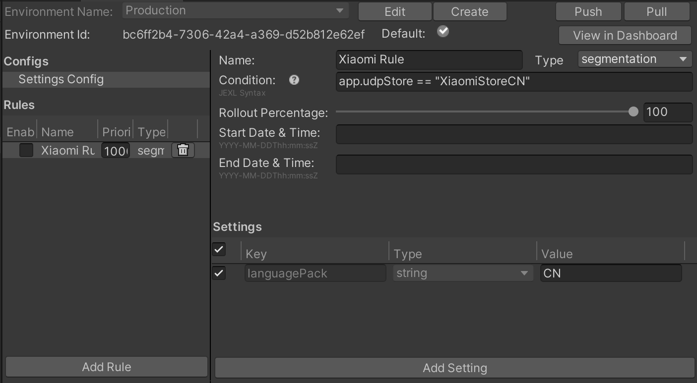

# Service interoperability

UDP can tell other services used by your game: "which store was the game downloaded from".

This information can be used in many ways, by Unity services as well as by third-party or your own services.

For example, Unity Remote Config lets you tune your game settings without deploying new versions of your application, based on rules that you define. The information "which store was the game downloaded from" can be used to define such rules. 

This section explains how to let other services gain access to this information, and includes an [example](#example).

## How does it work?

The first time your game is launched on a player’s device, UDP creates and drops a JSON file in the game’s Persistent Data Path. This file `udp.json` contains a field called `udpStore` whose value is the information "which store was the game downloaded from". Retrieve that information to use it the way you intend to.

**Note:** This doesn't add any new permission into your game manifest.

## Locating udp.json

The file `udp.json` is saved in: 

`Application.PersistentDataPath + '/Unity' + /Application.CloudProjectID + /udp/udp.json`

Where:

* `Application.PersistentDataPath` is your game’s persistent data path
* `Application.CloudProjectID` is your game’s Unity project ID

Here is an example of a path to the `udp.json` file:

`path/storage/emulated/0/Android/data/com.mystudio.mygame/files/Unity/c83d2de2-de74-4b75-83fc-ade948bda064/udp/udp.json`

Where:

* `Application.PersistentDataPath`= `path/storage/emulated/0/Android/data/com.mystudio.mygame`
* `Application.CloudProjectID`= `c83d2de2-de74-4b75-83fc-ade948bda064`

## Reading udp.json

The file `udp.json` contains the following information:

```
{"key":"UDP","udpStore":"StoreName","udpClientId":"value_of_udpClientId","CloudProjectId":"value_of_CloudProjectId"}
```

The field `udpStore` contains the value of the UDP store your game was downloaded from.

Here is an example of a `udp.json` file contents:

{"key":"UDP","udpStore":"SamsungGalaxyStore","udpClientId":"icjaB7wmu_q7AOjrSLH8yw","cloudProjectId":"bc2be074-09f3-450f-8e98-a0f79c9746f7"}

Where the UDP store your game was downloaded from is Samsung Galaxy Store.

**Tip:** use `JSONUtility.FromJsonOverwrite` to read the contents of the file as a text asset.

<a name="udp-values"></a>
## Possible udpStore values

The following table lists the `udpStore` values you can expect for stores available on UDP.

These are case-sensitive.

<table>
  <tr>
    <td>Store (channel name on UDP)</td>
    <td>Value for udpStore</td>
  </tr>
  <tr>
    <td>UDP Sandbox (for the generic UDP builds)</td>
    <td>UdpSandbox</td>
  </tr>
  <tr>
    <td>ONE store</td>
    <td>OneStore</td>
  </tr>
  <tr>
    <td>APPTUTTi</td>
    <td>Apptutti</td>
  </tr>
  <tr>
    <td>VIVEPORT</td>
    <td>Htc</td>
  </tr>
  <tr>
    <td>Mi GetApps (Xiaomi)</td>
    <td>XiaomiStore</td>
  </tr>
  <tr>
    <td>HUAWEI AppGallery</td>
    <td>Huawei</td>
  </tr>
  <tr>
    <td>Samsung Galaxy Store</td>
    <td>SamsungGalaxyStore</td>
  </tr>
  <tr>
    <td>QooApp Game Store</td>
    <td>QooApp</td>
  </tr>
  <tr>
    <td>TPAY MOBILE Stores</td>
    <td>Tpay</td>
  </tr>
  <tr>
    <td>Uptodown</td>
    <td>Uptodown</td>
  </tr>
  <tr>
    <td>JioGames</td>
    <td>JioGamesStore</td>
  </tr>
</table>

<a name="example"></a>
## Example - implementation with Remote Config

[Unity Remote Config](https://unity.com/remote-config) is a cloud service that allows you to tune your game settings without deploying new versions of your application. When a player launches your game, Remote Config detects contextual attributes used as Rule conditions (based on Unity, the application, the user, or custom criteria that you define). The service then returns customized settings for each player according to the Rules that apply to them.

Use `udpStore` as an attribute in your Rule conditions, so you can determine game settings that take the information "which UDP store was the game downloaded from" into account.

This is how the implementation breaks down:

1. Download and install the UDP package.
2. Download and install the Unity Remote Config package. See the [Remote Config documentation](https://docs.unity3d.com/Packages/com.unity.remote-config@latest/index.html).
3. In the game code, implement the Remote Config ConfigManager.FetchConfigs call. 
4. Before calling FetchConfigs, create a AppAttributes struct, which at least has a parameter, "udpStore":<br/>
    ```
    public struct AppAttributes
    {
      public string udpStore;
    }
    ```
5. When calling FetchConfigs, create a new instance of the AppAttributes struct, read the UDP store data file from:
Application.PersistentDataPath + '/Unity' + /Application.CloudProjectId + /udp/udp.json 
Use JSONUtility.FromJsonOverwrite to read the contents of the file as a text asset.<br/>
    ```
    {
        string udpFilePath = System.IO.Path.Combine(Application.persistentDataPath, "Unity", Application.cloudProjectId, "udp", "udp.json");
        string udpFileContents = System.IO.File.ReadAllText(udpFilePath);
        var appAttr = JsonUtility.FromJson<AppAttributes>(udpFileContents);
        Unity.RemoteConfig.ConfigManager.FetchCompleted += ConfigManager_FetchCompleted;
        Unity.RemoteConfig.ConfigManager.FetchConfigs(null, appAttr);
    }
    ```
6. Ensure the AppAttributes struct is used in ConfigManager.FetchConfigs
7. Open the **Remote Config** window (**Window** > **Remote Config**), and now create the parameters that you'd want to change based on the UDP store.
8. Once the parameters are set up, and instrumented in the game code, create a rule for each store in the Remote Config window
9. In each rule's condition, put: app.udpStore == "[storeName]"<br/>
    * See the [possible values for udpStore](#udp-values)<br/>
  
10. Enable the setting for the rule by clicking the checkbox next to the setting
11. Make sure the rule is enabled by clicking the checkbox next to the name of the rule on the left panel in the **Remote Config** window.
12. Build the app to a device and ensure the rules are properly applied, and ship it!