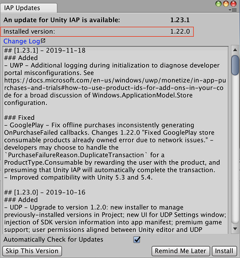
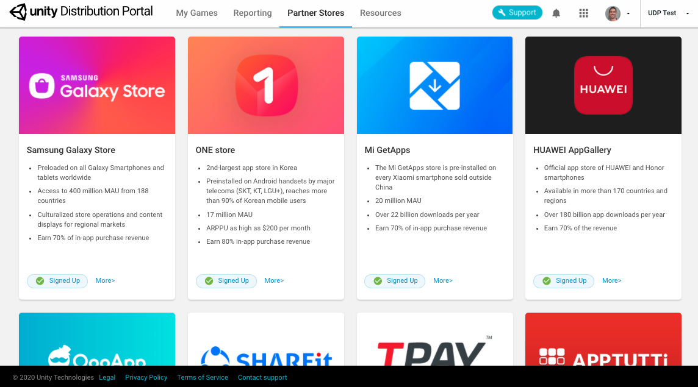

# Setting up UDP   

So you’ve chosen between using the UDP Package or using Unity IAP (see [How to implement UDP](getting-started.html#how-to-implement)).

1. Open the Unity Editor and log in with a Unity account. If you don’t have a Unity account yet, create one in [https://id.unity.com](https://id.unity.com). 
2. Create or open a Unity project in the Editor.
3. Set up UDP according to your choice: UDP Package, or Unity IAP implementation.

## Installing the UDP Package

You can install the UDP package from:

* The Package Manager
* The Asset Store

### Installing the UDP package from the Package Manager

1. In the Unity Editor, select **Window** > **Package Manager**: 
    
2. Select the tab **All** and look for Unity Distribution Portal: 
    
3. Select the Unity Distribution Portal package and install it in your project.

Learn more about the [Unity Package Manager](https://docs.unity3d.com/Packages/com.unity.package-manager-ui@2.1/manual/index.html).

### Installing the UDP package from the Asset Store

If you don’t have access to Unity Package Manager, download the **UDP Package** from the [Unity Asset Store](https://assetstore.unity.com/packages/add-ons/services/billing/unity-distribution-portal-138507) and install it in your project.

## Installing UDP via Unity IAP

Follow these steps to install the latest **Unity IAP** version and check you have 1.22 or above installed (which has UDP).

From the **Unity Services** window:

1.  [Enable Unity IAP from the Services Window](https://docs.unity3d.com/Manual/UnityIAPSettingUp.html).
2.  To import the latest package, select **Import** / **Reimport**. 
    
3. Go to **Window** > **Unity IAP** > **IAP Updates**:

UDP is included in version 1.22 and above.

## Navigating the UDP console

The [UDP console](https://distribute.dashboard.unity.com) is a web-based portal where you can prepare your games for submission to multiple app stores. The UDP console lets you:

* Consolidate and manage your game's information
* Edit your game's in-app purchases
* Publish your game to multiple app stores 
* View your games’ performance across all UDP stores

Access the UDP console via the URL [https://distribute.dashboard.unity.com](https://distribute.dashboard.unity.com). 

To access the UDP console from the Unity Editor, select **Window** > **Unity Distribution Portal**> **Settings**. In the **UDP Settings** inspector window, select **Go to UDP console**.

This section provides a high-level overview of the UDP console’s information architecture.

The UDP console contains a navigation bar that lets you navigate between the following sections of the UDP console:

* **My Games**
* **Reporting**
* **Partner Stores**

### My Games 

The **My Games** tab displays your UDP projects. From here you can switch between UDP projects, [create a new game](creating-a-game-on-udp.html#udp-new-game), and [archive and restore games](best-practices.html#archive).

To view the **Game Info** page for a game, select the card in the **My Games** tab. The **Game Info** page lets you [edit your game information](managing-and-publishing-your-game.html#edit-info), and [publish your game and view its status](managing-and-publishing-your-game.html#publish).

A game card has a status "Published" if it has been submitted to - and accepted by - at least one store.

### Reporting

The **Reporting** tab displays performance information for your published games. For more information, see [Reporting Dashboard](reporting-dashboard.md).

### Partner Stores

The **Partner Stores** tab displays information about the stores you can distribute your game to using UDP.

Click on the **More** link for more information on a store, such as overview, FAQs, and other useful links specific to each store.