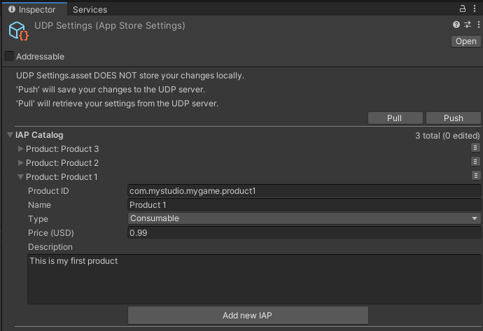
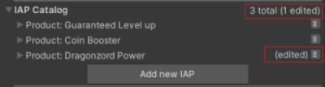

# UDP package reference

## Editor UI

### UDP Settings
The UDP Settings inspector manages the connection between your Unity project and the UDP client. To enable the UDP Settings window, you must [install the UDP package](getting-started.html#install) and [link your Unity project to a UDP client](getting-started.html#linking).

To access the UDP Settings window in the Unity Editor, select **Window** > **Unity Distribution Portal** > **Settings**.

|UDP Settings|Description|
|---|---|
|**Pull**|Retrieves (pulls) the information you last saved on the UDP server into the Editor.<br/>The following information is synced:<br/>- Game Title<br/>- Settings<br/>- UDP Sandbox Test Accounts<br/>- IAP Catalog (if using the UDP package only)<br/>This overrides any unsaved changes in the Editor.|
|**Push**|Saves (pushes) your changes to the UDP server.<br/>The following information is synced:<br/>- Game Title<br/>- Settings<br/>- UDP Sandbox Test Accounts<br/>- IAP Catalog (if you defined the IAP Catalog directly in the UDP Settings window)|
|**Game Title**|Input the title of your game, and press Push to save. This field syncs with the UDP console.<br/>By default and on first load, Game Title is populated with Game ID (see [Settings](#settings)).| 
|**Unity Project ID**|Your Unity project ID, which is now linked to your UDP client ID. This field is not editable.|
|**IAP Catalog**|For UDP package implementations, the IAP catalog fields are displayed.<br/>For Unity IAP implementations, the Open Catalog button is displayed.<br/>From Unity Editor version 2020.1, the IAP Catalog is available in a separate window.|
|**Settings**|Contains additional game settings.|
|**UDP Sandbox Test Accounts**|Contains settings for UDP Sandbox Test Accounts.|

### IAP Catalog
The IAP Catalog section lets you define IAP products for UDP. To add a new item, select **Add new IAP**.
The image below shows the IAP Catalog section if using the UDP package.




The table below describes the fields of the IAP Catalog section.

|Field|Description|
|---|---|
|**Product ID**|The unique ID used to identify the IAP product.<br/>**Product IDs** must follow these requirements:<br/>- Start with a letter or a digit<br/>- Contain only letters, digits, dots (.) and underscores (_)<br/>- Must not use capitalized letters|
|**Name**|The name of the IAP product.|
|**Type**|Indicates whether the IAP product is consumable or not.|
|**Price**|The price of the IAP product in USD. You can [set prices for additional currencies](https://docs.unity3d.com/Manual/udp.html#edit) in the UDP console.<br/>You must specify a price to enable players to purchase products in your game.|
|**Description**|A short description of the IAP product.<br/>This field only supports a description in a single language (English). You can [add further languages](https://docs.unity3d.com/Manual/udp.html#edit) in the UDP console.|

If you have any unsaved changes for your IAP products, an **edited** label is displayed. This disappears when you sync the IAP product.



**Note**: If you use the separate Unity IAP package, select **Window** > **Unity Distribution Portal** > **IAP Catalog** and define your IAP products in the separate IAP Catalog window.

<a name="settings"></a>
### Settings

The Settings section contains additional settings that are synced from the UDP console.
**Callback URL** is the only editable setting. Press **Push** to save any changes.

|Field|Function|Editable|
|---|---|---|
|**Game ID**|The identifier for the game|No|
|**Client ID**|The UDP client identifier|No|
|**Client Key**|Used when initializing the UDP SDK|No|
|**Client RSA Public Key**|Used to verify the callback notification|No|
|**Client Secret**|A Unity key to sign your request that your game sends to the UDP server|No|
|**Callback URL**|Specifies the URL for the server that receives the callback notification|Yes|

### UDP Sandbox Test Accounts

The UDP Sandbox Test Accounts section lets you add login credentials for the UDP sandbox. This is required to test your game in the UDP sandbox environment. You can also set these credentials in the UDP console.

|Field|Function|Editable|
|---|---|---|
|**Email**|The email address for the sandbox test account. It is used as the login name.|Yes|
|**Password**|The password for the test account.|Yes|

## UDP SDK

### UDP SDK data structure
This section describes the classes of the UDP SDK.

#### UserInfo
|field name|type|desc|
|---|---|---|
|Channel|string|PartnerStore name, generated by UDP|
|UserId|string|optional, user ID returned from PartnerStore|
|UserLoginToken|string|optional, user login token returned from PartnerStore|

#### Inventory

|public function|returns|desc|
|---|---|---|
|GetPurchaseInfo(string productId)|PurchaseInfo|get PurchaseInfo of given productId|
|GetProductInfo(string productId)|ProductInfo|get ProductInfo of given productId|
|HasPurchase(string productId)|bool|check if any unconsumed purchase exists for given productId|
|HasProduct(string productId)|bool|check if product exists for given productId|
|GetPurchaseDictionary()|Dictionary\<string, PurchaseInfo>|get purchases as productId - PurchaseInfo dictionary|
|GetPurchaseList()|List\<PurchaseInfo>|get purchases as list|
|GetProductDictionary()|Dictionary\<string, ProductInfo>|get products as productId - ProductInfo dictionary|
|GetProductList()|List\<ProductInfo>|get products as list|

#### PurchaseInfo

|field name|type|desc|
|---|---|---|
|ItemType|string|fixed value “inapp”|
|ProductId|string|product ID of IAP item|
|GameOrderId|string|cpOrderId provided by UDP|
|OrderQueryToken|string|token to query UDP server, generated by UDP|
|DeveloperPayload|string|Any string provided by the developer. UDP will pass this to PartnerStore in the ‘Purchase’ method.|
|StorePurchaseJsonString|string|any other additional info provided by PartnerStore|

#### ProductInfo
|field name|type|desc|
|---|---|---|
|ItemType|string|fixed value “inapp”|
|ProductId|string|product ID of IAP item|
|Consumable|bool|can be consumed or not|
|Price|string|formatted price of the item, including its currency sign.|
|PriceAmountMicros|long|price of IAP item in micros|
|Currency|string|currency of IAP item|
|Title|string|IAP item name|
|Description|string|IAP item description|

<a name="listener"></a>
#### IPurchaseListener

IPurchaseListener provides the following listeners that tell you the result of all purchase-related events:

|Event|Description|
|---|---|
|OnPurchase|The purchase succeeded.|
|OnPurchaseFailed|The purchase failed.|
|OnPurchaseRepeated |Used when a player buys a non-consumable product several times. You can implement this listener when the partner store doesn’t support QueryInventory.|
|OnPurchaseConsume|The consumption succeeded.|
|OnPurchaseConsumeFailed|The consumption failed.
|OnQueryInventory|The query succeeded.|
|OnQueryInventoryFailed|The query failed.|

<a name="order-query"></a>
## QueryOrder parameters

To query UDP about orders, call an HTTP GET request.
The table below describes the parameters in the QueryOrder request:

<table>
  <tr>
    <td>Attribute name</td>
    <td>Format</td>
    <td>Required/Optional</td>
    <td>Description</td>
    <td>Example</td>
  </tr>
  <tr>
    <td>orderQueryToken</td>
    <td>String</td>
    <td>Required</td>
    <td>The order query token returned by the client SDK when finishing a purchase. The token is Base64 encoded. (UDP SDK will return PurchaseInfo.OrderQueryToken)</td>
    <td style="word-break:break-all;">eyJjaGFubmVsUHJvZHVjdElkIjoiaWFwLl9mM2YzZiIsImNoYW5uZWxUeXBlIjoiQVBUT0lERSIsImNsaWVudElkIjoiQUFJZ3g5VmNGaDJZQ1ZxbUs2VWNDUSIsImNwT3JkZXJJZCI6IjJhNGQ5MWY4NDgzZjQ3YjlhYzFhNGY5MDAwZDVhNTRhIiwicGFja2FnZU5hbWUiOiJjb20udW5pdHkudW5pdHl0ZXN0Z2FtZV9mZWZ3In0=
</td>
  </tr>
  <tr>
    <td>orderId</td>
    <td>String</td>
    <td>Required</td>
    <td>The orderId returned by the client SDK when finishing a purchase. (UDP SDK will return PurchaseInfo.GameOrderId)</td>
    <td>2a4d91f8483f47b9ac1a4f9000d5a54a</td>
  </tr>
  <tr>
    <td>clientId</td>
    <td>String</td>
    <td>Required</td>
    <td>The clientId can be found in the Game info - integration information of UDP console.</td>
    <td>AAIgx9VcFh2YCVqmK6UcCQ</td>
  </tr>
  <tr>
    <td>sign</td>
    <td>String</td>
    <td>Required</td>
    <td>Generate signature with orderQueryToken and client secret, MD5.hash(orderQueryToken + clientSecret).

Client Secret can also been found in the Game info - integration information of UDP console.</td>
    <td style="word-break:break-all;">Client Secret:  KKcCyAgej06MxjKX31WuFNeHSaTJAjLDlgoDWsPJDAM

Sign:
90a4e440897623c7cd0b2b80a97c267e</td>
  </tr>
</table>

The store where your game is published returns the QueryOrder response to UDP. UDP forwards these parameters to your game.
The table below describes the parameters in the QueryOrder response：

<table>
  <tr>
    <td>Attribute name</td>
    <td>Format</td>
    <td>Required /optional</td>
    <td>Description</td>
    <td>Example</td>
  </tr>
  <tr>
    <td>clientId</td>
    <td>String </td>
    <td>Required</td>
    <td>The clientId that Unity returns after the game has created a client in the Unity IAP. </td>
    <td>Q4AnJDW2-rxLAPujqrk1zQ</td>
  </tr>
  <tr>
    <td>cpOrderId</td>
    <td>String </td>
    <td>Required</td>
    <td>The order ID assigned by your game, or Unity if the game does not generate it.</td>
    <td>66mea52wne</td>
  </tr>
    <tr>
    <td>storeOrderId</td>
    <td>String</td>
    <td>Optional</td>
    <td>The order ID that the store returns.</td>
    <td>Stores have their own Order ID format</td>
  </tr>
  <tr>
    <td>channelType</td>
    <td>String</td>
    <td>Required</td>
    <td>Channel type.</td>
    <td>APTOIDE,
CLOUDMOOLAH</td>
  </tr>
  <tr>
    <td>status </td>
    <td>String</td>
    <td>Required</td>
    <td>Indicates the status of the order.</td>
    <td>SUCCESS, FAILED, UNCONFIRMED, STORE_NOT_SUPPORT</td>
  </tr>
  <tr>
    <td>productId</td>
    <td>String</td>
    <td>Required</td>
    <td>The product ID associated with the order.</td>
    <td>product_1</td>
  </tr>
  <tr>
    <td>amount</td>
    <td>String</td>
    <td>Required</td>
    <td>The payment amount of the order.</td>
    <td>1</td>
  </tr>
  <tr>
    <td>quantity</td>
    <td>Integer</td>
    <td>Required</td>
    <td>Indicates the quantity of the product.</td>
    <td>1</td>
  </tr>
  <tr>
    <td>currency</td>
    <td>ISO 4217</td>
    <td>Required</td>
    <td>The currency used to purchase the product.</td>
    <td>CNY</td>
  </tr>
  <tr>
    <td>country</td>
    <td>ISO 3166-2</td>
    <td>Required</td>
    <td>The country or geographic region in which the user is located.</td>
    <td>CN</td>
  </tr>
  <tr>
    <td>paidTime</td>
    <td>ISO8601 yyyy-MM-ddThh:mm:ssXXX， UTC timezone</td>
    <td>Optional</td>
    <td>Specifies the time when the order is paid.</td>
    <td>2017-03-08T06:43:20Z
</td>
  </tr>
  <tr>
    <td>rev</td>
    <td>String</td>
    <td>Required</td>
    <td>The revision of the order (only for update).</td>
    <td>0</td>
  </tr>
  <tr>
    <td>extension</td>
    <td>Json String</td>
    <td>Optional</td>
    <td>The developer payload used to add reference information.</td>
    <td>{"abc" : "123"}</td>
  </tr>
</table>

Here is an example request from your game server to the UDP server and response from the UDP server back to your game server：

**The content of the orderQueryToken:**
```
{"channelProductId":“iap._f3f3f”,“channelType”:“APTOIDE”,“clientId”:“AAIgx9VcFh2YCVqmK6UcCQ”,“cpOrderId”:“2a4d91f8483f47b9ac1a4f9000d5a54a”,“packageName”:“com.unity.unitytestgame_fefw”}
```

**orderQueryToken (encoded as Base64):**
```
eyJjaGFubmVsUHJvZHVjdElkIjoiaWFwLl9mM2YzZiIsImNoYW5uZWxUeXBlIjoiQVBUT0lERSIsImNsaWVudElkIjoiQUFJZ3g5VmNGaDJZQ1ZxbUs2VWNDUSIsImNwT3JkZXJJZCI6IjJhNGQ5MWY4NDgzZjQ3YjlhYzFhNGY5MDAwZDVhNTRhIiwicGFja2FnZU5hbWUiOiJjb20udW5pdHkudW5pdHl0ZXN0Z2FtZV9mZWZ3In0=
```
**Order ID:**
```
2a4d91f8483f47b9ac1a4f9000d5a54a
```
**Client ID:**
```
AAIgx9VcFh2YCVqmK6UcCQ
```
**Client Secret:**
```
KKcCyAgej06MxjKX31WuFNeHSaTJAjLDlgoDWsPJDAM
```
**Sign:**
```
90a4e440897623c7cd0b2b80a97c267e
```
**Request**:
```
GET 

https://distribute.dashboard.unity.com/udp/developer/api/order?orderQueryToken=eyJjaGFubmVsUHJvZHVjdElkIjoiaWFwLl9mM2YzZiIsImNoYW5uZWxUeXBlIjoiQVBUT0lERSIsImNsaWVudElkIjoiQUFJZ3g5VmNGaDJZQ1ZxbUs2VWNDUSIsImNwT3JkZXJJZCI6IjJhNGQ5MWY4NDgzZjQ3YjlhYzFhNGY5MDAwZDVhNTRhIiwicGFja2FnZU5hbWUiOiJjb20udW5pdHkudW5pdHl0ZXN0Z2FtZV9mZWZ3In0%3D&orderId=2a4d91f8483f47b9ac1a4f9000d5a54a&clientId=AAIgx9VcFh2YCVqmK6UcCQ&sign=90a4e440897623c7cd0b2b80a97c267e
```
**Response:**
```
{"ClientId":"AAIgx9VcFh2YCVqmK6UcCQ","CpOrderId":"2a4d91f8483f47b9ac1a4f9000d5a54a","ProductId":"iap._f3f3f","ChannelType":"APTOIDE","Currency":"APPC","Amount":"0.1","Country":"HK","Quantity":1,"Rev":"0","Status":"SUCCESS","PaidTime":"2019-06-12T03:59:42Z","Extension":"unity://unity3d.com?cpOrderId=2a4d91f8483f47b9ac1a4f9000d5a54a\u0026payload=payload2"}
```

<a name="json-payload"></a>
## JSON payload

Here is the content of a JSON payload:

<table>
  <tr>
    <td>Attribute Name</td>
    <td>Format</td>
    <td>Required/Optional</td>
    <td>Description</td>
    <td>Example</td>
  </tr>
  <tr>
    <td>cpOrderId</td>
    <td>String</td>
    <td>Required</td>
    <td>The unique order identifier assigned by your game.</td>
    <td>0bckmoqhel5yd13f</td>
  </tr>
  <tr>
    <td>status</td>
    <td>String</td>
    <td>Required</td>
    <td>Indicates the status of the order.</td>
    <td>SUCCESS</td>
  </tr>
  <tr>
    <td>amount</td>
    <td>String</td>
    <td>Required</td>
    <td>Specifies the amount of money that the order cost.</td>
    <td>1.01</td>
  </tr>
  <tr>
    <td>productId</td>
    <td>String</td>
    <td>Required</td>
    <td>Specifies the unique identifiers of the products that belong to the order.</td>
    <td>com.mystudio.mygame.productid1</td>
  </tr>
  <tr>
    <td>paidTime</td>
    <td>ISO8601 yyyy-MM-ddThh:mm:ssZ, UTC timezone</td>
    <td>Optional</td>
    <td>The time when the order was paid. This is also returned in sandbox mode, even though no actual payment is made in the sandbox environment.</td>
    <td>2018-09-28T06:43:20Z</td>
  </tr>
  <tr>
    <td>country</td>
    <td>ISO 3166-2</td>
    <td>Required</td>
    <td>The country where the order was paid.</td>
    <td>CHINA</td>
  </tr>
  <tr>
    <td>currency</td>
    <td>ISO 4217 or cryptocurrency type</td>
    <td>Required</td>
    <td>The currency of the country where the order was placed.</td>
    <td>CNY</td>
  </tr>
  <tr>
    <td>quantity</td>
    <td>Integer</td>
    <td>Required</td>
    <td>The number of products in the order.</td>
    <td>1</td>
  </tr>
  <tr>
    <td>clientId</td>
    <td>String</td>
    <td>Required</td>
    <td>The unique client identifier that is returned after your game generates a client in Unity IAP.</td>
    <td>Q_sX9CXfn-rTcWmpP9VEfw</td>
  </tr>
  <tr>
    <td>extension</td>
    <td>String</td>
    <td>Optional</td>
    <td>The developer payload which is used to contain reference information for developers.</td>
    <td>"{\"key\":\"value\"}"</td>
  </tr>
</table>