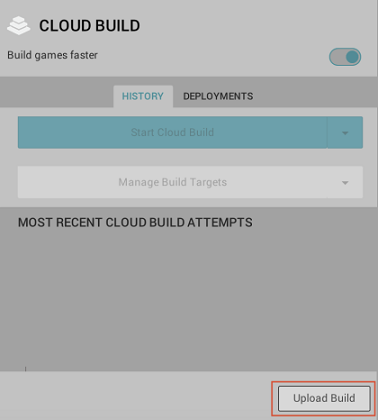
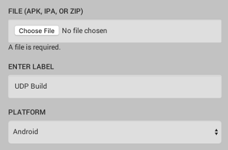
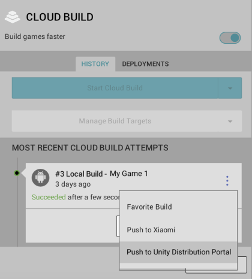
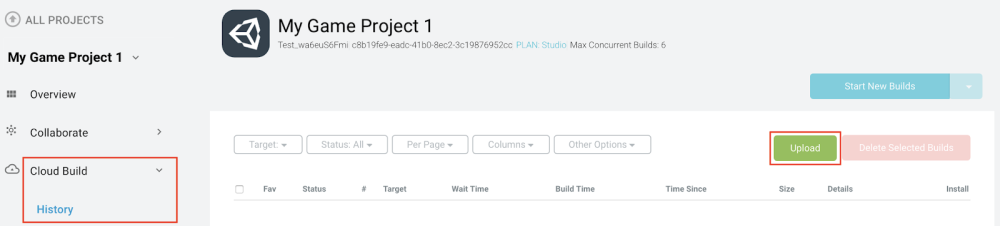
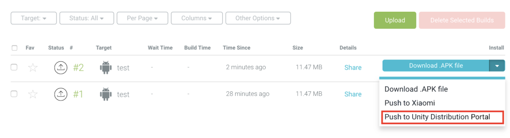

# Using CloudBuild with UDP

You can also deploy your game to the UDP console the following ways:

* Upload your APK to CloudBuild, and deploy it to UDP from there
* Build your game with CloudBuild, and deploy it to UDP from there

## Pushing the build to the UDP console via Cloud Build

In the Editor, enable Cloud Build through the **Unity Services** window (see documentation on [Cloud Build implementation](https://docs.unity3d.com/Manual/UnityCloudBuild.html)).

You can upload your game build to the build history of your Project, and push it to UDP either via the Editor, or via the Unity Cloud Build Developer Dashboard.

### Upload and Deploy via the Unity Editor

#### Step 1 - Upload your UDP build:

1. In the **Cloud Build Services** window, if you haven't uploaded any build before, select **Upload Build**.  
    
2. In **FILE**: 
    * Choose the APK of your UDP build
    * Enter a useful **LABEL**
    * Set the **PLATFORM** field to Android. 
    
3. Select **UPLOAD**, and let it complete the upload process.

#### Step 2 - Push your build to UDP

In the **Cloud Build Services** window, locate the desired build from the build **History** timeline and select **Push to Unity Distribution Portal**. Verify that you want to push, and that the action completes.

### Upload and Deploy via the Unity Cloud Build Developer Dashboard

#### Step 1 - Upload your UDP build

In the [Unity Developer Dashboard](https://developer.cloud.unity3d.com/build), navigate to your Project’s **Cloud Build** > **History**.

Select **Upload**, then select your APK file.

 
Uploading a build via the Cloud Build Developer Dashboard.

#### Step 2 - Push the build to UDP

From your Project’s **Cloud Build History**:

1. Click the arrow next to **Download .APK file** to expand the drop-down menu
2. Select **Push to Unity Distribution Portal**.

 
Pushing a hosted build to UDP via the Unity Cloud Build Developer Dashboard.

## Building and Deploying via Cloud Build

If you use Unity Teams Advanced, you can generate builds automatically (learn about [Automated Build Generation](https://docs.unity3d.com/Manual/UnityCloudBuildContinuousIntegration.html)). 

In the Cloud Build Services window:

1. Select **Manage Build Targets** > **Add new build target**
2. In the **TARGET SETUP** window, set the **PLATFORM** field to Android and enter a useful **TARGET LABEL**. 
3. Select **Next: Save**.
4. Select **Start Cloud Build**, then select the target build you just created.

Push your build to UDP directly via the Unity Cloud Build Developer Dashboard (as shown above).